# Data Modeling and SQL {-}

```{r, echo = FALSE, message = FALSE}
library(DBI)
db = dbConnect(RSQLite::SQLite(), dbname = "sql.sqlite")
```

> *It is a capital mistake to theorize before one has data.*
> 
> Sir Arthur Conan Doyle, "A Scandal in Bohemia," *The Adventures of
> Sherlock Holmes*, 1891

The application backlog, a large number of requests for new information
systems, has been a recurring problem in many organizations for decades.
The demand for new information systems and the need to maintain existing
systems have usually outstripped available information systems skills.
The application backlog, unfortunately, is not a new problem. In the
1970s, Codd laid out a plan for improving programmer productivity and
accelerating systems development by improving the management of data.
Codd's **relational model**, designed to solve many of the shortcomings
of earlier systems, is currently the most popular database model.

This section develops two key skills---data modeling and query
formation---that are required to take advantage of the relational model.
We concentrate on the design and use of relational databases. This very
abrupt change in focus is part of the plan to give you a dual
understanding of data management. Section 1 is the managerial
perspective, whereas this section covers technical skills development.
Competent data managers are able to accommodate both views and apply
whichever (or some blend of the two) is appropriate.

In Chapter 1, many forms of organizational memory were identified, and
in this section we focus on files and their components. Thus, only the
files branch of organizational memory is detailed in the following
figure.

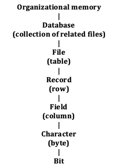

A collection of related files is a **database**. Describing the
collection of files as related means that it has a common purpose (e.g.,
data about students). Sometimes files are also called tables, and there
are synonyms for some other terms (the alternative names are shown in
parentheses). Files contain **records** (or rows). Each record contains
the data for one instance of the data the file stores. For example, if
the file stores data about students, each record will contain data about
a single student. Records have **fields** (or columns) that store the
fine detail of each instance (e.g., student's first name, last name, and
date of birth). Fields are composed of **characters** (a, b, c,.., 1,
2, 3,..., %, \$, \#,..., A, B, etc.). A **byte**, a unit of
storage sufficient to store a single letter (in English) or digit,
consists of a string of eight contiguous **bits** or binary digits.

The data management hierarchy stimulates three database design
questions:

What collection of files should the database contain?

How are these files related?

What fields should each record in the file contain?

The first objective of this section is to describe data modeling, a
technique for answering the three questions. Data modeling helps you to
understand the structure and meaning of data, which is necessary before
a database can be created. Once a database has been designed, built, and
loaded with data, the aim is to deploy it to satisfy management's
requests for information. Thus, the second objective is to teach you to
query a relational database. The learning of modeling and querying will
be intertwined, making it easier to grasp the intent of database design
and to understand why data modeling is so critical to making a database
an effective tool for managerial decision making.

Chapter 3 covers modeling a single entity and querying a single-table
database. This is the simplest database that can be created. As you will
soon discover, a **data model** is a graphical description of the
components of a database. One of these components is an entity, some
feature of the real world about which data must be stored. This section
also introduces the notions of a **data definition language** (DDL),
which is used to describe a database, and a **data manipulation
language** (DML), which is used to maintain and query a database.
Subsequent chapters in this section cover advanced data modeling
concepts and querying capabilities.

## The Single Entity {-}

> *I want to be alone.*
>
> Attributed to Greta Garbo

### Learning Objectives {-}

Students completing this chapter will be able to

* model a single entity;

* define a single database;

* write queries for a single-table database.

### The relational model {-}

The relational model introduced by Codd in 1970 is the most popular
technology for managing large collections of data. In this chapter, the
major concepts of the relational model are introduced. Extensive
coverage of the relational model is left until Chapter 8, by which time
you will have sufficient practical experience to appreciate fully its
usefulness, value, and elegance.

A **relation**, similar to the mathematical concept of a set, is a
two-dimensional table arranged in rows and columns. This is a very
familiar idea. You have been using tables for many years. A
**relational** **database** is a collection of relations, where
**relation** is a mathematical term for a table. One row of a table
stores details of one observation, instance, or case of an item about
which facts are retained---for example, one row for details of a
particular student. All the rows in a table store data about the same
type of item. Thus, a database might have one table for student data and
another table for class data. Similarly, each column in the table
contains the same type of data. For example, the first column might
record a student's identification number. A key database design question
is to decide what to store in each table. What should the rows and
columns contain?

In a relational database, each row must be uniquely identified. There
must be a **primary** **key**, such as student identifier, so that a
particular row can be designated. The use of unique identifiers is very
common. Telephone numbers and e-mail addresses are examples of unique
identifiers. Selection of the primary key, or unique identifier, is
another key issue of database design.

**Global legal entity identifier (LEI)**

There is no global standard for identifying legal entities across
markets and jurisdictions. The need for such a standard was amplified by
Lehman Brothers collapse in 2008. Lehman had 209 registered
subsidiaries, legal entities, in 21 countries, and it was party to more
than 900,000 derivatives contracts upon its collapse. Key stakeholders,
such as financial regulators and Lehman's creditors, were unable to
assess their exposure. Furthermore, others were unable to assess the
possible ripple on them of the effects of the collapse because of the
transitive nature of many investments (i.e., A owes B, B owes C, and C
owes D).

The adoption of a global legal entity identifier (LEI), should improve
financial system regulation and corporate risk management. Regulators
will find it easier to monitor and analyze threats to financial
stability and risk managers will be more able evaluate their companies'
risks.

Source: www.ny.frb.org/research/epr/2014/1403flem.pdf

The tables in a relational database are **connected** or **related** by
means of the data in the tables. You will learn, in the next chapter,
that this connection is through a pair of values---a primary key and a
foreign key. Consider a table of airlines serving a city. When examining
this table, you may not recognize the code of an airline, so you then go
to another table to find the name of the airline. For example, if you
inspect the following table, you find that AM is an international
airline serving Atlanta.

*International airlines serving Atlanta*

  Airline
  ---------
  AM
  JL
  KX
  LM
  MA
  OS
  RG
  SN
  SR
  LH
  LY

If you don't know which airline has the abbreviation AM, then you need
to look at the following table of airline codes to discover that
AeroMexico, with code AM, serves Atlanta. The two tables are related by
airline code. Later, you will discover which is the primary key and
which is the foreign key.

*A partial list of airline codes*

  Code   Airline
  ------ --------------------------
  AA     American Airlines
  AC     Air Canada
  AD     Lone Star Airlines
  AE     Mandarin Airlines
  AF     Air France
  AG     Interprovincial Airlines
  AI     Air India
  AM     AeroMexico
  AQ     Aloha Airlines

When designing the relational model, Codd provided commands for
processing multiple records at a time. His intention was to increase the
productivity of programmers by moving beyond the record-at-a-time
processing that is found in most programming languages. Consequently,
the relational model supports set processing (multiple
records-at-a-time), which is most frequently implemented as **Structured
Query Language (SQL).**^1^

The relational model separates the logical design of a database from its
physical storage. This notion of **data independence** simplifies data
modeling and database programming. In this section, we focus on logical
database design, and now that you have had a brief introduction to the
relational model, you are ready to learn data modeling.

### Getting started {-}

As with most construction projects, building a relational database must
be preceded by a design phase. Data modeling, our design technique, is a
method for creating a plan or blueprint of a database. The data model
must accurately mirror real-world relationships if it is to support
processing business transactions and managerial decision making.

Rather than getting bogged down with a *theory first, application later*
approach to database design and use, we will start with application. We
will get back to theory when you have some experience in data modeling
and database querying. After all, you did not learn to talk by first
studying sentence formation; you just started by learning and using
simple words. We start with the simplest data model, a single entity,
and the simplest database, a single table, as follows.

  Firm code   Firm's name           Price   Quantity    Dividend   PE ratio
  ----------- --------------------- ------- ----------- ---------- ----------
  FC          Freedonia Copper      27.5    10,529      1.84       16
  PT          Patagonian Tea        55.25   12,635      2.5        10
  AR          Abyssinian Ruby       31.82   22,010      1.32       13
  SLG         Sri Lankan Gold       50.37   32,868      2.68       16
  ILZ         Indian Lead & Zinc    37.75   6,390       3          12
  BE          Burmese Elephant      0.07    154,713     0.01       3
  BS          Bolivian Sheep        12.75   231,678     1.78       11
  NG          Nigerian Geese        35      12,323      1.68       10
  CS          Canadian Sugar        52.78   4,716       2.5        15
  ROF         Royal Ostrich Farms   33.75   1,234,923   3          6

### Modeling a single-entity database {-}

The simplest database contains information about one entity, which is
some real-world thing. Some entities are physical---CUSTOMER, ORDER, and
STUDENT; others are conceptual---WORK ASSIGNMENT and AUTHORSHIP. We
represent an entity by a rectangle: the following figure shows a
representation of the entity SHARE. The name of the entity is shown in
singular form in uppercase in the top part of the rectangle.

*The entity SHARE*


An entity has characteristics or attributes. An **attribute** is a
discrete element of data; it is not usually broken down into smaller
components. Attributes identify data we want to store. Some attributes
of the entity SHARE are *identification code*, *firm name*, *price*,
*quantity owned*, *dividend*, and *price-to-earnings ratio*.^2^
Attributes are shown below the entity's name. Notice that we refer to
*share price*, rather than *price*, to avoid confusion if there should
be another entity with an attribute called *price*. Attribute names must
be carefully selected so that they are self-explanatory and unique. For
example, *share dividend* is easily recognized as belonging to the
entity SHARE.

*The entity SHARE and its attributes*


An **instance** is a particular occurrence of an entity (e.g., facts
about Freedonia Copper). To avoid confusion, each instance of an entity
needs to be uniquely identified. Consider the case of customer billing.
In most cases, a request to bill Smith \$100 cannot be accurately
processed because a firm might have more than one Smith in its customer
file. If a firm has carefully controlled procedures for ensuring that
each customer has a unique means of identification, then a request to
bill customer number 1789 \$100 can be accurately processed. An
attribute or collection of attributes that uniquely identifies an
instance of an entity is called an **identifier**. The identifier for
the entity SHARE is *share code*, a unique identifier assigned by the
stock exchange.

There may be several attributes, or combinations of attributes, that are
feasible identifiers for an instance of an entity. Attributes that are
identifiers are prefixed by an asterisk. The following figure shows an
example of a representation of an entity, its attributes, and
identifier.

*The entity SHARE, its attributes, and identifier*

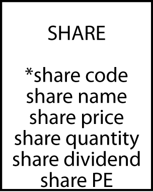

Briefly, entities are things in the environment about which we wish to
store information. Attributes describe an entity. An entity must have a
unique identifier.

The modeling language used in this text is designed to record the
essential details of a data model. The number of modeling symbols to
learn is small, and they preserve all the fundamental concepts of data
modeling. Since data modeling often occurs in a variety of settings, the
symbols used have been selected so that they can be quickly drawn using
pencil-and-paper, whiteboard, or a general-purpose drawing program. This
also means that models can be quickly revised as parts can be readily
erased and redrawn.

The symbols are distinct and visual clutter is minimized because only
the absolutely essential information is recorded. This also makes the
language easy for clients to learn so they can read and amend models.

Models can be rapidly translated to a set of tables for a relational
database. More importantly, since this text implements the fundamental
notions of all data modeling languages, you can quickly convert to
another data modeling dialect. Data modeling is a high-level skill, and
the emphasis needs to be on learning to think like a data modeler rather
than on learning a modeling language. This text's goal is to get you off
to a fast start.

+-----------------------------------------------------------------------+
| *Skill builder*                                                       |
|                                                                       |
| A ship has a name, registration code, gross tonnage, and a year of    |
| construction. Ships are classified as cargo or passenger. Draw a data |
| model for a ship.                                                     |
+-----------------------------------------------------------------------+

### Creating a single-table database {-}

The next stage is to translate the data model into a relational
database. The translation rules are very direct:

* Each entity becomes a table.

* The entity name becomes the table name.

* Each attribute becomes a column.

* The identifier becomes the primary key.

The American National Standards Institute's (ANSI) recommended language
for relational database definition and manipulation is SQL, which is
both a data definition language (DDL) (to define a database), a data
manipulation language (DML) (to query and maintain a database), and a
data control language (DCL) (to control access). SQL is a common
standard for describing and querying databases and is available with
many commercial relational database products, including DB2, Oracle, and
Microsoft SQL Server, and open source products such as MySQL and
PostgreSQL.

In this book, MySQL is the relational database for teaching SQL. Because
SQL is a standard, it does not matter which implementation of the
relational model you use as the SQL language is common across both the
proprietary and open variants.^3^

SQL uses the CREATE^4^ statement to define a table. It is not a
particularly friendly command, and most products have friendlier
interfaces for defining tables. However, it is important to learn the
standard, because this is the command that SQL understands. Also, a
table definition interface will generate a CREATE statement for
execution by SQL. Your interface interactions ultimately translate into
a standard SQL command.

It is common practice to abbreviate attribute names, as is done in the
following example.

#### Defining a table {-}

The CREATE command to establish a table called `share`^5^ is as follows:

```{sql, connection = db, eval = FALSE}
CREATE TABLE share (
  shrcode CHAR(3),
  shrfirm VARCHAR(20) NOT NULL,
  shrprice DECIMAL(6,2),
  shrqty DECIMAL(8),
  shrdiv DECIMAL(5,2),
  shrpe DECIMAL(2),
  PRIMARY KEY (shrcode));
```

The first line of the command names the table; subsequent lines describe
each of its columns. The first component is the name of the column
(e.g., `shrcode`). The second component is the data type (e.g., CHAR), and
its length is shown in parentheses. `shrfirm` is a variable-length
character field of length 20, which means it can store up to 20
characters, including spaces. The column `shrdiv` stores a decimal number
that can be as large as 999.99 because its total length is 5 digits and
there are 2 digits to the right of the decimal point. Some examples of
allowable data types are shown in the following table. The third
component (e.g., NOT NULL), which is optional, indicates any instance
that cannot have null values. A column might have a null value when it
is either unknown or not applicable. In the case of the share table, we
specify that `shrfirm` must be defined for each instance in the database.

The final line of the CREATE statement defines `shrcode` as the primary
key, the unique identifier for SHARE When a primary key is defined, the
relational database management system (RDBMS) will enforce the
requirement that the primary key is unique and not null. Before any row
is added to the table SHARE, the RDBMS will check that the value of
`shrcode` is not null and that there does not already exist a duplicate
value for `shrcode` in an existing row of `share`. If either of these
constraints is violated, the RDBMS will not permit the new row to be
inserted. This constraint, the **entity integrity rule**, ensures that
every row has a unique, non-null primary key. Allowing the primary key
to take a null value would mean there could be a row of `share` that is
not uniquely identified. Note that an SQL statement is terminated by a
semicolon, though this is not always enforced.

SQL statements can be written in any mix of valid upper and lowercase
characters. To make it easier for you to learn the syntax, this book
adopts the following conventions:

* SQL keywords are in uppercase.

* Table and column names are in lowercase.

There are more elaborate layout styles, but we will bypass those because
it is more important at this stage to learn SQL. You should lay out your
SQL statements so that they are easily read by you and others.

The following table shows some of the data types supported by most
relational databases. Other implementations of the relational model may
support some of these data types and additional ones. It is a good idea
to review the available data types in your RDBMS before defining your
first table.

*Some allowable data types*

  Category    Data type                  Description
  ----------- -------------------------- ---------------------------------------------------------------------------------------------------------------------------
  Numeric     SMALLINT                   A 15-bit signed binary value
              INTEGER                    A 31-bit signed binary value
              FLOAT(p)                   A scientific format number of *p* binary digits precision
              DECIMAL(p,q)               A packed decimal number of *p* digits total length; *q* decimal spaces to the right of the decimal point may be specified
  String      CHAR(n)                    A fixed-length string of *n* characters
              VARCHAR(n)                 A variable-length string of up to *n* characters
              text                       A variable-length string of up to 65,535 characters
  Date/time   DATE                       Date in the form *yyyymmdd*
              TIME                       Time in the form *hhmmss*
              timesTAMP                  A combination of date and time to the nearest microsecond
              time with time zone        Same as time, with the addition of an offset from universal time coordinated (UTC) of the specified time
              timestamp with time zone   Same as timestamp, with the addition of an offset from UTC of the specified time
  Logical     Boolean                    A set of truth values: TRUE, FALSE, or UNKNOWN

The CHAR and VARCHAR data types are similar but differ in the way
character strings are stored and retrieved. Both can be up to 255
characters long. The length of a CHAR column is fixed to the declared
length. When values are stored, they are right-padded with spaces to the
specified length. When CHAR values are retrieved, trailing spaces are
removed. VARCHAR columns store variable-length strings and use only as
many characters as are needed to store the string. Values are not
padded; instead, trailing spaces are removed. In this book, we use
VARCHAR to define most character strings, unless they are short (less
than five characters is a good rule-of-thumb).

### Data modeling with MySQL Workbench {-}

MySQL Workbench is a professional quality, open source, cross-platform
tool for data modeling and SQL querying.^6^ In this text, you will also
learn some of the features of Workbench that support data modeling and
using SQL. You will find it helpful to complete the MySQL Workbench
tutorial on creating a data model^7^ prior to further reading, as we
will assume you have such proficiency.

*The entity share created with MySQL Workbench*

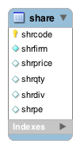

You will notice some differences from the data model we have created
previously. Workbench automatically generates the SQL code to create the
table, so when modeling you establish the names you want for tables and
columns. A gold key symbol is used to indicate the identifier, which
becomes the primary key. An open diamond indicates that a column can be
null, whereas a closed blue diamond indicate the column must have a
value, as with `shrfirm` in this case.

When specifying columns in Workbench you must also indicate the
datatype. We opt to turn off the display of a column's datatype^8^ in a
model to maintain focus on the entity.

A major advantage of using a tool such as Workbench is that it will
automatically generate the CREATE statement code (Database \> Forward
Engineer ...) and execute the code to create the database. The Workbench
tutorial will have shown you how to do this, and you should try this out
for yourself by creating a database with the single `share` table.

#### Inserting rows into a table {-}

The rows of a table store instances of an entity. A particular
shareholding (e.g., Freedonia Copper) is an example of an instance of
the entity `share`. The SQL statement INSERT is used to add rows to a
table. Although most implementations of the relational model use a
spreadsheet for row insertion and you can also usually import a
structured text file, the INSERT command is defined for completeness.

The following command adds one row to the table `share`:

```{sql, connection = db, eval = FALSE}
INSERT INTO share
  (shrcode,shrfirm,shrprice,shrqty,shrdiv,shrpe)
    VALUES ('FC','Freedonia Copper',27.5,10529,1.84,16);
```

There is a one-to-one correspondence between a column name in the first
set of parentheses and a value in the second set of parentheses. That
is, `shrcode` has the value "FC," `shrfirm` the value "Freedonia Copper,"
and so on. Notice that the value of a column that stores a character
string (e.g., `shrfirm`) is contained within straight quotes.

The list of field names can be omitted when values are inserted in all
columns of the table in the same order as that specified in the CREATE
statement, so the preceding expression could be written

```{sql, connection = db, eval = FALSE}
INSERT INTO share
  VALUES ('FC','Freedonia Copper',27.5,10529,1.84,16);
```

The data for the `share` table will be used in subsequent examples. If you
have ready access to a relational database, it is a good idea to now
create a table and enter the data. Then you will be able to use these
data to practice querying the table.

*Data for share*

  [shrcode]{.underline}   shrfirm               shrprice   shrqty      shrdiv   shrpe
  ----------------------- --------------------- ---------- ----------- -------- -------
  FC                      Freedonia Copper      27.5       10,529      1.84     16
  PT                      Patagonian Tea        55.25      12,635      2.5      10
  AR                      Abyssinian Ruby       31.82      22,010      1.32     13
  SLG                     Sri Lankan Gold       50.37      32,868      2.68     16
  ILZ                     Indian Lead & Zinc    37.75      6,390       3        12
  BE                      Burmese Elephant      0.07       154,713     0.01     3
  BS                      Bolivian Sheep        12.75      231,678     1.78     11
  NG                      Nigerian Geese        35         12,323      1.68     10
  CS                      Canadian Sugar        52.78      4,716       2.5      15
  ROF                     Royal Ostrich Farms   33.75      1,234,923   3        6

Notice that `shrcode`,the primary key, is underlined in the preceding
table. This is a convention we will use for denoting the primary key. In
the relational model, an identifier becomes a primary key, a column that
guarantees that each row of the table can be uniquely addressed.

MySQL Workbench offers a spreadsheet interface for entering data, as
explained in the tutorial on adding data to a database.^9^

*Inserting rows with MySQL Workbench*

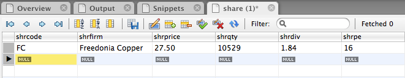

+--------------------------------------------------------------------------+
| *Skill builder*                                                          |
|                                                                          |
| Create a relational database for the ship entity you modeled previously. |
| Insert some rows.                                                        |
+--------------------------------------------------------------------------+

### Querying a database {-}

The objective of developing a database is to make it easier to use the
stored data to solve problems. Typically, a manager raises a question
(e.g., How many shares have a PE ratio greater than 12?). A question or
request for information, usually called a query, is then translated into
a specific data manipulation or query language. The most widely used
query language for relational databases is SQL. After the query has been
executed, the resulting data are displayed. In the case of a relational
database, the answer to a query is always a table.

There is also a query language called relational algebra, which
describes a set of operations on tables. Sometimes it is useful to think
of queries in terms of these operations. Where appropriate, we will
introduce the corresponding relational algebra operation.

Generally we use a four-phase format for describing queries:

1.  A brief explanation of the query's purpose

2.  The query italics, prefixed by •, and some phrasing you might expect
    from a manager

3.  The SQL version of the query

4.  The results of the query.

#### Displaying an entire table {-}

All the data in a table can be displayed using the SELECT statement. In
SQL, the all part is indicated by an asterisk (\*).

List all data in the share table.

```{sql, connection = db, eval = FALSE}
SELECT * FROM share;
```

  shrcode   shrfirm              shrprice   shrqty   shrdiv   shrpe
  --------- -------------------- ---------- -------- -------- -------
  FC        Freedonia Copper     27.5       10529    1.84     16
  PT        Patagonian Tea       55.25      12635    2.5      10
  AR        Abyssinian Ruby      31.82      22010    1.32     13
  SLG       Sri Lankan Gold      50.37      32868    2.68     16
  ILZ       Indian Lead & Zinc   37.75      6390     3        12
  BE        Burmese Elephant     0.07       154713   0.01     3
  BS        Bolivian Sheep       12.75      231678   1.78     11
  NG        Nigerian Geese       35         12323    1.68     10
  CS        Canadian Sugar       52.78      4716     2.5      15

#### Project---choosing columns {-}

The relational algebra operation **project** creates a new table from
the columns of an existing table. Project takes a vertical slice through
a table by selecting all the values in specified columns. The projection
of `share` on columns `shrfirm` and `shrpe` produces a new table with 10 rows
and 2 columns. These columns are shaded in the table.

*Projection of shrfirm and shrpe*

  [shrcode]{.underline}   shrfirm               shrprice   shrqty      shrdiv   shrpe
  ----------------------- --------------------- ---------- ----------- -------- -------
  FC                      Freedonia Copper      27.5       10,529      1.84     16
  PT                      Patagonian Tea        55.25      12,635      2.5      10
  AR                      Abyssinian Ruby       31.82      22,010      1.32     13
  SLG                     Sri Lankan Gold       50.37      32,868      2.68     16
  ILZ                     Indian Lead & Zinc    37.75      6,390       3        12
  BE                      Burmese Elephant      0.07       154,713     0.01     3
  BS                      Bolivian Sheep        12.75      231,678     1.78     11
  NG                      Nigerian Geese        35         12,323      1.68     10
  CS                      Canadian Sugar        52.78      4,716       2.5      15
  ROF                     Royal Ostrich Farms   33.75      1,234,923   3        6

The SQL syntax for the project operation simply lists the columns to be
displayed.

*Report a firm's name and price-earnings ratio.*

```{sql, connection = db, eval = FALSE}
SELECT shrfirm, shrpe FROM share;
```

  shrfirm               shrpe
  --------------------- -------
  Freedonia Copper      16
  Patagonian Tea        10
  Abyssinian Ruby       13
  Sri Lankan Gold       16
  Indian Lead & Zinc    12
  Burmese Elephant      3
  Bolivian Sheep        11
  Nigerian Geese        10
  Canadian Sugar        15
  Royal Ostrich Farms   6

#### Restrict---choosing rows {-}

The relational algebra operation **restrict** creates a new table from
the rows of an existing table. The operation restricts the new table to
those rows that satisfy a specified condition. Restrict takes all
columns of an existing table but only those rows that meet the specified
condition. The restriction of `share` to those rows where the PE ratio is
less than 12 will give a new table with five rows and six columns. These
rows are shaded.

*Restriction of share*

  [shrcode]{.underline}   shrfirm               shrprice   shrqty      shrdiv   shrpe
  ----------------------- --------------------- ---------- ----------- -------- -------
  FC                      Freedonia Copper      27.5       10,529      1.84     16
  PT                      Patagonian Tea        55.25      12,635      2.5      10
  AR                      Abyssinian Ruby       31.82      22,010      1.32     13
  SLG                     Sri Lankan Gold       50.37      32,868      2.68     16
  ILZ                     Indian Lead & Zinc    37.75      6,390       3        12
  BE                      Burmese Elephant      0.07       154,713     0.01     3
  BS                      Bolivian Sheep        12.75      231,678     1.78     11
  NG                      Nigerian Geese        35         12,323      1.68     10
  CS                      Canadian Sugar        52.78      4,716       2.5      15
  ROF                     Royal Ostrich Farms   33.75      1,234,923   3        6

Restrict is implemented in SQL using the WHERE clause to specify the
condition on which rows are restricted.

*Get all firms with a price-earnings ratio less than 12.*
```{sql, connection = db, eval = FALSE}
SELECT * FROM share WHERE shrpe < 12;
```

  shrcode   shrfirm               shrprice   shrqty    shrdiv   shrpe
  --------- --------------------- ---------- --------- -------- -------
  PT        Patagonian Tea        55.25      12635     2.5      10
  BE        Burmese Elephant      0.07       154713    0.01     3
  BS        Bolivian Sheep        12.75      231678    1.78     11
  NG        Nigerian Geese        35         12323     1.68     10
  ROF       Royal Ostrich Farms   33.75      1234923   3        6

In this example, we have a less than condition for the WHERE clause. All
permissible comparison operators are listed below.

  Comparison operator   Meaning
  --------------------- --------------------------
  =                     Equal to
  \<                    Less than
  \<=                   Less than or equal to
  \>                    Greater than
  \>=                   Greater than or equal to
  \<\>                  Not equal to

In addition to the comparison operators, the BETWEEN construct is
available.

a BETWEEN x AND y is equivalent to a \>= x AND a \<= y

#### Combining project and restrict---choosing rows and columns {-}

SQL permits project and restrict to be combined. A single SQL SELECT
statement can specify which columns to project and which rows to
restrict.

*List the name, price, quantity, and dividend of each firm where the share holding is at least 100,000.*

```{sql, connection = db, eval = FALSE}
SELECT shrfirm, shrprice, shrqty, shrdiv FROM share
  WHERE shrqty \>= 100000;
```

  shrfirm               shrprice   shrqty    shrdiv
  --------------------- ---------- --------- --------
  Burmese Elephant      0.07       154713    0.01
  Bolivian Sheep        12.75      231678    1.78
  Royal Ostrich Farms   33.75      1234923   3

#### More about WHERE {-}

The WHERE clause can contain several conditions linked by AND or OR. A
clause containing AND means all specified conditions must be true for a
row to be selected. In the case of OR, at least one of the conditions
must be true for a row to be selected.

*Find all firms where the PE is 12 or higher and the share holding is less than 10,000.*

```{sql, connection = db, eval = FALSE}
SELECT \* FROM share
  WHERE shrpe \>= 12 AND shrqty \< 10000;
```

  shrcode   shrfirm              shrprice   shrqty   shrdiv   shrpe
  --------- -------------------- ---------- -------- -------- -------
  ILZ       Indian Lead & Zinc   37.75      6390     3        12
  CS        Canadian Sugar       52.78      4716     2.5      15

#### The power of the primary key {-}

The purpose the primary key is to guarantee that any row in a table can
be uniquely addressed. In this example, we use `shrcode` to return a
single row because `shrcode` is unique for each instance of `share`. The
sought code (AR) must be specified in quotes because `shrcode` was defined
as a character string when the table was created.

*Report firms whose code is AR.*

```{sql, connection = db, eval = FALSE}
SELECT * FROM share WHERE shrcode = 'AR';
```

  shrcode   shrfirm           shrprice   shrqty   shrdiv   shrpe
  --------- ----------------- ---------- -------- -------- -------
  AR        Abyssinian Ruby   31.82      22010    1.32     13

A query based on a non-primary-key column cannot guarantee that a single
row is accessed, as the following illustrates.

*Report firms with a dividend of 2.50.*

```{sql, connection = db, eval = FALSE}
SELECT * FROM share WHERE shrdiv = 2.5;
```

  shrcode   shrfirm          shrprice   shrqty   shrdiv   shrpe
  --------- ---------------- ---------- -------- -------- -------
  PT        Patagonian Tea   55.25      12635    2.5      10
  CS        Canadian Sugar   52.78      4716     2.5      15

#### The IN crowd {-}

The keyword IN is used with a list to specify a set of values. IN is
always paired with a column name. All rows for which a value in the
specified column has a match in the list are selected. It is a simpler
way of writing a series of OR statements.

*Report data on firms with codes of FC, AR, or SLG.*

```{sql, connection = db, eval = FALSE}
SELECT * FROM share WHERE shrcode IN ('FC','AR','SLG');
```

The foregoing query could have also been written as

```{sql, connection = db, eval = FALSE}
SELECT \* FROM share
  WHERE shrcode = \'FC\' or shrcode = \'AR\' or shrcode = \'SLG\';
```

  shrcode   shrfirm            shrprice   shrqty   shrdiv   shrpe
  --------- ------------------ ---------- -------- -------- -------
  FC        Freedonia Copper   27.5       10529    1.84     16
  AR        Abyssinian Ruby    31.82      22010    1.32     13
  SLG       Sri Lankan Gold    50.37      32868    2.68     16

#### The NOT IN crowd {-}

A NOT IN list is used to report instances that do not match any of the
values.

*Report all firms other than those with the code CS or PT.*

```{sql, connection = db, eval = TRUE}
SELECT * FROM share WHERE shrcode NOT IN ('CS','PT');
```

is equivalent to

```{sql, connection = db, eval = TRUE}
SELECT * FROM share WHERE shrcode <> 'CS' AND shrcode <> 'PT';
```

  shrcode   shrfirm               shrprice   shrqty    shrdiv   shrpe
  --------- --------------------- ---------- --------- -------- -------
  FC        Freedonia Copper      27.5       10529     1.84     16
  AR        Abyssinian Ruby       31.82      22010     1.32     13
  SLG       Sri Lankan Gold       50.37      32868     2.68     16
  ILZ       Indian Lead & Zinc    37.75      6390      3        12
  BE        Burmese Elephant      0.07       154713    0.01     3
  BS        Bolivian Sheep        12.75      231678    1.78     11
  NG        Nigerian Geese        35         12323     1.68     10
  ROF       Royal Ostrich Farms   33.75      1234923   3        6

+------------------------------------------------------------------------+
| *Skill Builder*                                                        |
|                                                                        |
| List those shares where the value of the holding exceeds one million.  |
+------------------------------------------------------------------------+

#### Ordering columns {-}

The order of reporting columns is identical to their order in the SQL
command. For instance, compare the output of the following queries.

```{sql, connection = db, eval = FALSE}
SELECT shrcode, shrfirm FROM share WHERE shrpe = 10;
```

  shrcode   shrfirm
  --------- ----------------
  PT        Patagonian Tea
  NG        Nigerian Geese

```{sql, connection = db, eval = FALSE}
SELECT shrfirm, shrcode FROM share WHERE shrpe = 10;
```

  shrfirm          shrcode
  ---------------- ---------
  Patagonian Tea   PT
  Nigerian Geese   NG

#### Ordering rows {-}

People can generally process an ordered (e.g., sorted alphabetically)
report faster than an unordered one. In SQL, the ORDER BY clause
specifies the row order in a report. The default ordering sequence is
ascending (A before B, 1 before 2). Descending is specified by adding
DESC after the column name.

*List all firms where PE is at least 10, and order the report in descending PE. Where PE ratios are identical, list firms in alphabetical order.*

```{sql, connection = db, eval = FALSE}
SELECT * FROM share WHERE shrpe >= 10
  ORDER BY shrpe DESC, shrfirm;
```

  shrcode   shrfirm              shrprice   shrqty   shrdiv   shrpe
  --------- -------------------- ---------- -------- -------- -------
  FC        Freedonia Copper     27.5       10529    1.84     16
  SLG       Sri Lankan Gold      50.37      32868    2.68     16
  CS        Canadian Sugar       52.78      4716     2.5      15
  AR        Abyssinian Ruby      31.82      22010    1.32     13
  ILZ       Indian Lead & Zinc   37.75      6390     3        12
  BS        Bolivian Sheep       12.75      231678   1.78     11
  NG        Nigerian Geese       35         12323    1.68     10
  PT        Patagonian Tea       55.25      12635    2.5      10

#### Numeric versus character sorting {-}

Numeric data in character fields (e.g., a product code) do not always
sort the way you initially expect. The difference arises from the way
data are stored:

* Numeric fields are right justified and have leading zeros.

* Character fields are left justified and have trailing spaces.

For example, the value 1066 stored as CHAR(4) would be stored as '1066'
and the value 45 would be stored as '45 '. If the column containing
these data is sorted in ascending order, then '1066' precedes ' 45 '
because the leftmost character '1' is less than '4'. You can avoid this
problem by always storing numeric values as numeric data types (e.g.,
integer or decimal) or preceding numeric values with zeros when they are
stored as character data. Alternatively, start numbering at 1,000 so
that all values are four digits, though the best solution is to store
numeric data as numbers rather than characters.

#### Derived data {-}

One of the important principles of database design is to avoid
redundancy. One form of redundancy is including a column in a table when
these data can be derived from other columns. For example, we do not
need a column for yield because it can be calculated by dividing
dividend by price and multiplying by 100 to obtain the yield as a
percentage. This means that the query language does the calculation when
the value is required.

*Get firm name, price, quantity, and firm yield.*

```{sql, connection = db, eval = FALSE}
SELECT shrfirm, shrprice, shrqty, shrdiv/shrprice*100 AS yield FROM share;
```

  shrfirm               shrprice   shrqty    yield
  --------------------- ---------- --------- -------
  Freedonia Copper      27.5       10529     6.69
  Patagonian Tea        55.25      12635     4.52
  Abyssinian Ruby       31.82      22010     4.15
  Sri Lankan Gold       50.37      32868     5.32
  Indian Lead & Zinc    37.75      6390      7.95
  Burmese Elephant      0.07       154713    14.29
  Bolivian Sheep        12.75      231678    13.96
  Nigerian Geese        35         12323     4.8
  Canadian Sugar        52.78      4716      4.74
  Royal Ostrich Farms   33.75      1234923   8.89

You can give the results of the calculation a column name. In this case,
a good choice is `yield`. Note the use of AS to indicate the name of the
column in which the results of the calculation are displayed.

In the preceding query, the keyword AS is introduced to specify an
alias, or temporary name. The statement specifies that the result of the
calculation is to be reported under the column heading yield. You can
rename any column or specify a name for the results of an expression
using an alias.

#### Aggregate functions {-}

SQL has built-in functions to enhance its retrieval power and handle
many common aggregation queries, such as computing the total value of a
column. Four of these functions (AVG, SUM, MIN, and MAX) work very
similarly. COUNT is a little different.

##### COUNT {-}

COUNT computes the number of rows in a table. Use COUNT(\*) to count all
rows irrespective of their content (i.e., null or not null), and use
COUNT(`columnname`) to count rows without a null value for `columname`.
Count can be used with a WHERE clause to specify a condition.

*How many firms are there in the portfolio?*

```{sql, connection = db, eval = FALSE}
SELECT COUNT(shrcode) AS investments FROM share;
```

  investments
  -------------
  10

*How many firms have a holding greater than 50,000?*

```{sql, connection = db, eval = FALSE}
SELECT COUNT(shrfirm) AS bigholdings FROM share WHERE shrqty > 50000;
```

  bigholdings
  -------------
  3

#####  AVG---averaging {-}

AVG computes the average of the values in a column of numeric data. Null
values in the column are not included in the calculation.

*Find the average dividend.*

```{sql, connection = db, eval = FALSE}
SELECT AVG(shrdiv) AS avgdiv FROM share;
```

  avgdiv
  --------
  2.03

*What is the average yield for the portfolio?*

```{sql, connection = db, eval = FALSE}
SELECT AVG(shrdiv/shrprice*100) AS avgyield FROM share;
```

  avgyield
  ----------
  7.53

##### SUM, MIN, and MAX {-}

SUM, MIN, and MAX differ in the statistic they calculate but are used
similarly to AVG. As with AVG, null values in a column are not included
in the calculation. SUM computes the sum of a column of values. MIN
finds the smallest value in a column; MAX finds the largest.

#### Subqueries {-}

Sometimes we need the answer to another query before we can write the
query of ultimate interest. For example, to list all shares with a PE
ratio greater than the portfolio average, you first must find the
average PE ratio for the portfolio. You could do the query in two
stages:

```{sql, connection = db, eval = FALSE}
SELECT AVG(shrpe) FROM share;
```

and

```{sql, connection = db, eval = FALSE}
SELECT shrfirm, shrpe FROM share WHERE shrpe > x;
```

where x is the value returned from the first query.

Unfortunately, the two-stage method introduces the possibility of
errors. You might forget the value returned by the first query or enter
it incorrectly. It also takes longer to get the results of the query. We
can solve these problems by using parentheses to indicate the first
query is nested within the second one. As a result, the value returned
by the inner or nested subquery, the one in parentheses, is used in the
outer query. In the following example, the nested query returns 11.20,
which is then automatically substituted in the outer query.

*Report all firms with a PE ratio greater than the average for the portfolio.*

```{sql, connection = db, eval = FALSE}
SELECT shrfirm, shrpe FROM share
  WHERE shrpe \> (SELECT AVG(shrpe) FROM share);
```

  shrfirm              shrpe
  -------------------- -------
  Freedonia Copper     16
  Abyssinian Ruby      13
  Sri Lankan Gold      16
  Indian Lead & Zinc   12
  Canadian Sugar       15

+-------------------------------------------------------------+
| Warning: The preceding query is often mistakenly written as |
|                                                             |
| > SELECT shrfirm, shrpe from share                          |
| >                                                           |
| > WHERE shrpe \> avg(shrpe);                                |
+-------------------------------------------------------------+

+-----------------------------------------------------------------+
| *Skill builder*                                                 |
|                                                                 |
| Find the name of the firm for which the value of the holding is |
| greatest.                                                       |
+-----------------------------------------------------------------+

#### Regular expression---pattern matching {-}

Regular expression is a concise and powerful method for searching for a
specified pattern in a nominated column. Regular expression processing
is supported by languages such as Java, R, and PHP. In this chapter, we
introduce a few typical regular expressions and will continue developing
your knowledge of this feature in the next chapter.

##### Search for a string {-}

*List all firms containing \'Ruby\' in their name.*

```{sql, connection = db, eval = FALSE}
SELECT shrfirm FROM share WHERE shrfirm REGEXP 'Ruby';
```

  shrfirm
  -----------------
  Abyssinian Ruby

##### Search for alternative strings {-}

In some situations you want to find columns that contain more than one
string. In this case, we use the alternation symbol '\|' to indicate the
alternatives being sought. For example, a\|b finds 'a' or 'b'.

*List the firms containing gold or zinc in their name, irrespective of case.*

```{sql, connection = db, eval = FALSE}
SELECT shrfirm FROM share WHERE shrfirm REGEXP 'gold|zinc|Gold|Zinc';
```

  shrfirm
  --------------------
  Sri Lankan Gold
  Indian Lead & Zinc

##### Search for a beginning string {-}

If you are interested in finding a value in a column that starts with a
particular character string, then use \^ to indicate this option.

*List the firms whose name begins with Sri.*

```{sql, connection = db, eval = FALSE}
SELECT shrfirm FROM share WHERE shrfirm REGEXP '^Sri';
```

  shrfirm
  -----------------
  Sri Lankan Gold

##### Search for an ending string {-}

If you are interested in finding if a value in a column ends with a
particular character string, then use \$ to indicate this option.

*List the firms whose name ends with Geese.*

```{sql, connection = db, eval = FALSE}
SELECT shrfirm FROM share WHERE shrfirm REGEXP 'Geese$';
```

  shrfirm
  ----------------
  Nigerian Geese

+-----------------------------------------------------------------+
| *Skill builder*                                                 |
|                                                                 |
| List the firms containing "ian" in their name.                  |
+-----------------------------------------------------------------+

#### DISTINCT---eliminating duplicate rows {-}

The DISTINCT clause is used to eliminate duplicate rows. It can be used
with column functions or before a column name. When used with a column
function, it ignores duplicate values.

*Report the different values of the PE ratio.*

```{sql, connection = db, eval = FALSE}
SELECT DISTINCT shrpe FROM share;
```

  shrpe
  -------
  3
  10
  11
  12
  13
  15
  16

*Find the number of different PE ratios.*

```{sql, connection = db, eval = FALSE}
SELECT COUNT(DISTINCT shrpe) as 'Different PEs' FROM share;
```

  Different PEs
  ---------------
  8

When used before a column name, DISTINCT prevents the selection of
duplicate rows. Notice a slightly different use of the keyword AS. In
this case, because the alias includes a space, the entire alias is
enclosed in straight quotes.

#### DELETE {-}

Rows in a table can be deleted using the DELETE clause in an SQL
statement. DELETE is typically used with a WHERE clause to specify the
rows to be deleted. If there is no WHERE clause, all rows are deleted.

*Erase the data for Burmese Elephant. All the shares have been sold.*

```{sql, connection = db, eval = FALSE}
DELETE FROM share WHERE shrfirm = 'Burmese Elephant';
```

In the preceding statement, `shrfirm` is used to indicate the row to be
deleted.

#### UPDATE {-}

Rows can be modified using SQL's UPDATE clause, which is used with a
WHERE clause to specify the rows to be updated.

*Change the share price of FC to 31.50.*

```{sql, connection = db, eval = FALSE}
UPDATE share SET shrprice = 31.50 WHERE shrcode = 'FC';
```

*Increase the total number of shares for Nigerian Geese by 10% because of the recent bonus issue.*

```{sql, connection = db, eval = FALSE}
UPDATE share SET shrqty = shrqty*1.1 WHERE shrfirm = 'Nigerian Geese';
```

#### Quotes {-}

There are three types of quotes that you can typically use with SQL.
Double and single quotes are equivalent and can be used interchangeably.
Note that single and double quotes must be straight rather than curly,
and the back quote is to the left of the 1 key.

  Type of quote   Representation
  --------------- ----------------
  Single          **\'**
  Double          **\"**
  Back            **\`**

The following SQL illustrates the use of three types of quotes to find a
person with a last name of O'Hara and where the column names are `person first` and `person last`.

```{sql, connection = db, eval = FALSE}
SELECT `person first` FROM person WHERE `person last` = "O'Hara";
```

#### Debreifing {-}

Now that you have learned how to model a single entity, create a table,
and specify queries, you are on the way to mastering the fundamental
skills of database design, implementation, and use. Remember, planning
occurs before action. A data model is a plan for a database. The action
side of a database is inserting rows and running queries.

### Summary {-}

The relational database model is an effective means of representing
real-world relationships. Data modeling is used to determine what data
must be stored and how data are related. An entity is something in the
environment. An entity has attributes, which describe it, and an
identifier, which uniquely distinguishes an instance of an entity. Every
entity must have a unique identifier. A relational database consists of
tables with rows and columns. A data model is readily translated into a
relational database. The SQL statement CREATE is used to define a table.
Rows are added to a table using INSERT. In SQL, queries are written
using the SELECT statement. Project (choosing columns) and restrict
(choosing rows) are common table operations. The WHERE clause is used to
specify row selection criteria. WHERE can be combined with IN and NOT
IN, which specify values for a single column. The rows of a report are
sorted using the ORDER BY clause. Arithmetic expressions can appear in
SQL statements, and SQL has built-in functions for common arithmetic
operations. A subquery is a query within a query. Regular expressions
are used to find string patterns within character strings. Duplicate
rows are eliminated with the DISTINCT clause. Rows can be erased using
DELETE or modified with UPDATE.

Key terms and concepts
------------------------------------ --------------------------------------------------
Alias                                 Instance
AS                                    MAX
Attribute                             MIN
AVG                                   NOT IN
Column                                ORDER BY
COUNT                                 Primary key
CREATE                                Project
Data modeling                         Relational database
Data type                             Restrict
Database                              Row
DELETE                                SELECT
DISTINCT                              SQL
Entity                                Subquery
Entity integrity rule                 SUM
Identifier                            Table
IN                                    UPDATE
INSERT                                WHERE

#### Exercises {-}

1.  Draw data models for the following entities. In each case, make
    certain that you show the attributes and identifiers. Also, create a
    relational database and insert some rows for each of the models.

    a.  Aircraft: An aircraft has a manufacturer, model number, call
        sign (e.g., N123D), payload, and a year of construction.
        Aircraft are classified as civilian or military.

    b.  Car: A car has a manufacturer, range name, and style code (e.g.,
        a Honda Accord DX, where Honda is the manufacturer, Accord is
        the range, and DX is the style). A car also has a vehicle
        identification code, registration code, and color.

    c.  Restaurant: A restaurant has an address, seating capacity, phone
        number, and style of food (e.g., French, Russian, Chinese).

    d.  Cow: A dairy cow has a name, date of birth, breed (e.g.,
        Holstein), and a numbered plastic ear tag.

2.  Do the following queries using SQL:

    a.  List a share's name and its code.

    b.  List full details for all shares with a price less than \$1.

    c.  List the names and prices of all shares with a price of at least
        \$10.

    d.  Create a report showing firm name, share price, share holding,
        and total value of shares held. (Value of shares held is price
        times quantity.)

    e.  List the names of all shares with a yield exceeding 5 percent.

    f. Report the total dividend payment of Patagonian Tea. (The total
        dividend payment is dividend times quantity.)

    g. Find all shares where the price is less than 20 times the
        dividend.

    h. Find the share(s) with the minimum yield.

    i. Find the total value of all shares with a PE ratio \> 10.

    j. Find the share(s) with the maximum total dividend payment.

    k. Find the value of the holdings in Abyssinian Ruby and Sri Lankan
        Gold.

    l. Find the yield of all firms except Bolivian Sheep and Canadian
        Sugar.

    m. Find the total value of the portfolio.

    n. List firm name and value in descending order of value.

    o. List shares with a firm name containing "Gold."

    p. Find shares with a code starting with "B."

3.  Run the following queries and explain the differences in output.
    Write each query as a manager might state it.

    a. SELECT shrfirm FROM share WHERE shrfirm NOT REGEXP \'s\';

    b. SELECT shrfirm FROM share WHERE shrfirm NOT REGEXP \'S\';

    c. SELECT shrfirm FROM share WHERE shrfirm NOT REGEXP \'s\|S\';

    d. SELECT shrfirm FROM share WHERE shrfirm NOT REGEXP \'\^S\';

    e. SELECT shrfirm FROM share WHERE shrfirm NOT REGEXP \'s\$\';

4.  A weekly newspaper, sold at supermarket checkouts, frequently
    reports stories of aliens visiting Earth and taking humans on short
    trips. Sometimes a captured human sees Elvis commanding the
    spaceship. To keep track of all these reports, the newspaper has
    created the following data model.
    
    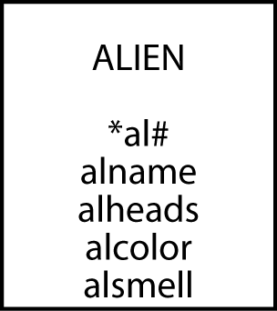
    
    The paper has also supplied some data for the last few sightings and asked you to create the database, 
    add details of these aliens, and answer the following queries:
    
    What's the average number of heads of an alien?

    a. Which alien has the most heads?

    b. Are there any aliens with a double o in their names?

    c. How many aliens are chartreuse?

    d. Report details of all aliens sorted by smell and color.

5.  Eduardo, a bibliophile, has a collection of several hundred books.
    Being a little disorganized, he has his books scattered around his
    den. They are piled on the floor, some are in bookcases, and others
    sit on top of his desk. Because he has so many books, he finds it
    difficult to remember what he has, and sometimes he cannot find the
    book he wants. Eduardo has a simple personal computer file system
    that is fine for a single entity or file. He has decided that he
    would like to list each book by author(s)' name and type of book
    (e.g., literature, travel, reference). Draw a data model for this
    problem, create a single entity table, and write some SQL queries.

    a.  How do you identify each instance of a book? (It might help to
        look at a few books.)

    b.  How should Eduardo physically organize his books to permit fast
        retrieval of a particular one?

    c.  Are there any shortcomings with the data model you have created?

6.  What is an identifier? Why does a data model have an identifier?

7.  What are entities?

8.  What is the entity integrity rule?

#### CD library case^10^ {-}

Ajay, a DJ in the student-operated radio station at his university, is
impressed by the station's large collection of CDs but is frustrated by
the time he spends searching for a particular piece of music. Recently,
when preparing his weekly jazz session, he spent more than half an hour
searching for a recording of Duke Ellington's "Creole Blues." An IS
major, Ajay had recently commenced a data management class. He quickly
realized that a relational database, storing details of all the CDs
owned by the radio station, would enable him to find quickly any piece
of music.

Having just learned how to model a single entity, Ajay decided to start
building a CD database. He took one of his favorite CDs, John Coltrane's
Giant Steps, and drew a model to record details of the tracks on this
CD.

*CD library V1.0*

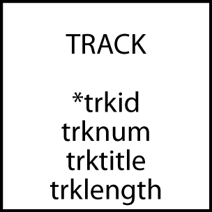

Ajay pondered using track number as the identifier since each track on a
CD is uniquely numbered, but he quickly realized that track number was
not suitable because it uniquely identifies only those tracks on a
specific CD. So, he introduced `trackid` to identify uniquely each track
irrespective of the CD on which it is found.

He also recorded the name of the track and its length. He had originally
thought that he would record the track's length in minutes and seconds
(e.g., 4:43) but soon discovered that the TIME data type of his DBMS is
designed to store time of day rather than the length of time of an
event. Thus, he concluded that he should store the length of a track in
minutes as a decimal (i.e., 4:43 is stored as 4.72).

  trkid   trknum   trktitle              trklength
  ------- -------- --------------------- -----------
  1       1        Giant Steps           4.72
  2       2        Cousin Mary           5.75
  3       3        Countdown             2.35
  4       4        Spiral                5.93
  5       5        Syeeda's Song Flute   7
  6       6        Naima                 4.35
  7       7        Mr. P.C.              6.95
  8       8        Giant Steps           3.67
  9       9        Naima                 4.45
  10      10       Cousin Mary           5.9
  11      11       Countdown             4.55
  12      12       Syeeda's Song Flute   7.03

+-----------------------------------------------------------------------+
| *Skill builder*                                                       |
|                                                                       |
| Create a single table database using the data in the preceding table. |
|                                                                       |
| Justify your choice of data type for each of the attributes.          |
+-----------------------------------------------------------------------+

Ajay ran a few queries on his single table database.

*On what track is "Giant Steps"?*

```{sql, connection = db, eval = FALSE}
SELECT trknum, trktitle FROM track
  WHERE trktitle = 'Giant Steps';
```

Observe that there are two tracks with the title "Giant Steps."

*Report all recordings longer than 5 minutes.*

```{sql, connection = db, eval = FALSE}
SELECT trknum, trktitle, trklength FROM track
  WHERE trklength > 5;
```

  trknum   trktitle               trklength
  -------- ---------------------- -----------
  2        Cousin Mary            5.75
  4        Spiral                 5.93
  5        Syeeda\'s Song Flute   7
  7        Mr. P.C.               6.95
  10       Cousin Mary            5.9
  12       Syeeda\'s song Flute   7.03

*What is the total length of recordings on the CD?*

This query makes use of the function SUM to total the length of tracks
on the CD.

```{sql, connection = db, eval = FALSE}
SELECT SUM(trklength) AS sumtrklen FROM track;
```

  sumtrklen
  -----------
  62.65

When you run the preceding query, the value reported may not be exactly
62.65. Why?

*Find the longest track on the CD.*

```{sql, connection = db, eval = FALSE}
SELECT trknum, trktitle, trklength FROM track
  WHERE trklength = (SELECT MAX(trklength) FROM track);
```

This query follows the model described previously in this chapter. First
determine the longest track (i.e., 7.03 minutes) and then find the
track, or tracks, that are this length.

  trknum   trktitle              trklength
  -------- --------------------- -----------
  12       Syeeda's Song Flute   7.03

*How many tracks are there on the CD?*

```{sql, connection = db, eval = FALSE}
SELECT COUNT(\*) AS tracks FROM track;
```

  tracks
  --------
  12

*Sort the different titles on the CD by their name.*

```{sql, connection = db, eval = FALSE}
SELECT DISTINCT(trktitle) FROM track
  ORDER BY trktitle;
```

  trktitle
  ---------------------
  Countdown
  Cousin Mary
  Giant Steps
  Mr. P.C.
  Naima
  Spiral
  Syeeda's Song Flute

*List the shortest track containing "song" in its title.*

```{sql, connection = db, eval = FALSE}
SELECT trknum, trktitle, trklength FROM track
  WHERE trktitle REGEXP 'song'
  AND trklength = (SELECT MIN(trklength) FROM track
    WHERE trktitle REGEXP 'song');
```

The subquery determines the length of the shortest track with "song" in
its title. Then any track with a length equal to the minimum and also
containing "song" in its title (just in case there is another without
"song" in its title that is the same length) is reported.

  trknum   trktitle              trklength
  -------- --------------------- -----------
  5        Syeeda's Song Flute   7

*Report details of tracks 1 and 5.*

```{sql, connection = db, eval = FALSE}
SELECT trknum, trktitle, trklength FROM track
  WHERE trknum IN (1,5);
```

  trknum   trktitle              trklength
  -------- --------------------- -----------
  1        Giant Steps           4.72
  5        Syeeda's Song Flute   7

+-------------------------------------------------------------------------+
| *Skill builder*                                                         |
|                                                                         |
| 1.  Write SQL commands for the following queries:                       |
|                                                                         |
|     a. Report all tracks between 4 and 5 minutes long.                  |
|                                                                         |
|     b. On what track is "Naima"?                                        |
|                                                                         |
|     c. Sort the tracks by descending length.                            |
|                                                                         |
|     d. What tracks are longer than the average length of tracks on the  |
|         CD?                                                             |
|                                                                         |
|     e. How many tracks are less than 5 minutes?                         |
|                                                                         |
|     f. What tracks start with "Cou"?                                    |
|                                                                         |
| 2.  Add the 13 tracks from The Manhattan Transfer's Swing CD in the     |
|     following table to the track table:                                 |
|                                                                         |
|   Track   Title                      Length                             |
|   ------- -------------------------- --------                           |
|   1       Stomp of King Porter       3.2                                |
|   2       Sing a Study in Brown      2.85                               |
|   3       Sing Moten's Swing         3.6                                |
|   4       A-tisket, A-tasket         2.95                               |
|   5       I Know Why                 3.57                               |
|   6       Sing You Sinners           2.75                               |
|   7       Java Jive                  2.85                               |
|   8       Down South Camp Meetin'    3.25                               |
|   9       Topsy                      3.23                               |
|   10      Clouds                     7.2                                |
|   11      Skyliner                   3.18                               |
|   12      It's Good Enough to Keep   3.18                               |
|   13      Choo Choo Ch' Boogie       3                                  |
|                                                                         |
| 3.  Write SQL to answer the following queries:                          |
|                                                                         |
|     a. What is the longest track on Swing?                              |
|                                                                         |
|     b. What tracks on Swing include the word Java?                      |
|                                                                         |
| 4.  What is the data model missing?                                     |
+-------------------------------------------------------------------------+

## The One-to-Many Relationship

> *Cow of many---well milked and badly fed.*
>
> Spanish proverb

### Learning Objectives

Students completing this chapter will be able to

* model a one-to-many relationship between two entities;

* define a database with a one-to-many relationship;

* write queries for a database with a one-to-many relationship.


Alice
sat with a self-satisfied smirk on her face. Her previous foray into her
attaché case had revealed the extent of her considerable stock holdings.
She was wealthy beyond her dreams. What else was there in this
marvelous, magic attaché case? She rummaged further into the case and
retrieved a folder labeled "Stocks---foreign." More shares!

On the inside cover of the folder was a note stating that the stocks in
this folder were not listed in the United Kingdom. The folder contained
three sheets of paper. Each was headed by the name of a country and
followed by a list of stocks and the number of shares. The smirk became
the cattiest of Cheshire grins. Alice ordered another bottle of
champagne and turned to her iPad to check the latest prices on the
Google Finance page. She wanted to calculate the current value of each
stock and then use current exchange rates to convert the values into
British pounds.

### Relationships

Entities are not isolated; they are related to other entities. When we
move beyond the single entity, we need to identify the relationships
between entities to accurately represent the real world. Once we
recognize that all stocks in our case study are not listed in the United
Kingdom, we need to introduce an entity called NATION. We now have two
entities, STOCK and NATION. Consider the relationship between them. A
NATION can have many listed stocks. A stock, in this case, is listed in
only one nation. There is a 1:m (one-to-many) relationship between
NATION and STOCK.

A 1:m relationship between two entities is depicted by a line connecting
the two with a crow's foot at the many end of the relationship. The
following figure shows the 1:m relationship between NATION and STOCK.
This can be read as: "a nation can have many stocks, but a stock belongs
to only one nation." The entity NATION is identified by *nation code*
and has attributes *nation name* and *exchange rate*.

*A 1:m relationship between NATION and STOCK*

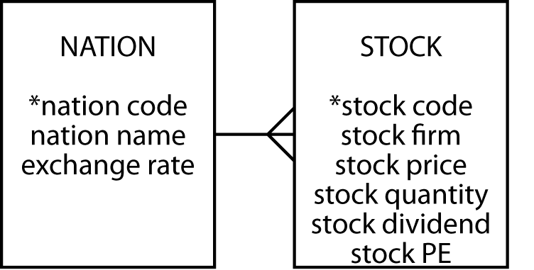

The 1:m relationship occurs frequently in business situations. Sometimes
it occurs in a tree or hierarchical fashion. Consider a very
hierarchical firm. It has many divisions, but a division belongs to only
one firm. A division has many departments, but a department belongs to
only one division. A department has many sections, but a section belongs
to only one department.

*A series of 1:m relationships*


#### Why did we create an additional entity?

Another approach to adding data about listing nation and exchange rate
is to add two attributes to STOCK: *nation name* and *exchange rate*. At
first glance, this seems a very workable solution; however, this will
introduce considerable redundancy, as the following table illustrates.

*The table stock with additional columns*

  [stkcode]{.underline}   stkfirm               stkprice   stkqty    stkdiv   stkpe   natname          exchrate
  ----------------------- --------------------- ---------- --------- -------- ------- ---------------- ----------
  FC                      Freedonia Copper      27.5       10529     1.84     16      United Kingdom   1
  PT                      Patagonian Tea        55.25      12635     2.5      10      United Kingdom   1
  AR                      Abyssinian Ruby       31.82      22010     1.32     13      United Kingdom   1
  SLG                     Sri Lankan Gold       50.37      32868     2.68     16      United Kingdom   1
  ILZ                     Indian Lead & Zinc    37.75      6390      3        12      United Kingdom   1
  BE                      Burmese Elephant      0.07       154713    0.01     3       United Kingdom   1
  BS                      Bolivian Sheep        12.75      231678    1.78     11      United Kingdom   1
  NG                      Nigerian Geese        35         12323     1.68     10      United Kingdom   1
  CS                      Canadian Sugar        52.78      4716      2.5      15      United Kingdom   1
  ROF                     Royal Ostrich Farms   33.75      1234923   3        6       United Kingdom   1
  MG                      Minnesota Gold        53.87      816122    1        25      USA              0.67
  GP                      Georgia Peach         2.35       387333    0.2      5       USA              0.67
  NE                      Narembeen Emu         12.34      45619     1        8       Australia        0.46
  QD                      Queensland Diamond    6.73       89251     0.5      7       Australia        0.46
  IR                      Indooroopilly Ruby    15.92      56147     0.5      20      Australia        0.46
  BD                      Bombay Duck           25.55      167382    1        12      India            0.0228

The exact same nation name and *e*xchange rate data pair occurs 10 times
for stocks listed in the United Kingdom. Redundancy presents problems
when we want to insert, delete, or update data. These problems,
generally known as **update anomalies**, occur with these three basic
operations.

##### Insert anomalies

We cannot insert a fact about a nation's exchange rate unless we first
buy a stock that is listed in that nation. Consider the case where we
want to keep a record of France's exchange rate and we have no French
stocks. We cannot skirt this problem by putting in a null entry for
stock details because stkcode, the primary key, would be null, and this
is not allowed. If we have a separate table for facts about a nation,
then we can easily add new nations without having to buy stocks. This is
particularly useful when other parts of the organization, say
International Trading, also need access to exchange rates for many
nations.

##### Delete anomalies

If we delete data about a particular stock, we might also lose a fact
about exchange rates. For example, if we delete details of Bombay Duck,
we also erase the Indian exchange rate.

##### Update anomalies

Exchange rates are volatile. Most companies need to update them every
day. What happens when the Australian exchange rate changes? Every row
in stock with nation = \'Australia\' will have to be updated. In a large
portfolio, many rows will be changed. There is also the danger of
someone forgetting to update all the instances of the nation and
exchange rate pair. As a result, there could be two exchange rates for
the one nation. If exchange rate is stored in nation, however, only one
change is necessary, there is no redundancy, and there is no danger of
inconsistent exchange rates.

### Creating a database with a 1:m relationship

As before, each entity becomes a table in a relational database, the
entity name becomes the table name, each attribute becomes a column, and
each identifier becomes a primary key. The 1:m relationship is mapped by
adding a column to the entity at the many end of the relationship. The
additional column contains the identifier of the one end of the
relationship.

Consider the relationship between the entities STOCK and NATION. The
database has two tables: `stock` and `nation.` The table stock has an
additional column, natcode, which contains the primary key of nation. If
natcode is not stored in `stock`, then there is no way of knowing the
identity of the nation where the `stock` is listed.

*A relational database with tables nation and stock*

  nation                                              
  ----------------------- ---------------- ---------- ---
  [natcode]{.underline}   natname          exchrate   
  AUS                     Australia        0.46       
  IND                     India            0.0228     
  UK                      United Kingdom   1          
  USA                     United States    0.67       →

  stock                                                                                             
  ----------------------- --------------------- ---------- ----------- -------- ------- ----------- ---
  [stkcode]{.underline}   stkfirm               stkprice   stkqty      stkdiv   stkpe   *natcode*   
  FC                      Freedonia Copper      27.5       10,529      1.84     16      UK          
  PT                      Patagonian Tea        55.25      12,635      2.5      10      UK          
  AR                      Abyssinian Ruby       31.82      22,010      1.32     13      UK          
  SLG                     Sri Lankan Gold       50.37      32,868      2.68     16      UK          
  ILZ                     Indian Lead & Zinc    37.75      6,390       3        12      UK          
  BE                      Burmese Elephant      0.07       154,713     0.01     3       UK          
  BS                      Bolivian Sheep        12.75      231,678     1.78     11      UK          
  NG                      Nigerian Geese        35         12,323      1.68     10      UK          
  CS                      Canadian Sugar        52.78      4,716       2.5      15      UK          
  ROF                     Royal Ostrich Farms   33.75      1,234,923   3        6       UK          
  MG                      Minnesota Gold        53.87      816,122     1        25      USA         â†
  GP                      Georgia Peach         2.35       387,333     0.2      5       USA         â†
  NE                      Narembeen Emu         12.34      45,619      1        8       AUS         
  QD                      Queensland Diamond    6.73       89,251      0.5      7       AUS         
  IR                      Indooroopilly Ruby    15.92      56,147      0.5      20      AUS         
  BD                      Bombay Duck           25.55      167,382     1        12      IND         

Notice that `natcode` appears in both the `stock` and `nation` tables. In
`nation`, `natcode` is the primary key; it is unique for each instance of
`nation.` In table `stock`, `natcode` is a **foreign key** because it is the
primary key of `nation`, the one end of the 1:m relationship. The column
`natcode` is a foreign key in `stock` because it is a primary key in `nation`.
A matched primary key--foreign key pair is the method for recording the
1:m relationship between the two tables. This method of representing a
relationship is illustrated using shading and arrows for the two USA
stocks. In the `stock` table, `natcode` is italicized to indicate that it is
a foreign key. This method, like underlining a primary key, is a useful
reminder.

Although the same name has been used for the primary key and the foreign
key in this example, it is not mandatory. The two columns can have
different names, and in some cases you are forced to use different
names. When possible, we find it convenient to use identical column
names to help us remember that the tables are related. To distinguish
between columns with identical names, they must by **qualified** by
prefixing the table name. In this case, use `nation.natcode` and
`stock.natcode.` Thus, `nation.natcode` refers to the `natcode` column in the
table `nation.`

Although a nation can have many stocks, it is not mandatory to have any.
That is, in data modeling terminology, many can be zero, one, or more,
but it is mandatory to have a value for `natcode` in `nation` for every
value of `natcode` in `stock`. This requirement, known as the **referential
integrity constraint**, maintains the accuracy of a database. Its
application means that every foreign key in a table has an identical
primary key in that same table or another table. In this example, it
means that for every value of `natcode` in `stock`, there is a corresponding
entry in `nation`. As a result, a primary key row must be created before
its corresponding foreign key row. In other words, details for a `nation`
must be added before any data about its listed stocks are entered.

Every foreign key must have a matching primary key (referential
integrity rule), and every primary key must be non-null (entity
integrity rule). A foreign key cannot be null when a relationship is
mandatory, as in the case where a stock must belong to a nation. If a
relationship is optional (a person can have a boss), then a foreign key
can be null (i.e., a person is the head of the organization, and thus
has no boss). The ideas of mandatory and optional will be discussed
later in this book.

Why is the foreign key in the table at the "many" end of the
relationship? Because each instance of `stock` is associated with exactly
one instance of `nation`. The rule is that a `stock` must be listed in one,
and only one, nation. Thus, the foreign key field is single-valued when
it is at the "many" end of a relationship. The foreign key is not at the
"one" end of the relationship because each instance of nation can be
associated with more than one instance of `stock`, and this implies a
multivalued foreign key. The relational model does not support
multivalued fields.

Using SQL, the two tables are defined in a similar manner to the way we
created a single table in Chapter 3. Here are the SQL statements:

```{sql, connection = db, eval = FALSE}
CREATE TABLE nation (
  natcode CHAR(3),
  natname VARCHAR(20),
  exchrate DECIMAL(9,5),
  PRIMARY KEY(natcode));
```

```{sql, connection = db, eval = FALSE}
CREATE TABLE stock (
  stkcode CHAR(3),
  stkfirm VARCHAR(20),
  stkprice DECIMAL(6,2),
  stkqty DECIMAL(8),
  stkdiv DECIMAL(5,2),
  stkpe DECIMAL(5),
  natcode CHAR(3),
  PRIMARY KEY(stkcode),
  CONSTRAINT fk_has_nation FOREIGN KEY(natcode)
  REFERENCES nation(natcode) ON DELETE RESTRICT);
```

Notice that the definition of `stock` includes an additional phrase to
specify the foreign key and the referential integrity constraint. The
CONSTRAINT clause defines the column or columns in the table being
created that constitute the foreign key. A referential integrity
constraint can be named, and in this case, the constraint's name is
`fk_has_nation`. The foreign key is the column `natcode` in STOCK, and it
references the primary key of `nation`, which is `natcode`.

The ON DELETE clause specifies what processing should occur if an
attempt is made to delete a row in `nation` with a primary key that is a
foreign key in `stock`. In this case, the ON DELETE clause specifies that
it is not permissible (the meaning of RESTRICT) to delete a primary key
row in `nation` while a corresponding foreign key in `stock` exists. In
other words, the system will not execute the delete. You must first
delete all corresponding rows in `stock` before attempting to delete the
row containing the primary key. ON DELETE is the default clause for most
RDBMSs, so we will dispense with specifying it for future foreign key
constraints.

Observe that both the primary and foreign keys are defined as CHAR(3).
The relational model requires that a primary key--foreign key pair have
the same data type and are the same length.

+----------------------------------------------------------------------------+
| *Skill builder*                                                            |
|                                                                            |
| The university architect has asked you to develop a data model to record   |
| details of the campus buildings. A building can have many rooms, but a     |
| room can be in only one building. Buildings have names, and rooms have a   |
| size and purpose (e.g., lecture, laboratory, seminar). Draw a data model   |
| for this situation and create the matching relational database.            |                                  
+----------------------------------------------------------------------------+

#### MySQL Workbench

In Workbench, a 1:m relationship is represented in a similar manner to
the method you have just learned. Also, note that the foreign key is
shown in the entity at the many end with a red diamond. We omit the
foreign key when data modeling because it can be inferred. You will
observe some additional symbols on the line between the two entities,
and these will be explained later, but take note of the crow's foot
indicating the 1:m relationship between nation and stock. Because
Workbench can generate automatically the SQL to create the tables,^11^
we use lowercase table names and abbreviated column names.

*Specifying a 1:m relationship in MySQL Workbench*

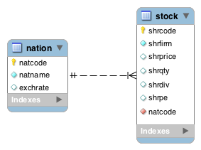

### Querying a two-table database

A two-table database offers the opportunity to learn more SQL and
another relational algebra operation: join.

#### Join

Join creates a new table from two existing tables by matching on a
column common to both tables. Usually, the common column is a primary
key--foreign key pair: The primary key of one table is matched with the
foreign key of another table. Join is frequently used to get the data
for a query into a single row. Consider the tables `nation` and `stock`. If
we want to calculate the value---in British pounds---of a stock, we
multiply stock price by stock quantity and then exchange rate. To find
the appropriate exchange rate for a stock, get its `natcode` from stock
and then find the exchange rate in the matching row in `nation`, the one
with the same value for `natcode`. For example, to calculate the value of
Georgia Peach, which has `natcode` = \'US\', find the row in `nation` that
also has `natcode` = \'US\'. In this case, the stock's value is
2.35\*387333\*0.67 = £609,855.81.

Calculation of stock value is very easy once a join is used to get the
three values in one row. The SQL command for joining the two tables is:

```{sql, connection = db, eval = FALSE}
SELECT * FROM stock JOIN nation
	ON stock.natcode = nation.natcode;
```

*The join of stock and nation*

  stkcode   stkfirm               stkprice   stkqty    stkdiv   stkpe   natcode   natcode   natname          exchrate
  --------- --------------------- ---------- --------- -------- ------- --------- --------- ---------------- ----------
  NE        Narembeen Emu         12.34      45619     1        8       AUS       AUS       Australia        0.4600
  IR        Indooroopilly Ruby    15.92      56147     0.5      20      AUS       AUS       Australia        0.4600
  QD        Queensland Diamond    6.73       89251     0.5      7       AUS       AUS       Australia        0.4600
  BD        Bombay Duck           25.55      167382    1        12      IND       IND       India            0.0228
  ROF       Royal Ostrich Farms   33.75      1234923   3        6       UK        UK        United Kingdom   1.0000
  CS        Canadian Sugar        52.78      4716      2.5      15      UK        UK        United Kingdom   1.0000
  FC        Freedonia Copper      27.5       10529     1.84     16      UK        UK        United Kingdom   1.0000
  BS        Bolivian Sheep        12.75      231678    1.78     11      UK        UK        United Kingdom   1.0000
  BE        Burmese Elephant      0.07       154713    0.01     3       UK        UK        United Kingdom   1.0000
  ILZ       Indian Lead & Zinc    37.75      6390      3        12      UK        UK        United Kingdom   1.0000
  SLG       Sri Lankan Gold       50.37      32868     2.68     16      UK        UK        United Kingdom   1.0000
  AR        Abyssinian Ruby       31.82      22010     1.32     13      UK        UK        United Kingdom   1.0000
  PT        Patagonian Tea        55.25      12635     2.5      10      UK        UK        United Kingdom   1.0000
  NG        Nigerian Geese        35         12323     1.68     10      UK        UK        United Kingdom   1.0000
  MG        Minnesota Gold        53.87      816122    1        25      US        US        United States    0.6700
  GP        Georgia Peach         2.35       387333    0.2      5       US        US        United States    0.6700

The columns `stkprice` and `stkdiv` record values in the country's currency.
Thus, the price of Bombay Duck is 25.55 Indian rupees. To find the value
in U.K. pounds (GPB), multiply the price by 0.0228, because one rupee is
worth 0.0228 GPB. The value of one share of Bombay Duck in U.S. dollars
(USD) is 25.55\*0.0228/0.67 because one USD is worth 0.67 GBP.

There are several things to notice about the SQL command and the result:

* To avoid confusion because `natcode` is a column name in both stock and
nation, it needs to be qualified. If `natcode` is not qualified, the
system will reject the query because it cannot distinguish between the
two columns titled `natcode`.

* The new table has the `natcode` column replicated. Both are called
`natcode`. The naming convention for the replicated column varies with the
RDBMS. The columns, for example, should be labeled `stock.natcode` and
`nation.natcode`.

* The SQL command specifies the names of the tables to be joined, the
columns to be used for matching, and the condition for the match
(equality in this case).

* The number of columns in the new table is the sum of the columns in the
two tables.

* The stock value calculation is now easily specified in an SQL command
because all the data are in one row.

Remember that during data modeling we created two entities, STOCK and
NATION, and defined the relationship between them. We showed that if the
data were stored in one table, there could be updating problems. Now,
with a join, we have combined these data. So why separate the data only
to put them back together later? There are two reasons. First, we want
to avoid update anomalies. Second, as you will discover, we do not join
the same tables every time.

Join comes in several flavors. The matching condition can be =, \<\>,
\<=, \<, \>=, and \>. This generalized version is called a **theta
join**. Generally, when people refer to a join, they mean an equijoin,
when the matching condition is equality.

*In an alphabetical list of employees, how many appear before Clare?*

```{sql, connection = db, eval = FALSE}
SELECT count(*) FROM emp A JOIN emp B
  ON A.empfname > B.empfname
  WHERE A.empfname = "Clare"
```

A join can be combined with other SQL commands.

*Report the value of each stockholding in UK pounds. Sort the report by
nation and firm.*

```{sql, connection = db, eval = FALSE}
SELECT natname, stkfirm, stkprice, stkqty, exchrate,
	stkprice*stkqty*exchrate as stkvalue
		FROM stock JOIN nation
			ON stock.natcode = nation.natcode
				ORDER BY natname, stkfirm;
```

  natname          stkfirm               stkprice   stkqty    exchrate   stkvalue
  ---------------- --------------------- ---------- --------- ---------- ----------
  Australia        Indooroopilly Ruby    15.92      56147     0.4600     411176
  Australia        Narembeen Emu         12.34      45619     0.4600     258952
  Australia        Queensland Diamond    6.73       89251     0.4600     276303
  India            Bombay Duck           25.55      167382    0.0228     97507
  United Kingdom   Abyssinian Ruby       31.82      22010     1.0000     700358
  United Kingdom   Bolivian Sheep        12.75      231678    1.0000     2953895
  United Kingdom   Burmese Elephant      0.07       154713    1.0000     10830
  United Kingdom   Canadian Sugar        52.78      4716      1.0000     248910
  United Kingdom   Freedonia Copper      27.5       10529     1.0000     289548
  United Kingdom   Indian Lead & Zinc    37.75      6390      1.0000     241223
  United Kingdom   Nigerian Geese        35         12323     1.0000     431305
  United Kingdom   Patagonian Tea        55.25      12635     1.0000     698084
  United Kingdom   Royal Ostrich Farms   33.75      1234923   1.0000     41678651
  United Kingdom   Sri Lankan Gold       50.37      32868     1.0000     1655561
  United States    Georgia Peach         2.35       387333    0.6700     609856
  United States    Minnesota Gold        53.87      816122    0.6700     29456210

#### Control break reporting

The purpose of a join is to collect the necessary data for a report.
When two tables in a 1:m relationship are joined, the report will
contain repetitive data. If you re-examine the report from the previous
join, you will see that `nation` and `exchrate` are often repeated because
the same values apply to many stocks. A more appropriate format is shown
in the following figure, an example of a **control break report**.

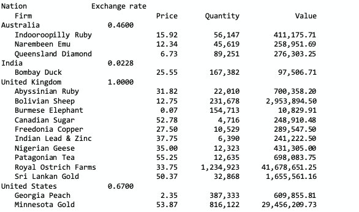

A control break report recognizes that the values in a particular column
or columns seldom change. In this case, `natname` and `exchrate` are often
the same from one row to the next, so it makes sense to report these
data only when they change. The report is also easier to read. The
column `natname` is known as a *control field*. Notice that there are four
groups of data, because `natname` has four different values.

Many RDBMS packages have report-writing languages to facilitate creating
a control break report. These languages typically support summary
reporting for each group of rows having the same value for the control
field(s). A table must usually be sorted on the control break field(s)
before the report is created.

##### GROUP BY---reporting by groups

The GROUP BY clause is an elementary form of control break reporting. It
permits grouping of rows that have the same value for a specified column
or columns, and it produces one row for each different value of the
grouping column(s).

*Report by nation the total value of stockholdings.*

```{sql, connection = db, eval = FALSE}
SELECT natname, sum(stkprice*stkqty*exchrate) as stkvalue
	FROM stock JOIN nation ON stock.natcode = nation.natcode
		GROUP BY natname;
```

  natname          stkvalue
  ---------------- ----------
  Australia        946431
  India            97507
  United Kingdom   48908364
  United States    30066066

SQL's built-in functions (COUNT, SUM, AVERAGE, MIN, and MAX) can be used
with the GROUP BY clause. They are applied to a group of rows having the
same value for a specified column. You can specify more than one
function in a SELECT statement. For example, we can compute total value
and number of different stocks and group by nation using:

*Report the number of stocks and their total value by nation.*

```{sql, connection = db, eval = FALSE}
SELECT natname, COUNT(*), SUM(stkprice*stkqty*exchrate) AS stkvalue
	FROM stock JOIN nation ON stock.natcode = nation.natcode
		GROUP BY natname;
```

  natname          count   stkvalue
  ---------------- ------- ----------
  Australia        3       946431
  India            1       97507
  United Kingdom   10      48908364
  United States    2       30066066

You can group by more than one column name; however, all column names
appearing in the SELECT clause must be associated with a built-in
function or be in a GROUP BY clause.

*List stocks by nation, and for each nation show the number of stocks for each PE ratio and the total value of those stock holdings in UK pounds.*

```{sql, connection = db, eval = FALSE}
SELECT natname,stkpe,COUNT(*),
	SUM(stkprice*stkqty*exchrate) AS stkvalue
		FROM stock JOIN nation ON stock.natcode = nation.natcode
			GROUP BY natname, stkpe;
```

  natname          stkpe   count   stkvalue
  ---------------- ------- ------- ----------
  Australia        7       1       276303
  Australia        8       1       258952
  Australia        20      1       411176
  India            12      1       97507
  United Kingdom   3       1       10830
  United Kingdom   6       1       41678651
  United Kingdom   10      2       1129389
  United Kingdom   11      1       2953895
  United Kingdom   12      1       241223
  United Kingdom   13      1       700358
  United Kingdom   15      1       248910
  United Kingdom   16      2       1945109
  United States    5       1       609856
  United States    25      1       29456210

In this example, stocks are grouped by both `natname` and `stkpe`. In most
cases, there is only one stock for each pair of `natname` and `stkpe`;
however, there are two situations (U.K. stocks with PEs of 10 and 16)
where details of multiple stocks are grouped into one report line.
Examining the values in the COUNT column helps you to identify these
stocks.

##### HAVING---the WHERE clause of groups

HAVING does in the GROUP BY what the WHERE clause does in a SELECT. It
restricts the number of groups reported, whereas WHERE restricts the
number of rows reported. Used with built-in functions, HAVING is always
preceded by GROUP BY and is always followed by a function (SUM, AVG,
MAX, MIN, or COUNT).

*Report the total value of stocks for nations with two or more listed stocks.*

```{sql, connection = db, eval = FALSE}
SELECT natname, SUM(stkprice*stkqty*exchrate) AS stkvalue
	FROM stock JOIN nation ON stock.natcode = nation.natcode
		GROUP BY natname
			HAVING COUNT(*) >= 2;
```

  natname          stkvalue
  ---------------- ----------
  Australia        946431
  United Kingdom   48908364
  United States    30066066

+-------------------------------------------------+
| *Skill Builder*                                 |
|                                                 |
| Report by nation the total value of dividends.  |
+-------------------------------------------------+

#### Regular expression---pattern matching

Regular expression was introduced in the previous chapter, and we will
now continue to learn some more of its features.

##### Search for a string not containing specified characters

The \^ (carat) is the symbol for NOT. It is used when we want to find a
string not containing a character in one or more specified strings. For
example, \[\^a-f\] means any character not in the set containing a, b,
c, d, e, or f.

*List the names of nations with non-alphabetic characters in their names*

```{sql, connection = db, eval = FALSE}
SELECT natname FROM nation WHERE natname REGEXP '[^a-z|A-Z]'
```
  natname
  ----------------
  United Kingdom
  United States

Notice that the nations reported have a space in their name, which is a
character not in the range a-z and not in A-Z.

##### Search for string containing a repeated pattern or repetition

A pair of curly brackets is used to denote the repetition factor for a
pattern. For example, {n} means repeat a specified pattern n times.

*List the names of firms with a double 'e'.*

```{sql, connection = db, eval = FALSE}
SELECT stkfirm FROM stock WHERE stkfirm REGEXP '[e]{2}';
```

  stkfirm
  ------------------
  Bolivian Sheep
  Freedonia Copper
  Narembeen Emu
  Nigerian Geese

##### Search combining alternation and repetition

Regular expressions becomes very powerful when you combine several of
the basic capabilities into a single search expression.

*List the names of firms with a double 's' or a double 'n'.*

```{sql, connection = db, eval = FALSE}
SELECT stkfirm FROM stock WHERE stkfirm REGEXP '[s]{2}|[n]{2}';
```

  stkfirm
  -----------------
  Abyssinian Ruby
  Minnesota Gold

##### Search for multiple versions of a string

If you are interested in find a string containing several specified
string, you can use the square brackets to indicate the sought strings.
For example, \[ea\] means any character from the set containing e and a.

*List the names of firms with names that include 'inia' or 'onia'.*

```{sql, connection = db, eval = FALSE}
SELECT stkfirm FROM stock WHERE stkfirm REGEXP '[io]nia';
```

  shrfirm
  ------------------
  Abyssinian Ruby
  Freedonia Copper
  Patagonian Tea

##### Search for a string in a particular position

Sometimes you might be interested in identifying a string with a
character in a particular position.

*Find firms with 't' as the third letter of their name.*

```{sql, connection = db, eval = FALSE}
SELECT stkfirm FROM stock WHERE stkfirm REGEXP '^(.){2}t';
```

  shrfirm
  ----------------
  Patagonian Tea

The regular expression has three elements:

* \^ indicates start searching at the beginning of the string;

* (.){2} specifies that anything is acceptable for the next two
characters;

* t indicates what the next character, the third, must be.

You have seen a few of the features of a very powerful tool. To learn
more about regular expressions, see regexlib.com,^12^ which contains a
library of regular expressions and a feature for finding expressions to
solve specific problems. Check out the regular expression for checking
whether a character string is a valid email address.

#### Subqueries

A subquery, or nested SELECT, is a SELECT nested within another SELECT.
A subquery can be used to return a list of values subsequently searched
with an IN clause.

*Report the names of all Australian stocks.*

```{sql, connection = db, eval = FALSE}
SELECT stkfirm FROM stock
	WHERE natcode IN
		(SELECT natcode FROM nation
			WHERE natname = 'Australia');
```

  stkfirm
  --------------------
  Narembeen Emu
  Queensland Diamond
  Indooroopilly Ruby

Conceptually, the subquery is evaluated first. It returns a list of
values for natcode (\'AUS\') so that the query then is the same as:

```{sql, connection = db, eval = FALSE}
SELECT stkfirm FROM stock
	WHERE natcode IN ('AUS');
```

When discussing subqueries, sometimes a subquery is also called an
**inner query**. The term **outer query** is applied to the SQL
preceding the inner query. In this case, the outer and inner queries
are:

+-------------+---------------------------------+
| Outer query | SELECT stkfirm FROM stock       |
|             |                                 |
|             | WHERE natcode IN                |
+=============+=================================+
| Inner query | (SELECT natcode FROM nation     |
|             |                                 |
|             | WHERE natname = \'Australia\'); |
+-------------+---------------------------------+

Note that in this case we do not have to qualify `natcode`. There is no
identity crisis, because `natcode` in the inner query is implicitly
qualified as `nation.natcode` and `natcode` in the outer query is understood
to be `stock.natcode`.

This query also can be run as a join by writing:

```{sql, connection = db, eval = FALSE}
SELECT stkfirm FROM stock JOIN nation
	ON stock.natcode = nation.natcode
	AND natname = 'Australia';
```

##### Correlated subquery

In a correlated subquery, the subquery cannot be evaluated independently
of the outer query. It depends on the outer query for the values it
needs to resolve the inner query. The subquery is evaluated for each
value passed to it by the outer query. An example illustrates when you
might use a correlated subquery and how it operates.

*Find those stocks where the quantity is greater than the average for that country.*

An approach to this query is to examine the rows of stock one a time,
and each time compare the quantity of stock to the average for that
country. This means that for each row, the subquery must receive the
outer query's country code so it can compute the average for that
country.

```{sql, connection = db, eval = FALSE}
SELECT natname, stkfirm, stkqty FROM stock JOIN nation
	ON stock.natcode = nation.natcode
	WHERE stkqty > 
		(SELECT avg(stkqty) FROM stock
			WHERE stock.natcode = nation.natcode);
```

  natname          stkfirm               stkqty
  ---------------- --------------------- ---------
  Australia        Queensland Diamond    89251
  United Kingdom   Bolivian Sheep        231678
  United Kingdom   Royal Ostrich Farms   1234923
  United States    Minnesota Gold        816122

Conceptually, think of this query as stepping through the join of `stock`
and `nation` one row at a time and executing the subquery each time. The
first row has `natcode` = \'AUS\' so the subquery becomes

```{sql, connection = db, eval = FALSE}
SELECT AVG(stkqty) FROM stock
	WHERE stock.natcode = 'AUS';
```

Since the average stock quantity for Australian stocks is 63,672.33, the
first row in the join, Narembeen Emu, is not reported. Neither is the
second row reported, but the third is.

The term **correlated subquery** is used because the inner query's
execution depends on receiving a value for a variable (`nation.natcode` in
this instance) from the outer query. Thus, the inner query of the
correlated subquery cannot be evaluated once and for all. It must be
evaluated repeatedly---once for each value of the variable received from
the outer query. In this respect, a correlated subquery is different
from a subquery, where the inner query needs to be evaluated only once.
The requirement to compare each row of a table against a function (e.g.,
average or count) for some rows of a column is usually a clue that you
need to write a correlated subquery.

+-----------------------------------------------------------------------------+
| *Skill builder*                                                             |
|                                                                             |
| Why are no Indian stocks reported in the correlated subquery example?       |
| How would you change the query to report an Indian stock?                   |
|                                                                             |
| Report only the three stocks with the largest quantities (i.e., do the      |
| query without using ORDER BY).                                              |
+-----------------------------------------------------------------------------+

#### Views---virtual tables

You might have noticed that in these examples we repeated the join and
stock value calculation for each query. Ideally, we should do this once,
store the result, and be able to use it with other queries. We can do so
if we create a ***view***, a virtual table. A view does not physically
exist as stored data; it is an imaginary table constructed from existing
tables as required. You can treat a view as if it were a table and write
SQL to query it.

A view contains selected columns from one or more tables. The selected
columns can be renamed and rearranged. New columns based on arithmetic
expressions can be created. GROUP BY can also be used when creating a
view. Remember, a view contains no actual data. It is a virtual table.

This SQL command does the join, calculates stock value, and saves the
result as a view:

```{sql, connection = db, eval = FALSE}
CREATE VIEW stkvalue
	(nation, firm, price, qty, exchrate, value)
	AS SELECT natname, stkfirm, stkprice, stkqty, exchrate,
		stkprice*stkqty*exchrate
			FROM stock JOIN nation
			ON stock.natcode = nation.natcode;
```

There are several things to notice about creating a view:

* The six names enclosed by parentheses are the column names for the view.

* There is a one-to-one correspondence between the names in parentheses
and the names or expressions in the SELECT clause. Thus the view column
named `value` contains the result of the arithmetic expression
`stkprice`\*`stkqty`\*`exchrate`.

A view can be used in a query, such as:

*Find stocks with a value greater than £100,000.*

```{sql, connection = db, eval = FALSE}
SELECT nation, firm, value FROM stkvalue WHERE value > 100000;
```

  nation           firm                  value
  ---------------- --------------------- ----------
  United Kingdom   Freedonia Copper      289548
  United Kingdom   Patagonian Tea        698084
  United Kingdom   Abyssinian Ruby       700358
  United Kingdom   Sri Lankan Gold       1655561
  United Kingdom   Indian Lead & Zinc    241223
  United Kingdom   Bolivian Sheep        2953895
  United Kingdom   Nigerian Geese        431305
  United Kingdom   Canadian Sugar        248910
  United Kingdom   Royal Ostrich Farms   41678651
  United States    Minnesota Gold        29456210
  United States    Georgia Peach         609856
  Australia        Narembeen Emu         258952
  Australia        Queensland Diamond    276303
  Australia        Indooroopilly Ruby    411176

There are two main reasons for creating a view. *First**, ***as we have
seen, query writing can be simplified. If you find that you are
frequently writing the same section of code for a variety of queries,
then isolate the common section and put it in a view. This means that
you will usually create a view when a fact, such as stock value, is
derived from other facts in the table.

The *second* reason is to restrict access to certain columns or rows.
For example, the person who updates `stock` could be given a view that
excludes `stkqty`. In this case, changes in stock prices could be updated
without revealing confidential information, such as the value of the
stock portfolio.

+--------------------------------------------------------------------------+
| *Skill builder*                                                          |
|                                                                          |
| How could you use a view to solve the following query that was used when |
| discussing the correlated subquery?                                      |
|                                                                          |
| *Find those stocks where the quantity is greater than the average for    |
| that country.*                                                           |
+--------------------------------------------------------------------------+

### Summary

Entities are related to other entities by relationships. The 1:m
(one-to-many) relationship occurs frequently in data models. An
additional entity is required to represent a 1:m relationship to avoid
update anomalies. In a relational database, a 1:m relationship is
represented by an additional column, the foreign key, in the table at
the many end of the relationship. The referential integrity constraint
insists that a foreign key must always exist as a primary key in a
table. A foreign key constraint is specified in a CREATE statement.

Join creates a new table from two existing tables by matching on a
column common to both tables. Often the common column is a primary
key--foreign key combination. A theta-join can have matching conditions
of =, \<\>, \<=, \<, \>=, and \>. An equijoin describes the situation
where the matching condition is equality. The GROUP BY clause is used to
create an elementary control break report. The HAVING clause of GROUP BY
is like the WHERE clause of SELECT. A subquery, which has a SELECT
statement within another SELECT statement, causes two SELECT statements
to be executed---one for the inner query and one for the outer query. A
correlated subquery is executed as many times as there are rows selected
by the outer query. A view is a virtual table that is created when
required. Views can simplify report writing and restrict access to
specified columns or rows.

Key terms and concepts
------------------------------------ --------------------------------------------------
Constraint                           JOIN
Control break reporting              One-to-many (1:m) relationship
Correlated subquery                  Referential integrity
Delete anomalies                     Relationship
Equijoin                             Theta-join
Foreign key                          Update anomalies
GROUP BY                             Views
HAVING                               Virtual table
Insert anomalies

#### Exercises

1.  Draw data models for the following situations. In each case, make
    certain that you show the attributes and feasible identifiers:

    a. A farmer can have many cows, but a cow belongs to only one
        farmer.

    b. A university has many students, and a student can attend at most
        one university.

    c. An aircraft can have many passengers, but a passenger can be on
        only one flight at a time.

    d. A nation can have many states and a state many cities.

    e. An art researcher has asked you to design a database to record
        details of artists and the museums in which their paintings are
        displayed. For each painting, the researcher wants to know the
        size of the canvas, year painted, title, and style. The
        nationality, date of birth, and death of each artist must be
        recorded. For each museum, record details of its location and
        specialty, if it has one.

2. Report all values in British pounds:

    a. Report the value of stocks listed in Australia.

    b. Report the dividend payment of all stocks.

    c. Report the total dividend payment by nation.

    d. Create a view containing nation, firm, price, quantity, exchange
        rate, value, and yield.

    e. Report the average yield by nation.

    f. Report the minimum and maximum yield for each nation.

    g. Report the nations where the average yield of stocks exceeds the
        average yield of all stocks.

3. How would you change the queries in exercise 4-2 if you were
    required to report the values in American dollars, Australian
    dollars, or Indian rupees?

4. What is a foreign key and what role does it serve?

5. What is the referential integrity constraint? Why should it be
    enforced?

6. Kisha, against the advice of her friends, is simultaneously studying
    data management and Shakespearean drama. She thought the two
    subjects would be an interesting contrast. However, the classes are
    very demanding and often enter her midsummer dreams. Last night, she
    dreamed that William Shakespeare wanted her to draw a data model. He
    explained, before she woke up in a cold sweat, that a play had many
    characters but the same character never appeared in more than one
    play. "Methinks," he said, "the same name may have appeareth more
    than the once, but 'twas always a person of a different ilk." He
    then, she hazily recollects, went on to spout about the quality of
    data dropping like the gentle rain. Draw a data model to keep old
    Bill quiet and help Kisha get some sleep.

7. An orchestra has four broad classes of instruments (strings,
    woodwinds, brass, and percussion). Each class contains musicians who
    play different instruments. For example, the strings section of a
    full symphony orchestra contains 2 harps, 16 to 18 first violins, 14
    to 16 second violins, 12 violas, 10 cellos, and 8 double basses. A
    city has asked you to develop a database to store details of the
    musicians in its three orchestras. All the musicians are specialists
    and play only one instrument for one orchestra.
    
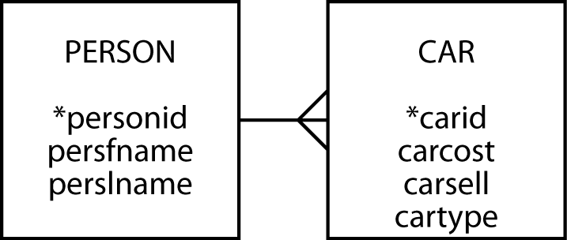

8. Answer the following queries based on the following database for a
    car dealer:
    
    a.  What is the personid of Sheila O'Hara?


    b. List sales personnel sorted by last name and within last name,
        first name.

    c. List details of the sales made by Bruce Bush.

    d. List details of all sales showing the gross profit (selling
        price minus cost price).

    e. Report the number of cars sold of each type.

    f. What is the average selling price of cars sold by Sue Lim?

    g. Report details of all sales where the gross profit is less than
        the average.

    h. What was the maximum selling price of any car?

    i. What is the total gross profit?

    j. Report the gross profit made by each salesperson who sold at
        least three cars.

    k. Create a view containing all the details in the car table and
        the gross profit

17. Find stocks where the third or fourth letter in their name is an
    \'m\'.

18. An electricity supply company needs a database to record details of
    solar panels installed on its customers' homes so it can estimate
    how much solar energy will be generated based on the forecast level
    of solar radiation for each house's location. A solar panel has an
    area, measured in square meters, and an efficiency expressed as a
    percentage (e.g., 22% efficiency means that 22% of the incident
    solar energy is converted into electrical energy). Create a data
    model. How will you identify each customer and each panel?

#### CD library case

Ajay soon realized that a CD contains far more data that just a list of
track titles and their length. Now that he had learned about the 1:m
relationship, he was ready to add some more detail. He recognized that a
CD contains many tracks, and a label (e.g., Atlantic) releases many CDs.
He revised his data model to include these additional entities (CD and
LABEL) and their relationships.

*CD library V2.0*


*Giant Steps* and *Swing* are both on the Atlantic label; the data are

  [lbltitle]{.underline}   lblstreet              lblcity    lblstate   lblpostcode   lblnation
  ------------------------ ---------------------- ---------- ---------- ------------- -----------
  Atlantic                 75 Rockefeller Plaza   New York   NY         10019         USA

The cd data, where lbltitle is the foreign key, are

  cdid   cdlblid   cdtitle       cdyear   l*bltitle*
  ------ --------- ------------- -------- ------------
  1      A2 1311   Giant Steps   1960     Atlantic
  2      83012-2   Swing         1977     Atlantic

The track data, where *cdid* is the foreign key, are

  [trkid]{.underline}   trknum   trktitle                   trklength   cdid
  --------------------- -------- -------------------------- ----------- ------
  1                     1        Giant Steps                4.72        1
  2                     2        Cousin Mary                5.75        1
  3                     3        Countdown                  2.35        1
  4                     4        Spiral                     5.93        1
  5                     5        Syeeda's Song Flute        7           1
  6                     6        Naima                      4.35        1
  7                     7        Mr. P.C.                   6.95        1
  8                     8        Giant Steps                3.67        1
  9                     9        Naima                      4.45        1
  10                    10       Cousin Mary                5.9         1
  11                    11       Countdown                  4.55        1
  12                    12       Syeeda's Song Flute        7.03        1
  13                    1        Stomp of King Porter       3.2         2
  14                    2        Sing a Study in Brown      2.85        2
  15                    3        Sing Moten's Swing         3.6         2
  16                    4        A-tisket, A-tasket         2.95        2
  17                    5        I Know Why                 3.57        2
  18                    6        Sing You Sinners           2.75        2
  19                    7        Java Jive                  2.85        2
  20                    8        Down South Camp Meetin'    3.25        2
  21                    9        Topsy                      3.23        2
  22                    10       Clouds                     7.2         2
  23                    11       Skyliner                   3.18        2
  24                    12       It's Good Enough to Keep   3.18        2
  25                    13       Choo Choo Ch' Boogie       3           2

+-------------------------------------------------------------------------------+
| *Skill builder*                                                               |
|                                                                               |
| Create tables to store the label and CD data. Add a column to `track` to      |
| store the foreign key. Then, either enter the new data or download it         |
| from the Web site. Define `lbltitle` as a foreign key in `cd` and `cdid` as a |
| foreign key in `track`.                                                       |
+-------------------------------------------------------------------------------+

Ajay ran a few queries on his revised database.

*What are the tracks on Swing?*

This query requires joining `track` and `cd` because the name of a CD
(*Swing* in this case) is stored in `cd` and track data are stored in
`track`. The foreign key of `track` is matched to the primary key of cd
(i.e., `track.cdid` = `cd.cdid`).

```{sql, connection = db, eval = FALSE}
SELECT trknum, trktitle, trklength FROM track JOIN cd
	ON track.cdid = cd.cdid
	WHERE cdtitle = 'Swing';
```

  trknum   trktitle                   trklength
  -------- -------------------------- -----------
  1        Stomp of King Porter       3.2
  2        Sing a Study in Brown      2.85
  3        Sing Moten's Swing         3.6
  4        A-tisket, A-tasket         2.95
  5        I Know Why                 3.57
  6        Sing You Sinners           2.75
  7        Java Jive                  2.85
  8        Down South Camp Meetin'    3.25
  9        Topsy                      3.23
  10       Clouds                     7.2
  11       Skyliner                   3.18
  12       It's Good Enough to Keep   3.18
  13       Choo Choo Ch' Boogie       3

*What is the longest track on Swing?*

Like the prior query, this one requires joining track and cd. The inner
query isolates the tracks on *Swing* and then selects the longest of
these using the MAX function. The outer query also isolates the tracks
on *Swing* and selects the track equal to the maximum length. The outer
query must restrict attention to tracks on *Swing* in case there are
other tracks in the track table with a time equal to the value returned
by the inner query.

```{sql, connection = db, eval = FALSE}
SELECT trknum, trktitle, trklength FROM track JOIN cd
	ON track.cdid = cd.cdid
	WHERE cdtitle = 'Swing'
	AND trklength = 
		(select max(trklength) FROM track, cd
			WHERE track.cdid = cd.cdid
			AND cdtitle = 'Swing');
```

  trknum   trktitle   trklength
  -------- ---------- -----------
  10       Clouds     7.2

*What are the titles of CDs containing some tracks less than 3 minutes long and on U.S.-based labels? List details of these tracks as well.*

This is a three-table join since resolution of the query requires data
from `cd` (`cdtitle`), `track` (`trktitle`), and `label` (`lblnation`).

```{sql, connection = db, eval = FALSE}
SELECT cdtitle, trktitle, trklength FROM track JOIN cd
	ON track.cdid = cd.cdid
	JOIN label
	ON cd.lbltitle = label.lbltitle
	WHERE trklength < 3
	AND lblnation = 'USA';
```

  cdtitle       trktitle                trklength
  ------------- ----------------------- -----------
  Giant Steps   Countdown               2.35
  Swing         Sing a Study in Brown   2.85
  Swing         A-tisket, A-tasket      2.95
  Swing         Sing You Sinners        2.75
  Swing         Java Jive               2.85

*Report the number of tracks on each CD.*

This query requires GROUP BY because the number of tracks on each CD is
totaled by using the aggregate function COUNT.

```{sql, connection = db, eval = FALSE}
SELECT cdtitle, count(*) AS tracks FROM track JOIN cd
	ON track.cdid = cd.cdid
		GROUP BY cdtitle;
```

  cdtitle       tracks
  ------------- --------
  Giant Steps   12
  Swing         13

*Report, in ascending order, the total length of tracks on each CD.*

This is another example of GROUP BY. In this case, SUM is used to
accumulate track length, and ORDER BY is used for sorting in ascending
order, the default sort order.

```{sql, connection = db, eval = FALSE}
SELECT cdtitle, SUM(trklength) AS sumtrklen FROM track JOIN cd
	ON track.cdid = cd.cdid
		GROUP BY cdtitle
			ORDER BY SUM(trklength);
```

  cdtitle       sumtrklen
  ------------- -----------
  Swing         44.81
  Giant Steps   62.65

*Does either CD have more than 60 minutes of music?*

This query uses the HAVING clause to limit the CDs reported based on
their total length.

```{sql, connection = db, eval = FALSE}
SELECT cdtitle, SUM(trklength) AS sumtrklen FROM track JOIN cd
	ON track.cdid = cd.cdid
		GROUP BY cdtitle HAVING SUM(trklength) > 60;
```

  cdtitle       sumtrklen
  ------------- -----------
  Giant Steps   62.65
  
+----------------------------------------------------------+
| *Skill Builder*                                          |
|                                                          |
| 1.  Write SQL for the following queries:                 |
|                                                          |
|     a. List the tracks by CD in order of track length.   |
|                                                          |
|     b. What is the longest track on each CD?             |
|                                                          |
| 2. What is wrong with the current data model?            |
|                                                          |
| 3. Could cdlblid be used as an identifier for CD?        |
+----------------------------------------------------------+

## The Many-to-Many Relationship

> *Fearful concatenation of circumstances.*
>
> Daniel Webster

### Learning objectives

Students completing this chapter will be able to

* model a many-to-many relationship between two entities;

* define a database with a many-to-many relationship;

* write queries for a database with a many-to-many relationship.


Alice
was deeply involved in uncovering the workings of her firm. She spent
hours talking to the staff, wanting to know everything about the
products sold. She engaged many a customer in conversation to find out
why they shopped at The Expeditioner, what they were looking for, and
how they thought the business could be improved. She examined all the
products herself and pestered the staff to tell her who bought them, how
they were used, how many were sold, who supplied them, and a host of
other questions. She plowed (or should that be "ploughed") through
accounting journals, sales reports, and market forecasts. She was more
than a new broom; she was a giant vacuum cleaner sucking up data about
the firm so that she would be prepared to manage it successfully.

Ned, the marketing manager, was a Jekyll and Hyde character. By day he
was a charming, savvy, marketing executive. Walking to work in his
three-piece suit, bowler hat, and furled umbrella, he was the epitome of
the conservative English businessman. By night he became a computer nerd
with ragged jeans, a T-shirt, black-framed glasses, and unruly hair. Ned
had been desperate to introduce computers to The Expeditioner for years,
but he knew that he could never reveal his second nature. The other
staff at The Expeditioner just would not accept such a radical change in
technology. Why, they had not even switched to fountain pens until their
personal stock of quill pens was finally depleted. Ned was just not
prepared to face the indignant silence and contempt that would greet his
mere mention of computers. It was better to continue a secret double
life than admit to being a cyber punk.

But times were changing, and Ned saw the opportunity. He furtively
suggested to Lady Alice that perhaps she needed a database of sales
facts. Her response was instantaneous: "Yes, and do it as soon as
possible." Ned was ecstatic. This was truly a wonderful woman.

### Consider the case when items are sold. We can immediately identify two
entities: SALE and ITEM. A sale can contain many items, and an item can
appear in many sales. We are not saying the same item can be sold many
times, but the particular type of item (e.g., a compass) can be sold
many times; thus we have a many-to-many (m:m) relationship between SALE
and ITEM. When we have an m:m relationship, we create a third entity to
link the entities through two 1:m relationships. Usually, it is fairly
easy to name this third entity. In this case, this third entity,
typically known as an **associative entity**, is called LINE ITEM. A
typical old style sales form lists the items purchased by a customer.
Each of the lines appearing on the order form is generally known in
retailing as a line item, which links an item and a sale.

*A sales form*

+------------------+-------------+----------+------------+-------+--+
| The Expeditioner |             |          |            |       |  |
| ---------------- |             |          |            |       |  |
|                  |             |          |            |       |  |
| Sale of Goods    |             |          |            |       |  |
+==================+=============+==========+============+=======+==+
| Sale\#           | Date:       |          |            |       |  |
+------------------+-------------+----------+------------+-------+--+
| Item\#           | Description | Quantity | Unit price | Total |  |
+------------------+-------------+----------+------------+-------+--+
| 1                |             |          |            |       |  |
+------------------+-------------+----------+------------+-------+--+
| 2                |             |          |            |       |  |
+------------------+-------------+----------+------------+-------+--+
| 3                |             |          |            |       |  |
+------------------+-------------+----------+------------+-------+--+
| 4                |             |          |            |       |  |
+------------------+-------------+----------+------------+-------+--+
| 5                |             |          |            |       |  |
+------------------+-------------+----------+------------+-------+--+
| 6                |             |          |            |       |  |
+------------------+-------------+----------+------------+-------+--+
| Grand total      |             |          |            |       |  |
+------------------+-------------+----------+------------+-------+--+

The representation of this m:m relationship is shown. We say
many-to-many because there are two relationships---an ITEM is related to
many SALEs, and a SALE is related to many ITEMs. This data model can
also be read as: "a sale has many line items, but a line item refers to
only one sale. Similarly, an item can appear as many line items, but a
line item references only one item."

*An m:m relationship between SALE and ITEM*

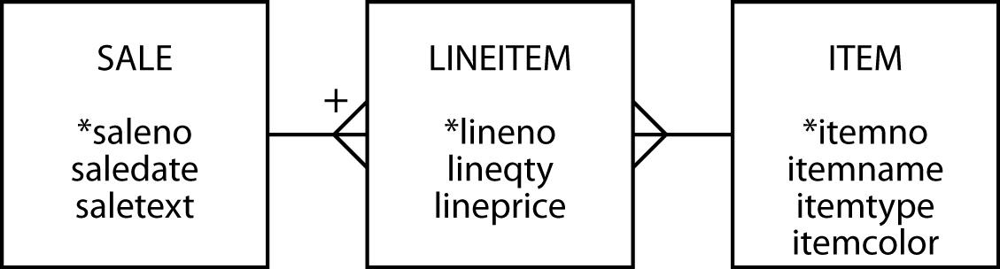

The entity SALE is identified by *saleno* and has the attributes
*saledate* and *saletext* (a brief comment on the customer---soft
information). LINEITEM is partially identified by *lineno* and has
attributes *lineqty* (the number of units sold) and *lineprice* (the
unit selling price for this sale). ITEM is identified by *itemno* and
has attributes *itemname*, *itemtype* (e.g., clothing, equipment,
navigation aids, furniture, and so on), and *itemcolor*.

If you look carefully at the m:m relationship figure, you will notice
that there is a plus sign (+) above the crow's foot at the "many" end of
the 1:m relationship between SALE and LINEITEM. This plus sign provides
information about the identifier of LINEITEM. As you know, every entity
must have a unique identifier. A sales order is a series of rows or
lines, and *lineno* is unique only within a particular order. If we just
use *lineno* as the identifier, we cannot guarantee that every instance
of LINEITEM is unique. If we use *saleno* and *lineno* together,
however, we have a unique identifier for every instance of LINEITEM.
Identifier *saleno* is unique for every sale, and *lineno* is unique
within any sale. The plus indicates that LINEITEM's unique identifier is
the concatenation of *saleno* and *lineno*. The order of concatenation
does not matter.

LINEITEM is termed a **weak entity** because it relies on another entity
for its existence and identification.

#### MySQL Workbench

Workbench automatically creates an associative entity for an m:m
relationship and populates it with a composite primary key based on
concatenating the primary keys of the two entities forming the m:m
relationship. *First*, draw the two tables and enter their respective
primary keys and columns. *Second*, select the m:m symbol and connect
the two tables through clicking on one and dragging to the second and
releasing. You can then modify the associative entity as required, such
as changing its primary key. The capability to automatically create an
associative entity for an m:m relationship is a very useful Workbench
feature.

*An m:m relationship with Workbench*


Workbench distinguishes between two types of relationships. An
**identifying relationship**, shown by a solid line, is used when the
entity at the many end of the relationship is a weak entity and needs
the identifier of the one end of the relationship to uniquely identify
an instance of the relationship, as in LINEITEM. An identifying
relationship corresponds to the + sign associated with a crow's foot.
The other type of relationship, shown by a dashed line, is known as a
*non-identifying* relationship. The mapping between the type of
relationship and the representation (i.e., dashed or solid line) is
arbitrary and thus not always easily recalled. We think that using a +
on the crow's foot is a better way of denoting weak entities.

When the relationship between SALE and ITEM is drawn in Workbench, as
shown in the following figure, there are two things to notice. *First*,
the table, lineitem, maps the associative entity generated for the m:m
relationship. *Second*, lineitem has an identifying relationship with
sale and a non-identifying relationship with item.

*An m:m relationship between SALE and ITEM in MySQL Workbench*

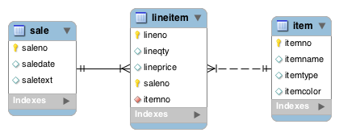

#### Why did we create a third entity?

When we have an m:m relationship, we create an associative entity to
store data about the relationship. In this case, we have to store data
about the items sold. We cannot store the data with SALE because a sale
can have many items, and an instance of an entity stores only
single-value facts. Similarly, we cannot store data with ITEM because an
item can appear in many sales. Since we cannot store data in SALE or
ITEM, we must create another entity to store data about the m:m
relationship.

You might find it useful to think of the m:m relationship as two 1:m
relationships. An item can appear on many line item listings, and a line
item entry refers to only one item. A sale has many line items, and each
line item entry refers to only one sale.

+---------------------------------------------------------------------------+
| ***Social Security number is not unique!***                               |
|                                                                           |
| Two girls named Sarah Lee Ferguson were born on May 3, 1959. The U.S.     |
| government considered them one and the same and issued both the same      |
| Social Security number (SSN), a nine-digit identifier of U.S. residents.  |
| Now Sarah Lee Ferguson Boles and Sarah Lee Ferguson Johnson share the     |
| same SSN.^13^                                                             |
|                                                                           |
| Mrs. Boles became aware of her SSN twin in 1987 when the Internal         |
| Revenue Service claimed there was a discrepancy in her reported income.   |
| Because SSN is widely used as an attribute or identifier in many          |
| computer systems, Mrs. Boles encountered other incidents of mistaken      |
| identity. Some of Mrs. Johnson's purchases appeared on Mrs. Boles'        |
| credit reports.                                                           |
|                                                                           |
| In late 1989, the Social Security Administration notified Mrs. Boles      |
| that her original number was given to her in error and she had to         |
| provide evidence of her age, identity, and citizenship to get a new       |
| number. When Mrs. Boles got her new SSN, it is likely she had to also     |
| get a new driver's license and establish a new credit history.            |
+---------------------------------------------------------------------------+

### Creating a relational database with an m:m relationship

As before, each entity becomes a table in a relational database, the
entity name becomes the table name, each attribute becomes a column, and
each identifier becomes a primary key. Remember, a 1:m relationship is
mapped by adding a column to the entity of the many end of the
relationship. The new column contains the identifier of the one end of
the relationship.

Conversion of the foregoing data model results in the three tables
following. Note the one-to-one correspondence between attributes and
columns for sale and item. Observe the lineitem has two additional
columns, saleno and itemno. Both of these columns are foreign keys in
lineitem (remember the use of italics to signify foreign keys). Two
foreign keys are required to record the two 1:m relationships. Notice in
lineitem that saleno is both part of the primary key and a foreign key.

*Tables sale, lineitem, and item*

  [saleno]{.underline}   saledate     saletext
  ---------------------- ------------ ------------------------------------------------
  1                      2003-01-15   Scruffy Australian---called himself Bruce.
  2                      2003-01-15   Man. Rather fond of hats.
  3                      2003-01-15   Woman. Planning to row Atlantic---lengthwise!
  4                      2003-01-15   Man. Trip to New York---thinks NY is a jungle!
  5                      2003-01-16   Expedition leader for African safari.

  [lineno]{.underline}   lineqty   lineprice   *[saleno]{.underline}*   *itemno*
  ---------------------- --------- ----------- ------------------------ ----------
  1                      1         4.5         1                        2
  1                      1         25          2                        6
  2                      1         20          2                        16
  3                      1         25          2                        19
  4                      1         2.25        2                        2
  1                      1         500         3                        4
  2                      1         2.25        3                        2
  1                      1         500         4                        4
  2                      1         65          4                        9
  3                      1         60          4                        13
  4                      1         75          4                        14
  5                      1         10          4                        3
  6                      1         2.25        4                        2
  1                      50        36          5                        10
  2                      50        40.5        5                        11
  3                      8         153         5                        12
  4                      1         60          5                        13
  5                      1         0           5                        2

  [itemno]{.underline}   itemname                itemtype   itemcolor
  ---------------------- ----------------------- ---------- -----------
  1                      Pocket knife---Nile     E          Brown
  2                      Pocket knife---Avon     E          Brown
  3                      Compass                 N          ---
  4                      Geopositioning system   N          ---
  5                      Map measure             N          ---
  6                      Hat---Polar Explorer    C          Red
  7                      Hat---Polar Explorer    C          White
  8                      Boots---snake proof     C          Green
  9                      Boots---snake proof     C          Black
  10                     Safari chair            F          Khaki
  11                     Hammock                 F          Khaki
  12                     Tent---8 person         F          Khaki
  13                     Tent---2 person         F          Khaki
  14                     Safari cooking kit      E          ---
  15                     Pith helmet             C          Khaki
  16                     Pith helmet             C          White
  17                     Map case                N          Brown
  18                     Sextant                 N          ---
  19                     Stetson                 C          Black
  20                     Stetson                 C          Brown

The SQL commands to create the three tables are as follows:

```{sql, connection = db, eval = FALSE}
CREATE TABLE sale (
	saleno		INTEGER,
	saledate		DATE NOT NULL,
	saletext		VARCHAR(50),
	  PRIMARY KEY(saleno));
```

```{sql, connection = db, eval = FALSE}
CREATE TABLE item (
	itemno		INTEGER,
	itemname		VARCHAR(30) NOT NULL,
	itemtype		CHAR(1) NOT NULL,
	itemcolor		VARCHAR(10),
		PRIMARY KEY(itemno));
```

```{sql, connection = db, eval = FALSE}
CREATE TABLE lineitem (
	lineno		INTEGER,
	lineqty		INTEGER NOT NULL,
	lineprice		DECIMAL(7,2) NOT NULL,
	saleno		INTEGER,
	itemno		INTEGER,
		PRIMARY KEY(lineno,saleno),
		CONSTRAINT fk_has_sale FOREIGN KEY(saleno)
			REFERENCES sale(saleno),
		CONSTRAINT fk_has_item FOREIGN KEY(itemno)
			REFERENCES item(itemno));
```

Although the `sale` and `item` tables are created in a similar fashion to
previous examples, there are two things to note about the definition of
`lineitem`. *First,* the primary key is a composite of `lineno` and `saleno`,
because together they uniquely identify an instance of `lineitem`.
*Second*, there are two foreign keys, because `lineno` is at the \"many\"
end of two 1: m relationships.

+--------------------------------------------------------------------------+
| *Skill builder*                                                          |
|                                                                          |
| A hamburger shop makes several types of hamburgers, and the same type of |
| ingredient can be used with several types of hamburgers. This does not   |
| literally mean the same piece of lettuce is used many times, but lettuce |
| is used with several types of hamburgers. Draw the data model for this   |
| situation. What is a good name for the associative entity?               |
+--------------------------------------------------------------------------+

### Querying an m:m relationship

#### A three-table join

The join operation can be easily extended from two tables to three or
more merely by specifying the tables to be joined and the matching
conditions. For example:

```{sql, connection = db, eval = FALSE}
SELECT * FROM sale JOIN lineitem 
	ON sale.saleno = lineitem.saleno
	JOIN item
	ON item.itemno = lineitem.itemno;
```

There are two matching conditions: one for `sale` and `lineitem`
(`sale.saleno` = `lineitem.saleno`) and one for the item and `lineitem` tables
(`item.itemno` = `lineitem.itemno`). The table `lineitem` is the link between
`sale` and `item` and must be referenced in both matching conditions.

You can tailor the join to be more precise and report some columns
rather than all.

*List the name, quantity, price, and value of items sold on January 16, 2011.*

```{sql, connection = db, eval = FALSE}
SELECT itemname, lineqty, lineprice, lineqty*lineprice AS total
	FROM sale, lineitem, item
		WHERE lineitem.saleno = sale.saleno
		AND item.itemno = lineitem.itemno
		AND saledate = '2011-01-16';
```

  itemname              lineqty   lineprice   total
  --------------------- --------- ----------- -------
  Pocket knife---Avon   1         0           0
  Safari chair          50        36          1800
  Hammock               50        40.5        2025
  Tent---8 person       8         153         1224
  Tent---2 person       1         60          60

#### EXISTS---does a value exist

EXISTS is used in a WHERE clause to test whether a table contains at
least one row satisfying a specified condition. It returns the value
**true** if and only if some row satisfies the condition; otherwise it
returns **false**. EXISTS represents the **existential quantifier** of
formal logic. The best way to get a feel for EXISTS is to examine a
query.

*Report all clothing items (type "C") for which a sale is recorded.*

```{sql, connection = db, eval = FALSE}
SELECT itemname, itemcolor FROM item
	WHERE itemtype = 'C'
	AND EXISTS (SELECT * FROM lineitem
		WHERE lineitem.itemno = item.itemno);
```

  itemname               itemcolor
  ---------------------- -----------
  Hat---Polar Explorer   Red
  Boots---snake proof    Black
  Pith helmet            White
  Stetson                Black

Conceptually, we can think of this query as evaluating the subquery for
each row of item. The first item with itemtype = \'C\', Hat---Polar
Explorer (red), in item has itemno = 6. Thus, the query becomes

```{sql, connection = db, eval = FALSE}
SELECT itemname, itemcolor FROM item
	WHERE itemtype = 'C'
	AND EXISTS (SELECT * FROM lineitem
		WHERE lineitem.itemno = 6);
```

Because there is at least one row in `lineitem` with `itemno` = 6, the
subquery returns *true*. The item has been sold and should be reported.
The second clothing item, Hat---Polar Explorer (white), in `item` has
`itemno` = 7. There are no rows in `lineitem` with `itemno` = 7, so the
subquery returns *false*. That item has not been sold and should not be
reported.

You can also think of the query as, "Select clothing items for which a
sale exists." Remember, for EXISTS to return *true*, there needs to be
only one row for which the condition is *true*.

#### NOT EXISTS---select a value if it does not exist

NOT EXISTS is the negative of EXISTS. It is used in a WHERE clause to
test whether all rows in a table fail to satisfy a specified condition.
It returns the value *true* if there are no rows satisfying the
condition; otherwise it returns *false*.

*Report all clothing items that have not been sold.*

```{sql, connection = db, eval = FALSE}
SELECT itemname, itemcolor FROM item
	WHERE itemtype = 'C'
	AND NOT EXISTS
		(SELECT * FROM lineitem
			WHERE item.itemno = lineitem.itemno);
```

  itemname               itemcolor
  ---------------------- -----------
  Hat---Polar Explorer   White
  Boots---snake proof    Green
  Pith helmet            Khaki
  Stetson                Brown

You can also think of the query as, "Select clothing items for which no
sales exist." Also remember, for NOT EXISTS to return *true*, no rows
should satisfy the condition.

+----------------------------------------------------------------------+
| *Skill builder*                                                      |
|                                                                      |
| Report all red items that have not been sold. Write the query twice, |
| once using EXISTS and once without EXISTS.                           |
+----------------------------------------------------------------------+

#### Divide (and be conquered)

In addition to the existential quantifier that you have already
encountered, formal logic has a **universal quantifier** known as
**forall** that is necessary for queries such as

Find the items that have appeared in all sales.

If a universal quantifier were supported by SQL, this query could be
phrased as, "Select item names where *forall* sales there *exists* a
`lineitem` row recording that this item was sold." A quick inspection of
the first set of tables shows that one item satisfies this condition
(`itemno` = 2).

While SQL does not directly support the universal quantifier, formal
logic shows that *forall* can be expressed using EXISTS. The query
becomes, "Find items such that there does not exist a sale in which this
item does not appear." The equivalent SQL expression is

```{sql, connection = db, eval = FALSE}
SELECT itemno, itemname FROM item
	WHERE NOT EXISTS
		(SELECT * FROM sale
			WHERE NOT EXISTS
				(SELECT * FROM lineitem
					WHERE lineitem.itemno = item.itemno
					AND lineitem.saleno = sale.saleno));
```

  itemname
  --------------------
  Pocket knife--Avon

If you are interested in learning the inner workings of the preceding
SQL for divide, see the additional material for Chapter 5 on the book's
Web site.

Relational algebra (Chapter 9) has the divide operation, which makes
divide queries easy to write. Be careful: Not all queries containing the
word *all* are divides. With experience, you will learn to recognize and
conquer divide.

To save the tedium of formulating this query from scratch, we have
developed a template for dealing with these sorts of queries. Divide
queries typically occur with m:m relationships.

*A template for divide*

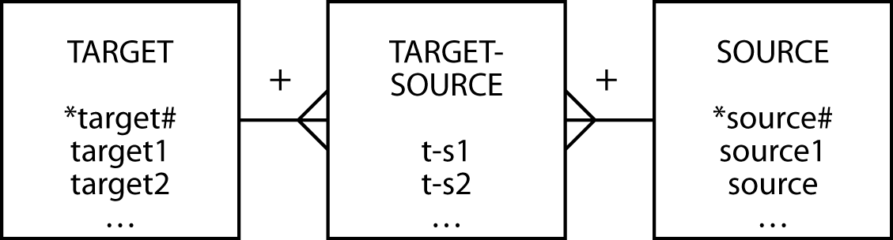

An appropriate generic query and template SQL command are

*Find the target1 that have appeared in all sources.*

```{sql, connection = db, eval = FALSE}
SELECT target1 FROM target
	WHERE NOT EXISTS
		(SELECT * FROM source
			WHERE NOT EXISTS
				(SELECT * FROM target-source
					WHERE target-source.target# = target.target#
					AND target-source.source# = source.source#));
```

+-------------------------------------------------------+
| *Skill builder*                                       |
|                                                       |
| Find the brown items that have appeared in all sales. |
+-------------------------------------------------------+

#### Beyond the great divide

Divide proves troublesome to most people because of the double
negative---we just don't think that way. If divide sends your neurons
into knots, then try the following approach.

The query "Find the items that have appeared in all sales" can be
rephrased as "Find the items for which the number of sales that include
this item is equal to the total number of sales." This is an easier
query to write than "Find items such that there does not exist a sale in
which this item does not appear." The rephrased query has two parts.
*First**, ***determine the total number of sales. Here we mean distinct
sales (i.e., the number of rows with a distinct value for saleno). The
SQL is

```{sql, connection = db, eval =FALSE}
SELECT COUNT (DISTINCT saleno) FROM sale;
```

*Second*, group the items sold by `itemno` and `itemname` and use a HAVING
clause with COUNT to calculate the number of sales in which the item has
occurred. Forcing the count in the HAVING clause to equal the result of
the first query, which becomes an inner query, results in a list of
items appearing in all sales.

```{sql, connection = db, eval = FALSE}
SELECT item.itemno, item.itemname
	FROM item JOIN lineitem
		ON item.itemno = lineitem.itemno
			GROUP BY item.itemno, item.itemname
				HAVING COUNT(DISTINCT saleno)
					= (SELECT COUNT(DISTINCT saleno) FROM sale);
```

#### Set operations

Set operators are useful for combining the values derived from two or
more SQL queries. The UNION operation is equivalent to *or*, and
INTERSECT is equivalent to *and*.

*List items that were sold on January 16, 2011, or are brown.*

Resolution of this query requires two tables: one to report items sold
on January 16, 2011, and one to report the brown items. UNION (i.e., or)
then combines the results of the tables, including *any* rows in both
tables and excluding duplicate rows.

```{sql, connection = db, eval = FALSE}
SELECT itemname FROM item JOIN lineitem
	ON item.itemno = lineitem.itemno
	JOIN sale
	ON lineitem.saleno = sale.saleno
	WHERE saledate = '2011-01-16'
UNION
	SELECT itemname FROM item WHERE itemcolor = 'Brown';
```

  itemname
  ---------------------
  Hammock
  Map case
  Pocket knife---Avon
  Pocket knife---Nile
  Safari chair
  Stetson
  Tent---2 person
  Tent---8 person

List items that were sold on January 16, 2011, and are brown.

This query uses the same two tables as the previous query. In this case,
INTERSECT (i.e., and) then combines the results of the tables including
***only*** rows in both tables and excluding duplicates.^14^

```{sql, connection = db, eval = FALSE}
SELECT itemname FROM item JOIN lineitem
	ON item.itemno = lineitem.itemno
	JOIN sale
	ON lineitem.saleno = sale.saleno
	WHERE saledate = '2011-01-16'
INTERSECT
	SELECT itemname FROM item WHERE itemcolor = 'Brown';
```

  itemname
  ---------------------
  Pocket knife---Avon

+------------------------------------------------------------------------+
| *Skill builder*                                                        |
|                                                                        |
| List the items that contain the words "Hat", "Helmet", or "Stetson" in |
| their names.                                                           |
+------------------------------------------------------------------------+

### Summary

There can be a many-to-many (m:m) relationship between entities, which
is represented by creating an associative entity and two 1:m
relationships. An associative entity stores data about an m:m
relationship. The join operation can be extended from two tables to
three or more tables. EXISTS tests whether a table has at least one row
that meets a specified condition. NOT EXISTS tests whether all rows in a
table do not satisfy a specified condition. Both EXISTS and NOT EXISTS
can return *true* or *false*. The relational operation divide, also
known as *forall*, can be translated into a double negative. It is
represented in SQL by a query containing two NOT EXISTS statements. Set
operations enable the results of queries to be combined.

Key terms and concepts
------------------------------------ --------------------------------------------------
Associative entity                   Many-to-many (m:m) relationship
Divide                               NOT EXISTS
Existential quantifier               UNION
EXISTS                               Universal quantifier
INTERSECT

#### Exercises

1.  Draw data models for the following situations. In each case, think
    about the names you give each entity:

    a. Farmers can own cows or share cows with other farmers.

    b. A track and field meet can have many competitors, and a
        competitor can participate in more than one event.

    c. A patient can have many physicians, and a physician can have
        many patients.

    d. A student can attend more than one class, and the same class can
        have many students.

    e. *The Marathoner*, a monthly magazine, regularly reports the
        performance of professional marathon runners. It has asked you
        to design a database to record the details of all major
        marathons (e.g., Boston, London, and Paris). Professional
        marathon runners compete in several races each year. A race may
        have thousands of competitors, but only about 200 or so are
        professional runners, the ones *The Marathoner* tracks. For each
        race, the magazine reports a runner's time and finishing
        position and some personal details such as name, gender, and
        age.

2. The data model shown was designed by a golf statistician. Write SQL
    statements to create the corresponding relational database.

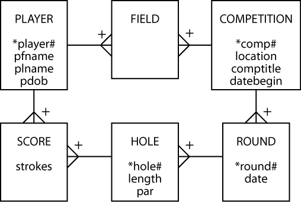

3. Write the following SQL queries for the database described in this
    chapter:

    a. List the names of items for which the quantity sold is greater
        than one for any sale.

    b. Compute the total value of sales for each item by date.

    c. Report all items of type "F" that have been sold.

    d. List all items of type "F" that have not been sold.

    e. Compute the total value of each sale.

4. Why do you have to create a third entity when you have an m:m
    relationship?

5. What does a plus sign near a relationship arc mean?

6. How does EXISTS differ from other clauses in an SQL statement?

7. Answer the following queries based on the described relational
    database.
    
    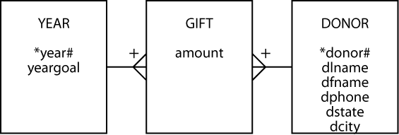
    
    a. List the phone numbers of donors Hays and Jefts.

    b. How many donors are there in the donor table?

    c. How many people made donations in 1999?

    d. What is the name of the person who made the largest donation in
        1999?

    e. What was the total amount donated in 2000?

    f. List the donors who have made a donation every year.

    g. List the donors whose average donation is more than twice the
       average donation of all donors.

    h. List the total amount given by each person across all years; sort
       the report by the donor's name.

    i. Report the total donations in 2001 by state.

    j. In which years did the total donated exceed the goal for the year?

8. The following table records data found on the side of a breakfast
    cereal carton. Use these data as a guide to develop a data model to
    record nutrition facts for a meal. In this case, a meal is a cup of
    cereal and 1/2 cup of skim milk.

+---------------------------------+--------+---------------------------+
| **Nutrition facts**             |        |                           |
|                                 |        |                           |
| Serving size 1 cup (30g)        |        |                           |
|                                 |        |                           |
| Servings per container about 17 |        |                           |
+=================================+========+===========================+
| Amount per serving              | Cereal | with 1/2 cup of skim milk |
+---------------------------------+--------+---------------------------+
| Calories                        | 110    | 150                       |
+---------------------------------+--------+---------------------------+
| Calories from Fat               | 10     | 10                        |
+---------------------------------+--------+---------------------------+
|                                 |        | \% Daily Value            |
+---------------------------------+--------+---------------------------+
| Total Fat 1g                    | 1%     | 2%                        |
+---------------------------------+--------+---------------------------+
| Saturated Fat 0g                | 0%     | 0%                        |
+---------------------------------+--------+---------------------------+
| Polyunsaturated Fat 0g          |        |                           |
+---------------------------------+--------+---------------------------+
| Monounsaturated Fat 0g          |        |                           |
+---------------------------------+--------+---------------------------+
| Cholesterol 0mg                 | 0%     | 1%                        |
+---------------------------------+--------+---------------------------+
| Sodium 220mg                    | 9%     | 12%                       |
+---------------------------------+--------+---------------------------+
| Potassium 105 mg                | 3%     | 9%                        |
+---------------------------------+--------+---------------------------+
| Total Carbohydrate 24g          | 8%     | 10%                       |
+---------------------------------+--------+---------------------------+
| Dietary Fiber 3g                | 13%    | 13%                       |
+---------------------------------+--------+---------------------------+
| Sugars 4g                       |        |                           |
+---------------------------------+--------+---------------------------+
| Other Carbohydrate 17g          |        |                           |
+---------------------------------+--------+---------------------------+
| Protein 3g                      |        |                           |
+---------------------------------+--------+---------------------------+
| Vitamin A                       | 10%    | 15%                       |
+---------------------------------+--------+---------------------------+
| Vitamin C                       | 10%    | 10%                       |
+---------------------------------+--------+---------------------------+
| Calcium                         | 2%     | 15%                       |
+---------------------------------+--------+---------------------------+
| Iron                            | 45%    | 45%                       |
+---------------------------------+--------+---------------------------+
| Vitamin D                       | 10%    | 25%                       |
+---------------------------------+--------+---------------------------+
| Thiamin                         | 50%    | 50%                       |
+---------------------------------+--------+---------------------------+
| Riboflavin                      | 50%    | 50%                       |
+---------------------------------+--------+---------------------------+
| Niacin                          | 50%    | 50%                       |
+---------------------------------+--------+---------------------------+
| Vitamin B12                     | 50%    | 60%                       |
+---------------------------------+--------+---------------------------+
| Phosphorus                      | 10%    | 20%                       |
+---------------------------------+--------+---------------------------+
| Magnesium                       | 8%     | 10%                       |
+---------------------------------+--------+---------------------------+
| Zinc                            | 50%    | 50%                       |
+---------------------------------+--------+---------------------------+
| Copper                          | 4%     | 4%                        |
+---------------------------------+--------+---------------------------+

#### CD library case

After learning how to model m:m relationships, Ajay realized he could
now model a number of situations that had bothered him. He had been
puzzling over some relationships that he had recognized but was unsure
how to model:

* A person can appear on many tracks, and a track can have many persons
(e.g., *The Manhattan* *Transfer*, a quartet, has recorded many tracks).

* A person can compose many songs, and a song can have multiple composers
(e.g., Rodgers and Hammerstein collaborated many times with Rodgers
composing the music and Hammerstein writing the lyrics).

* An artist can release many CDs, and a CD can feature several artists
(e.g., John Coltrane, who has many CDs, has a CD, *Miles & Coltrane,*
with Miles Davis).

Ajay revised his data model to include the m:m relationships he had
recognized. He wrestled with what to call the entity that stored details
of people. Sometimes these people are musicians; other times singers,
composers, and so forth. He decided that the most general approach was
to call the entity PERSON. The extended data model is shown in the
following figure.

*CD library V3.0*

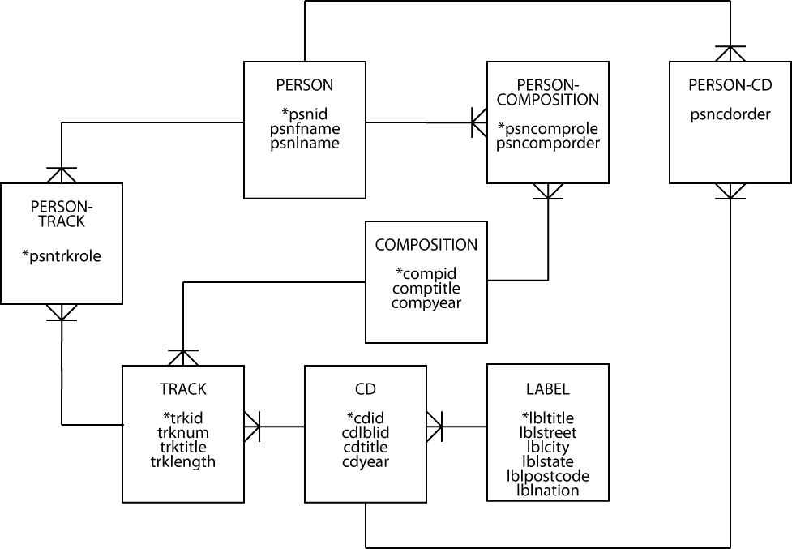

In version 3.0, Ajay introduced several new entities, including
COMPOSITION to record details of a composition. He initially linked
COMPOSITION to TRACK with a 1:m relationship. In other words, a
composition can have many tracks, but a track is of one composition.
This did not seem right.

After further thought, he realized there was a missing
entity---RECORDING. A composition has many recordings (e.g., multiple
recordings of John Coltrane's composition "Giant Steps"), and a
recording can appear as a track on different CDs (typically those whose
title begins with *The Best of* ... feature tracks on earlier CDs).
Also, because a recording is a performance of a composition, it is a
composition that has a title, not recording or track. So, he revised
version 3.0 of the data model to produce version 4.0.

*CD library V4.0*

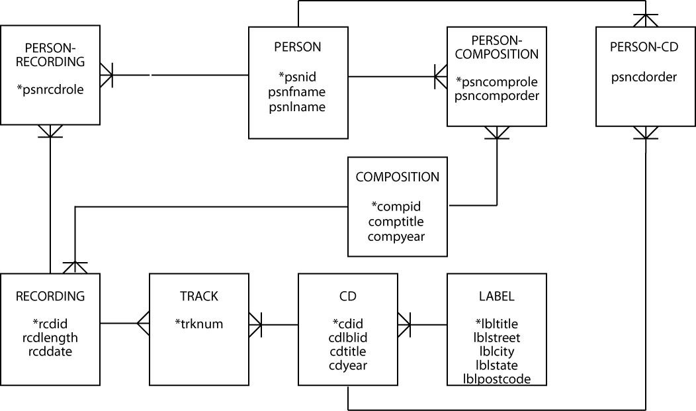

Version 4.0 of the model captures:

* the m:m between PERSON and RECORDING with the associative entity
PERSON-RECORDING. The identifier for PERSON-RECORDING is a composite key
(*psnid, rcdid, psnrcdrole*). The identifiers of PERSON and RECORDING
are required to identify uniquely an instance of PERSON-RECORDING, which
is why there are plus signs on the crow's feet attached to
PERSON-RECORDING. Also, because a person can have multiple roles on a
recording, (e.g., play the piano and sing), then *psnrcdrole* is
required to uniquely identify these situations.

* the m:m between PERSON and COMPOSITION with the associative entity
PERSON-COMPOSITION. The identifier is a composite key (*psnid, compid,
psncomprole*). The attribute *psncomporder* is for remembering the
correct sequence in those cases where there are multiple people involved
in a composition. That is, the database needs to record that it is
Rodgers and Hammerstein, not Hammerstein and Rodgers.

* the m:m between PERSON and CD with the associative entity PERSON-CD.
Again the identifier is a composite key (*psnid, cdid*) of the
identifiers of entities in the m:m relationship, and there is an
attribute (*psncdorder*) to record the order of the people featured on
the CD.

* the 1:m between RECORDING and TRACK. A recording can appear on many
tracks, but a track has only one recording.

* the 1:m between CD and TRACK. A CD can have many tracks, but a track
appears on only one CD. You can also think of TRACK as the name for the
associative entity of the m:m relationship between RECORDING and CD. A
recording can appear on many CDs, and a CD has many recordings.

After creating the new tables, Ajay was ready to add some data. He
decided first to correct the errors introduced by his initial, incorrect
modeling of `track` by inserting data for `recording` and revising `track`. He
realized that because `recording` contains a foreign key to record the 1:m
relationship with `composition`, he needed to start by entering the data
for `composition`. Note that some data are missing for the year of
composition.

*The table composition*

  [compid]{.underline}   comptitle                  compyear
  ---------------------- -------------------------- ----------
  1                      Giant Steps                
  2                      Cousin Mary                
  3                      Countdown                  
  4                      Spiral                     
  5                      Syeeda's Song Flute        
  6                      Naima                      
  7                      Mr. P.C.                   
  8                      Stomp of King Porter       1924
  9                      Sing a Study in Brown      1937
  10                     Sing Moten's Swing         1997
  11                     A-tisket, A-tasket         1938
  12                     I Know Why                 1941
  13                     Sing You Sinners           1930
  14                     Java Jive                  1940
  15                     Down South Camp Meetin'    1997
  16                     Topsy                      1936
  17                     Clouds                     
  18                     Skyliner                   1944
  19                     It's Good Enough to Keep   1997
  20                     Choo Choo Ch' Boogie       1945

Once `composition` was entered, Ajay moved on to the `recording` table.
Again, some data are missing.

*The table recording*

  [rcdid]{.underline}   [compid]{.underline}   rcdlength   rcddate
  --------------------- ---------------------- ----------- -------------
  1                     1                      4.72        1959-May-04
  2                     2                      5.75        1959-May-04
  3                     3                      2.35        1959-May-04
  4                     4                      5.93        1959-May-04
  5                     5                      7           1959-May-04
  6                     6                      4.35        1959-Dec-02
  7                     7                      2.95        1959-May-04
  8                     1                      5.93        1959-Apr-01
  9                     6                      7           1959-Apr-01
  10                    2                      6.95        1959-May-04
  11                    3                      3.67        1959-May-04
  12                    2                      4.45        1959-May-04
  13                    8                      3.2         
  14                    9                      2.85        
  15                    10                     3.6         
  16                    11                     2.95        
  17                    12                     3.57        
  18                    13                     2.75        
  19                    14                     2.85        
  20                    15                     3.25        
  21                    16                     3.23        
  22                    17                     7.2         
  23                    18                     3.18        
  24                    19                     3.18        
  25                    20                     3           

The last row of the `recording` table indicates a recording of the
composition "Choo Choo Ch' Boogie," which has `compid` = 20.

Next, the data for `track` could be entered.

*The table track*

  [cdid]{.underline}   [trknum]{.underline}   [rcdid]{.underline}
  -------------------- ---------------------- ---------------------
  1                    1                      1
  1                    2                      2
  1                    3                      3
  1                    4                      4
  1                    5                      5
  1                    6                      6
  1                    7                      7
  1                    8                      1
  1                    9                      6
  1                    10                     2
  1                    11                     3
  1                    12                     5
  2                    1                      13
  2                    2                      14
  2                    3                      15
  2                    4                      16
  2                    5                      17
  2                    6                      18
  2                    7                      19
  2                    8                      20
  2                    9                      21
  2                    10                     22
  2                    11                     23
  2                    12                     24
  2                    13                     25

The last row of the `track` data indicates that track 13 of *Swing* (`cdid`
= 2) is a recording of "Choo Choo Ch' Boogie" (`rcdid` = 25 and `compid` =
20).

The table person-recording stores details of the people involved in each
recording. Referring to the accompanying notes for the CD *Giant Steps*,
Ajay learned that the composition *"*Giants Steps," recorded on May 4,
1959, included the following personnel: John Coltrane on tenor sax,
Tommy Flanagan on piano, Paul Chambers on bass, and Art Taylor on drums.
Using the following data, he inserted four rows in the person table.

*The table person*

  [psnid]{.underline}   psnfname   psnlname
  --------------------- ---------- ----------
  1                     John       Coltrane
  2                     Tommy      Flanagan
  3                     Paul       Chamber
  4                     Art        Taylor

Then, he linked these people to the particular recording of "Giant
Steps" by entering the data in the table, person-recording.

*The table person-recording*

  [psnid]{.underline}   [rcdid]{.underline}   [psncdrole]{.underline}
  --------------------- --------------------- -------------------------
  1                     1                     tenor sax
  2                     1                     piano
  3                     1                     bass
  4                     1                     drums

+---------------------------------------------------------------------------+
| *Skill builder*                                                           |
|                                                                           |
| 1.  What data will you enter in person-cd to relate John Coltrane to the  |
|     *Giant Steps* CD?                                                     |
|                                                                           |
| 2.  Enter appropriate values in person-composition to relate John         |
|     Coltrane to compositions with compid 1 through 7. You should          |
|     indicate he wrote the music by entering a value of "music" for the    |
|     person's role in the composition.                                     |
|                                                                           |
| 3.  Use SQL to solve the following queries:                               |
|                                                                           |
|     a.  List the tracks on "Swing."                                       |
|                                                                           |
|     b.  Who composed the music for "Spiral"?                              |
|                                                                           |
|     c.  Who played which instruments for the May 4, 1959 recording of     |
|         "Giant Steps"?                                                    |
|                                                                           |
|     d.  List the composers who write music and play the tenor sax.        |
|                                                                           |
| 4.  What is the data model missing?                                       |
+---------------------------------------------------------------------------+

## One-to-One and Recursive Relationships

> *Self-reflection is the school of wisdom.*
> 
> Baltasar Gracián, *The Art of Worldly Wisdom*, 1647

### Learning objectives

Students completing this chapter will be able to

* model one-to-one and recursive relationships;

* define a database with one-to-one and recursive relationships;

* write queries for a database with one-to-one and recursive
relationships.


Alice
was convinced that a database of business facts would speed up decision
making. Her initial experience with the sales database had reinforced
this conviction. She decided that employee data should be computerized
next. When she arrived at The Expeditioner, she found the company lacked
an organization chart and job descriptions for employees. One of her
first tasks had been to draw an organization chart.

*The Expeditioner's organization chart*


She divided the firm into four departments and appointed a boss for each
department. The first person listed in each department was its boss; of
course, Alice was paramount.

Ned had finished the sales database, so the time was right to create an
employee database. Ned seemed to be enjoying his new role, though his
dress standard had slipped. Maybe Alice would have to move him out of
Marketing. In fact, he sometimes reminded her of fellows who used to
hang around the computer lab all day playing weird games. She wasn't
quite ready to sound a "nerd alert," but it was getting close.

### Modeling a one-to-one relationship

Initially, the organization chart appears to record two relationships.
*First**, ***a department has one or more employees, and an employee
belongs to one department. *Second*, a department has one boss, and a
person is boss of only one department. That is, boss is a 1:1
relationship between DEPT and EMP. The data model for this situation is
shown.

*A data model illustrating a 1:m and 1:1 relationship*

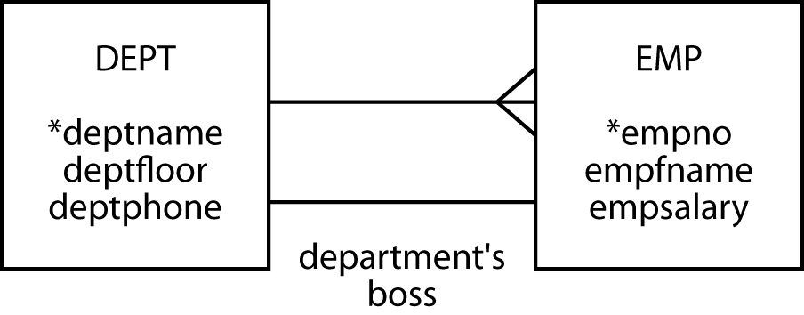

*MySQL Workbench version of a 1:m and 1:1 relationship*

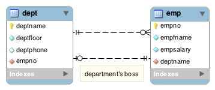

As a general rule, the 1:1 relationship is labeled to avoid confusion
because the meaning of such a relationship cannot always be inferred.
This label is called a **relationship descriptor**. The 1:m relationship
between DEPT and EMP is not labeled because its meaning is readily
understood by reading the model. Use a relationship descriptor when
there is more than one relationship between entities or when the meaning
of the relationship is not readily inferred from the model.

If we think about this problem, we realize there is more to boss than
just a department. People also have a boss. Thus, Alice is the boss of
all the other employees. In this case, we are mainly interested in who
directly bosses someone else. So, Alice is the direct boss of Ned, Todd,
Brier, and Sophie. We need to record the person-boss relationship as
well as the department-boss relationship.

The person-boss relationship is a **recursive 1:m relationship** because
it is a relationship between employees---an employee has one boss and a
boss can have many employees. The data model is shown in the following
figure.

*A data model illustrating a recursive 1:m relationship*

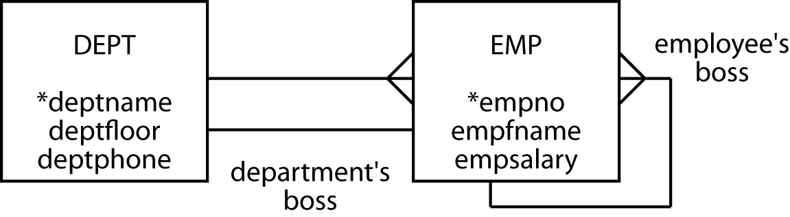

*MySQL Workbench version of a recursive 1:m relationship*

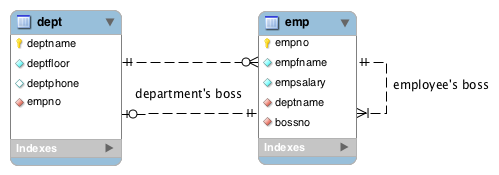

It is a good idea to label the recursive relationship, because its
meaning is often not obvious from the data model.

### Mapping a one-to-one relationship

Since mapping a 1:1 relationship follows the same rules as for any other
data model, the major consideration is where to place the foreign
key(s). There are three alternatives:

1.  Put the foreign key in dept.\
    Doing so means that every instance of dept will record the empno of
    the employee who is boss. Because it is mandatory that all
    departments, in this case have a boss, the foreign key will always
    be non-null.

2. Put the foreign key in emp.\
    Choosing this alternative means that every instance of emp should
    record deptname of the department this employee bosses. Since many
    employees are not bosses, the value of the foreign key column will
    generally be null.

3. Put a foreign key in both dept and emp.\
    The consequence of putting a foreign key in both tables in the 1:1
    relationship is the combination of points 1 and 2.

The best approach is to put the foreign key in dept, because it is
mandatory for each department to have a boss, and the foreign key will
always be non-null.

### Mapping a recursive one-to-many relationship

A recursive 1:m relationship is mapped like a standard 1:m relationship.
An additional column, for the foreign key, is created for the entity at
the "many" end of the relationship. Of course, in this case the "one"
and "many" ends are the same entity, so an additional column is added to
`emp`. This column contains the key `empno` of the "one" end of the
relationship. Since `empno` is already used as a column name, a different
name needs to be selected. In this case, it makes sense to call the
foreign key column `bossno` because it stores the boss's employee number.

The mapping of the data model is shown in the following table. Note that
`deptname` becomes a column in `emp`, the "many" end of the 1:m
relationship, and `empno` becomes a foreign key in `dept`, an end of the 1:1
relationship.

*The tables dept and emp*

  [deptname]{.underline}   deptfloor   deptphone   *empno*
  ------------------------ ----------- ----------- ---------
  Management               5           2001        1
  Marketing                1           2002        2
  Accounting               4           2003        5
  Purchasing               4           2004        7
  Personnel & PR           1           2005        9

  [empno]{.underline}   empfname   empsalary   deptname           bossno
  --------------------- ---------- ----------- ------------------ --------
  1                     *Alice*    75000       *Management*       
  2                     *Ned*      45000       *Marketing*        1
  3                     *Andrew*   25000       *Marketing*        2
  4                     *Clare*    22000       *Marketing*        2
  5                     *Todd*     38000       *Accounting*       1
  6                     *Nancy*    22000       *Accounting*       5
  7                     *Brier*    43000       *Purchasing*       1
  8                     *Sarah*    56000       *Purchasing*       7
  9                     *Sophie*   35000       *Personnel & PR*   1

If you examine `emp`, you will see that the boss of the employee with
`empno` = 2 (Ned) has `bossno` = 1. You can then look up the row in `emp` with
`empno` = 1 to find that Ned's boss is Alice. This "double lookup" is
frequently used when manually interrogating a table that represents a
recursive relationship. Soon you will discover how this is handled with
SQL.

Here is the SQL to create the two tables:

```{sql, connection = db, eval = FALSE}
CREATE TABLE dept (
	deptname		VARCHAR(15),
	deptfloor		SMALLINT NOT NULL,
	deptphone		SMALLINT NOT NULL,
	empno			SMALLINT NOT NULL,
	PRIMARY KEY(deptname));
```

```{sql, connection = db, eval = FALSE}
CREATE TABLE emp (
	empno			SMALLINT,
	empfname		VARCHAR(10),
	empsalary		DECIMAL(7,0),
	deptname		VARCHAR(15),
	bossno			SMALLINT,
	PRIMARY KEY(empno),
	CONSTRAINT fk_belong_dept FOREIGN KEY(deptname) 
		REFERENCES dept(deptname),
	CONSTRAINT fk_has_boss FOREIGN KEY(bossno) 
		REFERENCES emp(empno));
```

You will notice that there is no foreign key definition for `empno` in
`dept` (the 1:1 department's boss relationship). Why? Observe that
`deptname` is a foreign key in `emp`. If we make `empno` a foreign key in
`dept`, then we have a *deadly embrace*. A new department cannot be added
to the `dept` table until there is a boss for that department (i.e., there
is a person in the `emp` table with the `empno` of the boss); however, the
other constraint states that an employee cannot be added to the `emp`
table unless there is a department to which that person is assigned. If
we have both foreign key constraints, we cannot add a new department
until we have added a boss, and we cannot add a boss until we have added
a department for that person. Nothing, under these circumstances, can
happen if both foreign key constraints are in place. Thus, only one of
them is specified.

In the case of the recursive employee relationship, we can create a
constraint to ensure that `bossno` exists for each employee, except of
course the person, Alice, who is top of the pyramid. This form of
constraint is known as a **self-referential** foreign key. However, we
must make certain that the first person inserted into `emp` is Alice. The
following statements illustrate that we must always insert a person's
boss before we insert the person.

```{sql, connection = db, eval = FALSE}
INSERT INTO emp (empno, empfname, empsalary, deptname) VALUES (1,'Alice',75000,'Management');
INSERT INTO emp VALUES (2,'Ned',45000,'Marketing',1);
INSERT INTO emp VALUES (3,'Andrew',25000,'Marketing',2);
INSERT INTO emp VALUES (4,'Clare',22000,'Marketing',2);
INSERT INTO emp VALUES (5,'Todd',38000,'Accounting',1);
INSERT INTO emp VALUES (6,'Nancy',22000,'Accounting',5);
INSERT INTO emp VALUES (7,'Brier',43000,'Purchasing',1);
INSERT INTO emp VALUES (8,'Sarah',56000,'Purchasing',7);
INSERT INTO emp VALUES (9,'Sophie',35000,'Personnel',1);
```

In more complex modeling situations, such as when there are multiple
relationships between a pair of entities, use of a FOREIGN KEY clause
may result in a deadlock. Always consider the consequences of using a
FOREIGN KEY clause before applying it.

+-------------------------------------------------------------------------+
| *Skill builder*                                                         |
|                                                                         |
| A consulting company has assigned each of its employees to a specialist |
| group (e.g., database management). Each specialist group has a team     |
| leader. When employees join the company, they are assigned a mentor for |
| the first year. One person might mentor several employees, but an       |
| employee has at most one mentor.                                        |
+-------------------------------------------------------------------------+

### Querying a one-to-one relationship

Querying a 1:1 relationship presents no special difficulties but does
allow us to see additional SQL features.

*List the salary of each department's boss.*

```{sql, connection = db, eval = FALSE}
SELECT empfname, deptname, empsalary FROM emp
	WHERE empno IN (SELECT empno FROM dept);
```

or

```{sql, connection = db, eval = FALSE}
SELECT empfname, dept.deptname, empsalary
	FROM emp JOIN dept
		ON dept.empno = emp.empno;
```

  empfname   deptname         empsalary
  ---------- ---------------- -----------
  Alice      Management       75000
  Ned        Marketing        45000
  Todd       Accounting       38000
  Brier      Purchasing       43000
  Sophie     Personnel & PR   35000

### Querying a recursive 1:m relationship

Querying a recursive relationship is puzzling until you realize that you
can join a table to itself by creating two copies of the table. In SQL,
you use the WITH clause, also known as the *common table expression
(CTE)* to create a temporary copy, a **table alias.** First, use WITH to
define two aliases, `wrk` and `boss` for `emp`. Table aliases are required so
that SQL can distinguish which copy of the table is referenced. To
demonstrate:

*Find the salary of Nancy's boss.*

First, use WITH to define two aliases, `wrk` and `boss` for `emp`.

```{sql, connection = db, eval = FALSE}
WITH
wrk AS (SELECT * FROM emp), 
boss AS (SELECT * FROM emp) 
SELECT wrk.empfname, wrk.empsalary,boss.empfname, boss.empsalary
	FROM wrk JOIN boss 
		ON wrk.bossno = boss.empno
		WHERE wrk.empfname = 'Nancy';
```

Many queries are solved by getting all the data you need to answer the
request in one row. In this case, the query is easy to answer once the
data for Nancy and her boss are in the one row. Thus, think of this
query as joining two copies of the table `emp` to get the worker and her
boss's data in one row. Notice that there is a qualifier (`wrk` and `boss`)
for each copy of the table to distinguish between them. It helps to use
a qualifier that makes sense. In this case, the `wrk` and `boss` qualifiers
can be thought of as referring to the worker and boss tables,
respectively. You can understand how the query works by examining the
following table illustrating the self-join.

  wrk                                                      boss                                        
  ------- ---------- ----------- ---------------- -------- ------- ---------- ----------- ------------ --------
  empno   empfname   empsalary   deptname         bossno   empno   empfname   empsalary   deptname     bossno
  2       Ned        45000       Marketing        1        1       Alice      75000       Management   
  3       Andrew     25000       Marketing        2        2       Ned        45000       Marketing    1
  4       Clare      22000       Marketing        2        2       Ned        45000       Marketing    1
  5       Todd       38000       Accounting       1        1       Alice      75000       Management   
  6       Nancy      22000       Accounting       5        5       Todd       38000       Accounting   1
  7       Brier      43000       Purchasing       1        1       Alice      75000       Management   
  8       Sarah      56000       Purchasing       7        7       Brier      43000       Purchasing   1
  9       Sophie     35000       Personnel & PR   1        1       Alice      75000       Management   

The result of the SQL query is now quite clear once we apply the WHERE
clause (see the highlighted row in the preceding table):

  wrk.empfname   wrk.empsalary   boss.empfname   boss.empsalary
  -------------- --------------- --------------- ----------------
  Nancy          22000           Todd            38000

*Find the names of employees who earn more than their boss.*

```{sql, connection = db, eval = FALSE}
WITH
wrk AS (SELECT * FROM emp), 
boss AS (SELECT * FROM emp) 
SELECT wrk.empfname FROM wrk JOIN boss 
		ON wrk.bossno = boss.empno
		WHERE wrk.empsalary > boss.empsalary;
```

This would be very easy if the employee and boss data were in the same
row. We could simply compare the salaries of the two people. To get the
data in the one row, we repeat the self-join with a different WHERE
condition. The result is as follows:

  empfname
  ----------
  Sarah

+---------------------------------+
| *Skill builder*                 |
|                                 |
| Find the name of Sophie's boss. |
+---------------------------------+


Alice has found several histories of The Expeditioner from a variety of eras.
Because many expeditions they outfitted were conducted under royal
patronage, it was not uncommon for these histories to refer to British
monarchs. Alice could remember very little about British history, let
alone when various kings and queens reigned. This sounded like another
database problem. She would ask Ned to create a database that recorded
details of each monarch. She thought it also would be useful to record
details of royal succession.

### Modeling a recursive one-to-one relationship

The British monarchy can be represented by a simple one-entity model. A
monarch has one direct successor and one direct predecessor. The
sequencing of monarchs can be modeled by a recursive 1:1 relationship,
shown in the following figure.

*A data model illustrating a recursive 1:1 relationship*

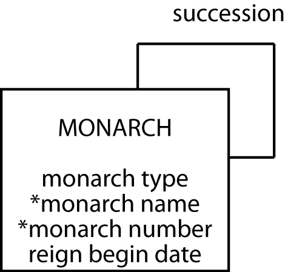

*MySQL Workbench version of a recursive 1:1 relationship*

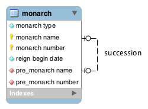

### Mapping a recursive one-to-one relationship

The recursive 1:1 relationship is mapped by adding a foreign key to
`monarch`. You can add a foreign key to represent either the successor or
predecessor relationship. In this case, for no particular reason, the
preceding relationship is selected. Because each instance of a monarch
is identified by a composite key, two columns are added to `monarch` for
the foreign key. Data for recent monarchs are shown in the following
table.

*The table monarch*

  montype   monname     monnum   rgnbeg       premonname   premonnum
  --------- ----------- -------- ------------ ------------ -----------
  King      William     IV       1830/6/26                 
  Queen     Victoria    I        1837/6/20    William      IV
  King      Edward      VII      1901/1/22    Victoria     I
  King      George      V        1910/5/6     Edward       VII
  King      Edward      VIII     1936/1/20    George       V
  King      George      VI       1936/12/11   Edward       VIII
  Queen     Elizabeth   II       1952/02/06   George       VI

The SQL statements to create the table are very straightforward.

```{sql, connection = db, eval = FALSE}
CREATE TABLE monarch (
	montype		CHAR(5) NOT NULL,
	monname		VARCHAR(15),
	monnum			VARCHAR(5),
	rgnbeg			DATE,
	premonname		VARCHAR(15),
	premonnum		VARCHAR(5),
	PRIMARY KEY(monname,monnum),
	CONSTRAINT fk_monarch FOREIGN KEY (premonname, premonnum)
		REFERENCES monarch(monname, monnum);
```

Because the 1:1 relationship is recursive, you cannot insert Queen
Victoria without first inserting King William IV. What you can do is
first insert King William, without any reference to the preceding
monarch (i.e., a null foreign key). The following code illustrates the
order of record insertion so that the referential integrity constraint
is obeyed.

```{sql, connection = db, eval = FALSE}
INSERT INTO MONARCH (montype,monname, monnum,rgnbeg) VALUES ('King','William','IV','1830-06-26');
INSERT INTO MONARCH VALUES ('Queen','Victoria','I','1837-06-20','William','IV');
INSERT INTO MONARCH VALUES ('King','Edward','VII','1901-01-22','Victoria','I');
INSERT INTO MONARCH VALUES ('King','George','V','1910-05-06','Edward','VII');
INSERT INTO MONARCH VALUES ('King','Edward','VIII','1936-01-20','George','V');
INSERT INTO MONARCH VALUES('King','George','VI','1936-12-11','Edward','VIII');
INSERT INTO MONARCH VALUES('Queen','Elizabeth','II','1952-02-06','George','VI');
```

+-------------------------------------------------------------------------+
| *Skill builder*                                                         |
|                                                                         |
| In a competitive bridge competition, the same pair of players play      |
| together for the entire tournament. Draw a data model to record details |
| of all the players and the pairs of players.                            |
+-------------------------------------------------------------------------+

### Querying a recursive one-to-one relationship

Some queries on the monarch table demonstrate querying a recursive 1:1
relationship.

*Who preceded Elizabeth II?*

```{sql, connection = db, eval = FALSE}
SELECT premonname, premonnum FROM monarch
	WHERE monname = 'Elizabeth' and monnum = 'II';
```

  premonname   premonnum
  ------------ -----------
  George       VI

This is simple because all the data are in one row. A more complex query
is:

*Was Elizabeth II's predecessor a king or queen?*

```{sql, connection = db, eval = FALSE}
WITH
cur AS (SELECT * FROM monarch), 
pre AS (SELECT * FROM monarch) 
SELECT pre.montype FROM cur JOIN  pre
	ON cur.premonname = pre.monname AND cur.premonnum = pre.monnum
	WHERE cur.monname = 'Elizabeth'
	AND cur.monnum = 'II';
```

Notice in the preceding query how to specify the ON clause when you have
a composite key.

  montype
  ---------
  King

This is very similar to the query to find the salary of Nancy's boss.
The `monarch` table is joined with itself to create a row that contains
all the details to answer the query.

*List the kings and queens of England in ascending chronological order.*

```{sql, connection = db, eval = FALSE}
SELECT montype, monname, monnum, rgnbeg
	FROM monarch ORDER BY rgnbeg;
```

  montype   monname     monnum   rgnbeg
  --------- ----------- -------- ------------
  Queen     Victoria    I        1837-06-20
  King      Edward      VII      1901-01-22
  King      George      V        1910-05-06
  King      Edward      VIII     1936-01-20
  King      George      VI       1936-12-11
  Queen     Elizabeth   II       1952-02-06

This is a simple query because `rgnbeg` is like a ranking column. It would
not be enough to store just the year in `rgnbeg`, because two kings
started their reigns in 1936; hence, the full date is required.

+-------------------------------+
| *Skill builder*               |
|                               |
| Who succeeded Queen Victoria? |
+-------------------------------+


Of course, Alice soon had another project for Ned. The Expeditioner keeps a
wide range of products that are sometimes assembled into kits to make
other products. For example, the animal photography kit is made up of
eight items that The Expeditioner also sells separately. In addition,
some kits became part of much larger kits. The animal photography kit is
included as one of 45 items in the East African Safari package. All of
the various items are considered products, and each has its own product
code. Ned was now required to create a product database that would keep
track of all the items in The Expeditioner's stock.

### Modeling a recursive many-to-many relationship

The assembly of products to create other products is very common in
business. Manufacturing even has a special term to describe it: a bill
of materials. The data model is relatively simple once you realize that
a product can appear as part of many other products and can be composed
of many other products; that is, we have a recursive many-to-many (m:m)
relationship for product. As usual, we turn an m:m relationship into two
one-to-many (1:m) relationships. Thus, we get the data model displayed
in the following figure.

*A data model illustrating a recursive m:m relationship*

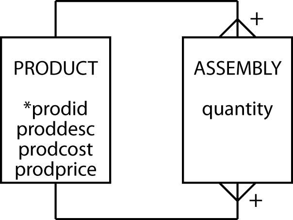

*MySQL Workbench version of a recursive m:m relationship*

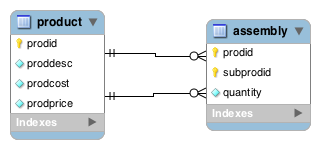

*Tables product and assembly*

  [prodid]{.underline}   proddesc                 prodcost   prodprice
  ---------------------- ------------------------ ---------- -----------
  1000                   Animal photography kit              725
  101                    Camera                   150        300
  102                    Camera case              10         15
  103                    70-210 zoom lens         125        200
  104                    28-85 zoom lens          115        185
  105                    Photographer's vest      25         40
  106                    Lens cleaning cloth      1          1.25
  107                    Tripod                   35         45
  108                    16 GB SDHC memory card   30         37

  quantity   *[prodid]{.underline}*   *[subprodid]{.underline}*
  ---------- ------------------------ ---------------------------
  1          1000                     101
  1          1000                     102
  1          1000                     103
  1          1000                     104
  1          1000                     105
  2          1000                     106
  1          1000                     107
  10         1000                     108

### Mapping a recursive many-to-many relationship

Mapping follows the same procedure described previously, producing the
two tables shown below. The SQL statements to create the tables are
shown next. Observe that `assembly` has a composite key, and there are two
foreign key constraints.

```{sql, connection = db, eval = FALSE}
CREATE TABLE product (
	prodid			INTEGER,
	proddesc		VARCHAR(30),
	prodcost		DECIMAL(9,2),
	prodprice		DECIMAL(9,2),
		PRIMARY KEY(prodid));
```

```{sql, connection = db, eval = FALSE}
CREATE TABLE assembly (
	quantity		INTEGER NOT NULL,
	prodid			INTEGER,
	subprodid		INTEGER,
		PRIMARY KEY(prodid, subprodid),
		CONSTRAINT fk_assembly_product FOREIGN KEY(prodid)
			REFERENCES product(prodid),
		CONSTRAINT fk_assembly_subproduct FOREIGN KEY(subprodid)
			REFERENCES product(prodid));
```

+--------------------------------------------------------------------------+
| *Skill builder*                                                          |
|                                                                          |
| An army is broken up into many administrative units (e.g., army,         |
| brigade, platoon). A unit can contain many other units (e.g., a regiment |
| contains two or more battalions), and a unit can be part of a larger     |
| unit (e.g., a squad is a member of a platoon). Draw a data model for     |
| this situation.                                                          |
+--------------------------------------------------------------------------+

### Querying a recursive many-to-many relationship

*List the product identifier of each component of the animal photography kit.*

```{sql, connection = db, eval = FALSE}
SELECT subprodid FROM product JOIN assembly
	ON product.prodid = assembly.prodid
	WHERE proddesc = 'Animal photography kit';
```

  subprodid
  -----------
  101
  106
  107
  105
  104
  103
  102
  108

Why are the values for `subprodid` listed in no apparent order? Remember,
there is no implied ordering of rows in a table, and it is quite
possible, as this example illustrates, for the rows to have what appears
to be an unusual ordering. If you want to order rows, use the ORDER BY
clause.

*List the product description and cost of each component of the animal photography kit.*

```{sql, connection = db, eval = FALSE}
SELECT proddesc, prodcost FROM product
	WHERE prodid IN
		(SELECT subprodid FROM product JOIN assembly
				ON product.prodid = assembly.prodid
				WHERE proddesc = 'Animal photography kit');
```

In this case, first determine the `prodid` of those products in the animal
photography kit (the inner query), and then report the description of
these products. Alternatively, a three-way join can be done using two
copies of `product`.

```{sql, connection = db, eval = FALSE}
WITH
a AS (SELECT * FROM product), 
b AS (SELECT * FROM product) 
SELECT b.proddesc, b.prodcost FROM a JOIN assembly
		ON a.prodid = assembly.prodid
		JOIN b
		ON assembly.subprodid = b.prodid
		WHERE a.proddesc = 'Animal photography kit';
```

  proddesc                 prodcost
  ------------------------ ----------
  Camera                   150
  Camera case              10
  70--210 zoom lens        125
  28--85 zoom lens         115
  Photographer's vest      25
  Lens cleaning cloth      1
  Tripod                   35
  16 GB SDHC memory card   0.85

+------------------------------------------------------------------------+
| *Skill builder*                                                        |
|                                                                        |
| How many lens cleaning cloths are there in the animal photography kit? |
+------------------------------------------------------------------------+

### Summary

Relationships can be one-to-one and recursive. A recursive relationship
is within a single entity rather than between entities. Recursive
relationships are mapped to the relational model in the same way as
other relationships. A self-referential foreign key constraint permits a
foreign key reference to a key within the same table. Resolution of
queries involving recursive relationships often requires a table to be
joined with itself. Recursive many-to-many relationships occur in
business in the form of a bill of materials.

Key terms and concepts
------------------------------------ --------------------------------------------------
One-to-one (1:1) relationship        Recursive 1:1 relationship
Recursive relationship               Relationship descriptor
Recursive m:m relationship           Self-join
Recursive 1:m relationship           Self-referential foreign key

#### Exercise

1.  Draw data models for the following two problems:

    a. \(i) A dairy farmer, who is also a part-time cartoonist, has several
        herds of cows. He has assigned each cow to a particular herd. In each
        herd, the farmer has one cow that is his favorite---often that cow is
        featured in a cartoon.\
        (ii) A few malcontents in each herd, mainly those who feel they should
        have appeared in the cartoon, disagree with the farmer's choice of a
        favorite cow, whom they disparagingly refer to as the sacred cow. As a
        result, each herd now has elected a herd leader.

    b. The originator of a pyramid marketing scheme has a system for
        selling ethnic jewelry. The pyramid has three levels---gold,
        silver, and bronze. New associates join the pyramid at the
        bronze level. They contribute 30 percent of the revenue of their
        sales of jewelry to the silver chief in charge of their clan. In
        turn, silver chiefs contribute 30 percent of what they receive
        from bronze associates to the gold master in command of their
        tribe. Finally, gold masters pass on 30 percent of what they
        receive to the originator of the scheme.

    c. The legion, the basic combat unit of the ancient Roman army,
        contained 3,000 to 6,000 men, consisting primarily of heavy
        infantry (hoplites), supported by light infantry (velites), and
        sometimes by cavalry. The hoplites were drawn up in three lines.
        The hastati (youngest men) were in the first, the principes
        (seasoned troops) in the second, and the triarii (oldest men)
        behind them, reinforced by velites. Each line was divided into
        10 maniples, consisting of two centuries (60 to 80 men per
        century) each. Each legion had a commander, and a century was
        commanded by a centurion. Julius Caesar, through one of his
        Californian channelers, has asked you to design a database to
        maintain details of soldiers. Of course, Julius is a little
        forgetful at times, and he has not supplied the titles of the
        officers who command maniples, lines, and hoplites, but he
        expects that you can handle this lack of fine detail.

    d. A travel agency is frequently asked questions about tourist
        destinations. For example, customers want to know details of the
        climate for a particular month, the population of the city, and
        other geographic facts. Sometimes they request the flying time
        and distance between two cities. The manager has asked you to
        create a database to maintain these facts.

    e. The Center for the Study of World Trade keeps track of trade
        treaties between nations. For each treaty, it records details of
        the countries signing the treaty and where and when it was
        signed.

    f. Design a database to store details about U.S. presidents and
        their terms in office. Also, record details of their date and
        place of birth, gender, and political party affiliation (e.g.,
        Caluthumpian Progress Party). You are required to record the
        sequence of presidents so that the predecessor and successor of
        any president can be identified. How will you model the case of
        Grover Cleveland, who served nonconsecutive terms as president?
        Is it feasible that political party affiliation may change? If
        so, how will you handle it?

    g. The IS department of a large organization makes extensive use of
        software modules. New applications are built, where possible,
        from existing modules. Software modules can also contain other
        modules. The IS manager realizes that she now needs a database
        to keep track of which modules are used in which applications or
        other modules. (Hint: It is helpful to think of an application
        as a module.)

    h. Data modeling is finally getting to you. Last night you dreamed
        you were asked by Noah to design a database to store data about
        the animals on the ark. All you can remember from Sunday school
        is the bit about the animals entering the ark two-by-two, so you
        thought you should check the real thing.\
        Take with you seven pairs of every kind of clean animal, a male
        and its mate, and two of every kind of unclean animal, a male
        and its mate, and also seven pair of every kind of bird, male
        and female. Genesis 7:2\
        Next time Noah disturbs your sleep, you want to be ready. So,
        draw a data model and make certain you record the two-by-two
        relationship.

2. Write SQL to answer the following queries using the DEPT and EMP
    tables described in this chapter:

    a. Find the departments where all the employees earn less than
        their boss.

    b. Find the names of employees who are in the same department as
        their boss (as an employee).

    c. List the departments having an average salary greater than
        \$25,000.

    d. List the departments where the average salary of the employees,
        excluding the boss, is greater than \$25,000.

    e. List the names and manager of the employees of the Marketing
        department who have a salary greater than \$25,000.

    f. List the names of the employees who earn more than any employee
        in the Marketing department.

3. Write SQL to answer the following queries using the monarch table
    described in this chapter:

    a. Who succeeded Victoria I?

    b. How many days did Victoria I reign?

    c. How many kings are there in the table?

    d. Which monarch had the shortest reign?

4. Write SQL to answer the following queries using the product and
    assembly tables:

    a. How many different items are there in the animal photography kit?

    b. What is the most expensive item in the animal photography kit?

    c. What is the total cost of the components of the animal photography
    kit?

    d. Compute the total quantity for each of the items required to
    assemble 15 animal photography kits.

#### CD Library case

Ajay had some more time to work on this CD Library database. He picked
up The Manhattan Transfer's *Swing* CD to enter its data. Very quickly
he recognized the need for yet another entity, if he were going to store
details of the people in a group. A group can contain many people (there
are four artists in The Manhattan Transfer), and also it is feasible
that over time a person could be a member of multiple groups. So, there
is an m:m between PERSON and GROUP. Building on his understanding of the
relationship between PERSON and RECORDING and CD, Ajay realized there
are two other required relationships: an m:m between GROUP and
RECORDING, and between GROUP and CD. This led to version 5.0, shown in
the following figure.

*CD library V5.0*

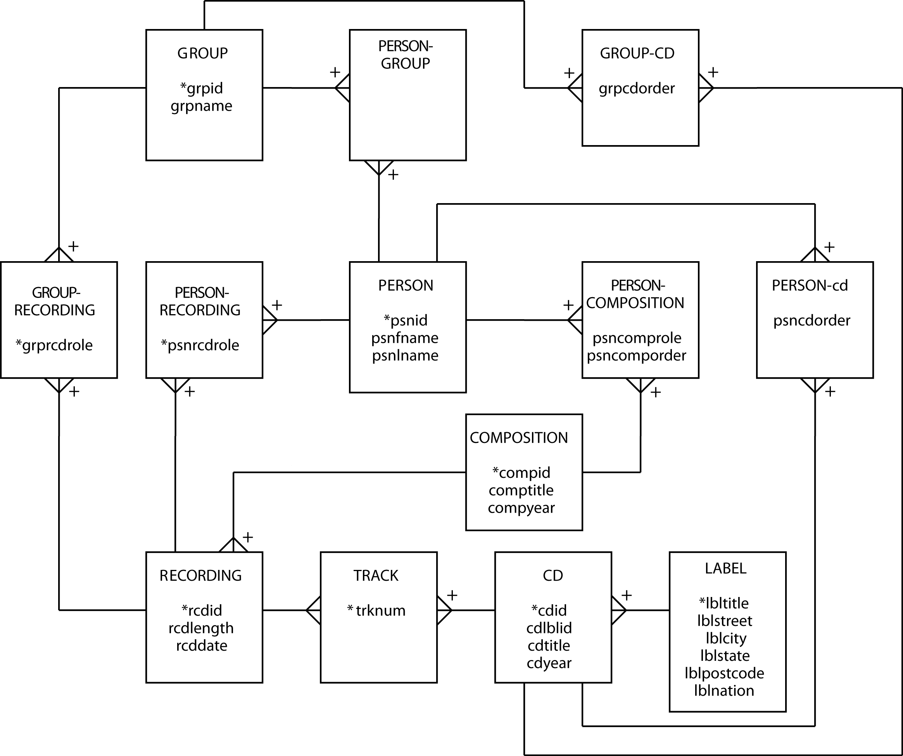

+------------------------------------------------------------------------------------------------------------------------------------------------------------------------+
| *Skill builder*                                                                                                                                                        |
|                                                                                                                                                                        |
| 1.	The group known as Asleep at the Wheel is featured on tracks 3, 4, and 7 of Swing. Record these data and write SQL to answer the following:                        | 
|     a.	What are the titles of the recordings on which Asleep at the Wheel appear?                                                                                     |
|     b.	List all CDs that have any tracks featuring Asleep at the Wheel.                                                                                               |
|         The members of The Manhattan Transfer are Cheryl Bentyne, Janis Siegel, Tim Hauser, and Alan Paul. Update the database with this information, and write SQL to answer the following:                                                                                                                                                               |
|             Who are the members of The Manhattan Transfer?                                                                                                             |
|             What CDs have been released by The Manhattan Transfer?                                                                                                     |
|             What CDs feature Cheryl Bentyne as an individual or member of a group?                                                                                     |
| 2.	Record the following facts. The music of “Sing a Song of Brown,†composed in 1937, is by Count Basie and Larry Clinton and lyrics by Jon Hendricks. “Sing Moten’s Swing,†composed in 1932, features music by Buster and Benny Moten, and lyrics by Jon Hendricks. Write SQL to answer the following:                                                       |
|     a.	For what songs has Jon Hendricks written the lyrics?                                                                                                           |
|     b.	Report all compositions and their composers where more than one person was involved in composing the music. Make certain you report them in the correct order. |
| 3.	Test your SQL skills with the following:                                                                                                                           |
|     a.	List the tracks on which Alan Paul appears as an individual or as a member of The Manhattan Transfer.                                                          |
|     b.	List all CDs featuring a group, and report the names of the group members.                                                                                     |
|     c.	Report all tracks that feature more than one group.                                                                                                            |
|     d.	List the composers appearing on each CD.                                                                                                                       |
| 4.	How might you extend the data model?                                                                                                                               |
+------------------------------------------------------------------------------------------------------------------------------------------------------------------------+

## Data Modeling

> *Man is a knot, a web, a mesh into which relationships are tied. Only those relationships matter.*
>
> Antoine de Saint-Exupéry in *Flight to Arras*

### Learning objectives

Students completing this chapter will be able to create a well-formed,
high-fidelity data model.

### Modeling

Modeling is widely used within business to learn about organizational
problems and design solutions. To understand where data modeling fits
within the broader context, it is useful to review the full range of
modeling activities. The types of modeling methods follow the 5W-H model
of journalism.^15^

                                    ***Scope***      ***Model***            ***Technology***       
  ------------------- ------------- ---------------- ---------------------- ----------------------
  ***Motivation ***   Why           Goals            Business plan canvas   Groupware
  ***People***        Who           Business units   Organization chart     System interface
  ***Time***          When          Key events       PERT chart             Scheduling
  ***Data ***         What          Key entities     Data model             Relational database
  ***Network ***      Where         Locations        Logistics network      System architecture
  ***Function***      How           Key processes    Process model          Application software

*A broad perspective on modeling*

Modeling occurs at multiple levels. At the highest level, an
organization needs to determine the scope of its business by identifying
the major elements of its environment, such as its goals, business
units, where it operates, and critical events, entities, and processes.
At the top level, textual models are frequently used. For example, an
organization might list its major goals and business processes. A map
will be typically used to display where the business operates.

Once senior managers have clarified the scope of a business, models can
be constructed for each of the major elements. Goals will be converted
into a business plan, business units will be shown on an organizational
chart, and so on. The key elements, from an IS perspective, are data and
process modeling, which are typically covered in the core courses of an
IS program.

Technology, the final stage, converts models into operational systems to
support the organization. Many organizations rely extensively on e-mail
and Web technology for communicating business decisions. People connect
to systems through an interface, such as a Web browser. Ensuring that
events occur at the right time is managed by scheduling software. This
could be implemented with operating system procedures that schedule the
execution of applications. In some database management systems (DBMSs),
triggers can be established. A **trigger** is a database procedure that
is automatically executed when some event is recognized. For example,
U.S. banks are required to report all deposits exceeding USD 10,000, and
a trigger could be coded for this event.

Data models are typically converted into relational databases, and
process models become computer programs. Thus, you can see that data
modeling is one element of a comprehensive modeling activity that is
often required to design business systems. When a business undergoes a
major change, such as a reengineering project, many dimensions can be
altered, and it may be appropriate to rethink many elements of the
business, starting with its goals. Because such major change is very
disruptive and costly, it occurs less frequently. It is more likely that
data modeling is conducted as a stand-alone activity or part of process
modeling to create a new business application.

### Data modeling

You were introduced to the basic building blocks of data modeling in the
earlier chapters of this section. Now it is time to learn how to
assemble blocks to build a data model. Data modeling is a method for
determining what data and relationships should be stored in the
database. It is also a way of communicating a database design.

The goal of data modeling is to identify the facts that must be stored
in a database. A data model is not concerned with how the data will be
stored. This is the concern of those who implement the database. A data
model is not concerned with how the data will be processed. This is the
province of process modeling. The goal is to create a data model that is
an accurate representation of data needs and real-world data
relationships.

Building a data model is a partnership between a client, a
representative of the eventual owners of the database, and a designer.
Of course, there can be a team of clients and designers. For simplicity,
we assume there is one client and one designer.

Drawing a data model is an iterative process of trial and revision. A
data model is a working document that will change as you learn more
about the client's needs and world. Your early versions are likely to be
quite different from the final product. Use a product such as MySQL
Workbench for drawing and revising a data model.

### The building blocks

The purpose of a database is to store data about things, which can
include facts (e.g., an exchange rate), plans (e.g., scheduled
production of two-person tents for June), estimates (e.g., forecast of
demand for smart phones), and a variety of other data. A data model
describes these things and their relationships with other things using
four components: entity, attribute, relationship, and identifier.

#### Entity

The entity is the basic building block of a data model. an entity is a
thing about which data should be stored, something we need to describe.
Each entity in a data model has a unique name that we write in singular
form. Why singular? Because we want to emphasize that an entity
describes an instance of a thing. Thus, we previously used the word
SHARE to define an entity because it describes each instance of a share
rather than shares in general.

We have already introduced the convention that an entity is represented
by a rectangle, and the name of the entity is shown in uppercase
letters, as follows.

*The entity SHARE*


A large data model might contain over a 1,000 entities. A database can
easily contain hundreds of millions of instances (rows) for any one
entity (table). Imagine the number of instances in a national tax
department's database.

How do you begin to identify entities? One approach is to underline any
*nouns* in the system proposal or provided documentation. Most nouns are
possible entities, and underlining ensures that you do not overlook any
potential entities. Start by selecting an entity that seems central to
the problem. If you were designing a student database, you might start
with the student. Once you have picked a central entity, describe it.
Then move to the others.

#### Attribute

An attribute describes an entity. When an entity has been identified,
the next step is to determine its attributes, that is, the data that
should be kept to describe fully the entity. An attribute name is
singular and unique within the data model. You may need to use a
modifier to make an attribute name unique (e.g., "hire date" and "sale
date" rather than just "date").

Our convention is that the name of an attribute is recorded in lowercase
letters within the entity rectangle. The following figure illustrates
that SHARE has attributes *share code, share name, share price, share
quantity, share dividend,* and *share PE*. Notice the frequent use of
the modifier "share". It is possible that other entities in the database
might also have a price and quantity, so we use a modifier to create
unique attribute names. Note also that *share cod*e is the identifier.

*The entity SHARE with its attributes*


Defining attributes generally takes considerable discussion with the
client. You should include any attribute that is likely to be required
for present or future decision making, but don't get carried away. Avoid
storing unnecessary data. For example, to describe the entity STUDENT
you usually record date of birth, but it is unlikely that you would
store height. If you were describing an entity PATIENT, on the other
hand, it might be necessary to record height, because that is sometimes
relevant to medical decision making.

An attribute has a single value, which may be null. Multiple values are
not allowed. If you need to store multiple values, it is a signal that
you have a one-to-many (1:m) relationship and need to define another
entity.

#### Relationship

Entities are related to other entities. If there were no relationships
between entities, there would be no need for a data model and no need
for a relational database. A simple, flat file (a single-entity
database) would be sufficient. A relationship is binary. It describes a
linkage between two entities and is represented by a line between them.

Because a relationship is binary, strictly speaking it has two
relationship descriptors, one for each entity. Each relationship
descriptor has a degree stating how many instances of the other entity
may be related to each instance of the described entity. Consider the
entities STOCK and NATION and their 1:m relationship (see the following
figure). We have two relationship descriptors: *stocks of nation* for
NATION and *nation of stock* for STOCK. The relationship descriptor
*stocks of nation* has a degree of m because a nation may have zero or
more listed stocks. The relationship descriptor *nation of stock* has a
degree of 1 because a stock is listed in at most one nation. To reduce
data model clutter, where necessary for clarification, we will use a
single label for the pair of relationship descriptors. Experience shows
this approach captures the meaning of the relationship and improves
readability.

*A 1:m relationship between STOCK and NATION*


Because the meaning of relationships frequently can be inferred, there
is no need to label every one; however, each additional relationship
between two entities should be labeled to clarify meaning. Also, it is a
good idea to label one-to-one (1:1) relationships, because the meaning
of the relationship is not always obvious.

Consider the fragment in the following figure. The descriptors of the
1:m relationship can be inferred as a firm has employees and an employee
belongs to a firm. the 1:1 relationship is clarified by labeling the 1:1
relationship as firm's boss.

*Relationship labeling*


#### Identifier

An identifier uniquely distinguishes an instance of an entity. An
identifier can be one or more attributes and may include the identifier
of a related entity. When a related entity's identifier is part of an
identifier, a plus sign is placed on the line closest to the entity
being identified. In the following figure, an instance of the entity
LINEITEM is identified by the composite of *lineno* and *saleno*, the
identifier of SALE. The value *lineno* does not uniquely identify an
instance of LINEITEM, because it is simply a number that appears on the
sales form. Thus, the identifier must include *saleno* (the identifier
of SALE). So, any instance of LINEITEM is uniquely identified by the
composite *saleno* and *lineno*.

*A related entity's identifier as part of the identifier*


Occasionally, there will be several possible identifiers, and these are
each given a different symbol. Our convention is to prefix an identifier
with an asterisk (\*). If there are multiple identifiers, use other
symbols such as \#, !, or &. Be careful: If you have too many possible
identifiers, your model will look like comic book swearing. In most
cases, you will have only one identifier.

No part of an identifier can be null. If this were permitted, there
would be no guarantee that the other parts of the identifier were
sufficiently unique to distinguish all instances in the database.

### Data model quality

There are two criteria for judging the quality of a data model. It must
be well-formed and have high fidelity.

#### A well-formed data model

A well-formed data model clearly communicates information to the client.
Being well-formed means the construction rules have been obeyed. There
is no ambiguity; all entities are named, and all entities have
identifiers. If identifiers are missing, the client may make incorrect
inferences about the data model. All relationships are recorded using
the proper notation and labeled whenever there is a possibility of
confusion.

*Characteristics of a well-formed data model*

  All construction rules are obeyed.
  ----------------------------------------------------------------
  There is no ambiguity.
  All entities are named.
  Every entity has an identifier.
  All relationships are represented, using the correct notation.
  Relationships are labeled to avoid misunderstanding.
  All attributes of each entity are listed.
  All attribute names are meaningful and unique.

All the attributes of an entity are listed because missing attributes
create two types of problems. *First**, ***it is unclear what data will
be stored about each instance. *Second*, the data model may be missing
some relationships. Attributes that can have multiple values become
entities. It is only by listing all of an entity's attributes during
data modeling that these additional entities are recognized.

In a well-formed data model, all attribute names are meaningful and
unique. The names of entities, identifiers, attributes, and
relationships must be meaningful to the client because they are describe
the client's world. Indeed, in nearly all cases they are the client's
everyday names. Take care in selecting words because they are critical
to communicating meaning. The acid test for comprehension is to get the
client to read the data model to other potential users. Names need to be
unique to avoid confusion.

#### A high-fidelity image

Music lovers aspire to own a high-fidelity stereo system---one that
faithfully reproduces the original performance with minimal or no
distortion. A data model is a high-fidelity image when it faithfully
describes the world it is supposed to represent. All relationships are
recorded and are of the correct degree. There are no compromises or
distortions. If the real-world relationship is many-to-many (m:m), then
so is the relationship shown in the data model. a well-formed,
high-fidelity data model is complete, understandable, accurate, and
syntactically correct.

### Quality improvement

A data model is an evolving representation. Each change should be an
incremental improvement in quality. Occasionally, you will find a major
quality problem at the data model's core and have to change the model
considerably.

#### Detail and context

The quality of a data model can be determined only by understanding the
context in which it will be used. Consider the data model (see the
following figure) used in Chapter 4 to discuss the 1:m relationship.
This fragment says a nation has many stocks. Is that really what we want
to represent? Stocks are listed on a stock exchange, and a nation may
have several stock exchanges. For example, the U.S. has the New York
Stock Exchange and NASDAQ. Furthermore, some foreign stocks are listed
on the New York Stock Exchange. If this is the world we have to
describe, the data model is likely to differ from that shown in the
figure. Try drawing the revised data model.

*A 1:m relationship between STOCK and NATION*


As you can see, the data model in the following figure is quite
different from the initial data model of preceding figure. Which one is
better? They both can be valid models; it just depends on the world you
are trying to represent and possible future queries. In the first case,
the purpose was to determine the value of a portfolio. There was no
interest in on which exchange stocks were listed or their home exchange.
So the first model has high fidelity for the described situation.

The second data model would be appropriate if the client needed to know
the home exchange of stocks and their price on the various exchanges
where they were listed. The second data model is an improvement on the
first if it incorporates the additional facts and relationships
required. If it does not, then the additional detail is not worth the
extra cost.

*Revised NATION-STOCK data*


#### A lesson in pure geography

A data model must be an accurate representation of the world you want to
model. The data model must account for all the exceptions---there should
be no impurities. Let's say you want to establish a database to store
details of the world's cities. You might start with the data model
depicted in the following figure.

*A world's cities data model*

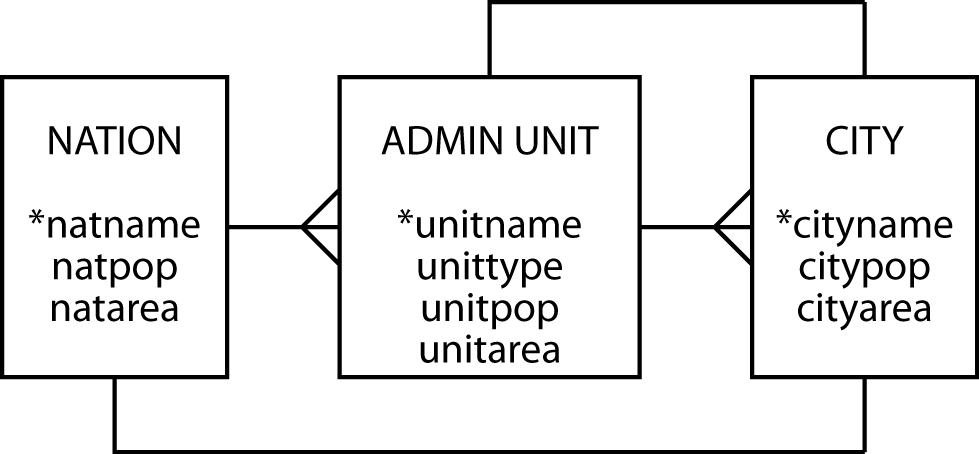

Before looking more closely at the data model, let's clarify the meaning
of *unittype*. Because most countries are divided into administrative
units that are variously called states, provinces, territories, and so
forth, *unittype* indicates the type of administrative unit (e.g.,
state). How many errors can you find in the initial data model?

Problems and solutions for the initial world's cities data model

      ***Problem***                                                                                                                                                                                                                                                                        ***Solution***
  --- ------------------------------------------------------------------------------------------------------------------------------------------------------------------------------------------------------------------------------------------------------------------------------------ -----------------------------------------------------------------------------------------------------------------------------------------------------------------------------------------
  1   City names are not unique. There is an Athens in Greece and the U.S. has an Athens in Georgia, Alabama, Ohio, Pennsylvania, Tennessee, and Texas.                                                                                                                                    To identify a city uniquely, you need to specify its administrative unit and country. Add a plus sign to the crow's feet between CITY and ADMIN UNIT and between ADMIN UNIT and NATION.
  2   Administrative unit names are not necessarily unique. There used to be a Georgia in the old U.S.S.R., and there is a Georgia in the U.S. There is no guarantee that administrative unit names will always be unique.                                                                 To identify an administrative unit uniquely, you also need to know the country in which it is found. Add a plus sign to the crow's foot between ADMIN UNIT and NATION.
  3   There is an unlabeled 1:1 relationship between CITY and ADMIN UNIT and CITY and NATION. What do these mean? They are supposed to indicate that an administrative unit has a capital, and a nation has a capital.                                                                     Label relationships (e.g., national capital city).
  4   The assumption is that a nation has only one capital, but there are exceptions. South Africa has three capitals: Cape Town (legislative), Pretoria (administrative), and Bloemfontein (judicial). You need only one exception to lower the fidelity of a data model significantly.   Change the relationship between NATION and CITY to 1:m. Add an attribute *natcaptype* to CITY to distinguish between types of capitals.
  5   The assumption is that an administrative unit has only one capital, but there are exceptions. At one point, Chandigarh was the capital of two Indian states, Punjab and Haryana. The Indian state of Jammu & Kashmir has two capitals: Jammu (summer) and Srinagar (winter).         Change the relationship between ADMIN UNIT and CITY to m:m by creating an associative entity and include a distinguishing attribute of *unitcaptype*.
  6   Some values can be derived. National population, *natpop*, and area, *natarea*, are the sum of the regional populations, *regpop*, and areas, *regarea*, respectively. The same rule does not apply to regions and cities because not everyone lives in a city.                      Remove the attributes *natpop* and *natarea* from NATION.

*A revised world's cities data model*

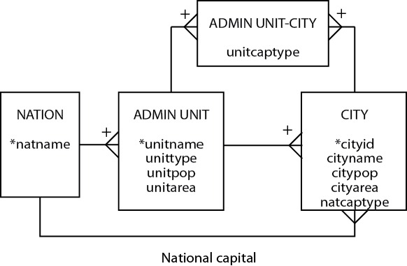

This geography lesson demonstrates how you often start with a simple
model of low fidelity. By additional thinking about relationships and
consideration of exceptions, you gradually create a high-fidelity data
model.

+-------------------------------------------------------------------------+
| *Skill Builder*                                                         |
|                                                                         |
| Write SQL to determine which administrative units have two capitals and |
| which have a shared capital.                                            |
+-------------------------------------------------------------------------+

#### Family matters

Families can be very complicated. It can be tricky to keep track of all
those relations---maybe you need a relational database (this is the
worst joke in the book; they improve after this). We start with a very
limited view of marriage and gradually ease the restrictions to
demonstrate how any and all aspects of a relationship can be modeled. An
initial fragment of the data model is shown in the following figure.
There are several things to notice about it.

*A man-woman data model*

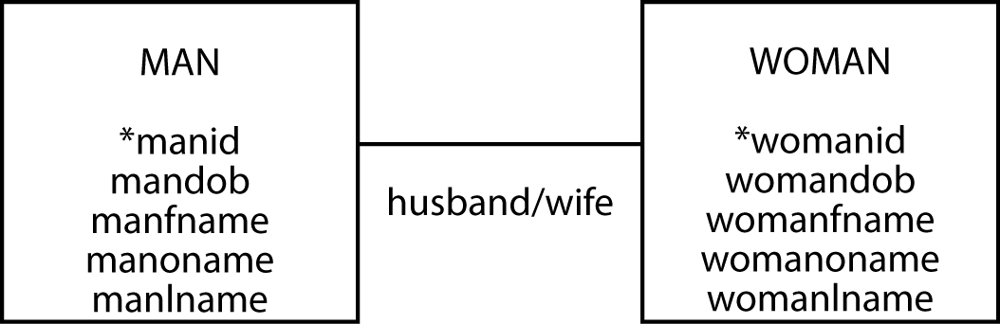

1.  There is a 1:1 relationship between man and woman. The labels
    indicate that this relationship is marriage, but there is no
    indication of the marriage date. We are left to infer that the data
    model records the current marriage.

2. MAN and WOMAN have the same attributes. A prefix is used to make
    them unique. Both have an identifier (*id*, in the United States
    this would probably be a Social Security number), date of birth
    (*dob*), first name (*fname*), other names (*oname*), and last name
    (*name*).

3. Other names (*oname*) looks like a multivalued attribute, which is
    not allowed. Should *oname* be single or multivalue? This is a
    tricky decision. It depends on how these data will be used. If
    queries such as "find all men whose other names include Herbert" are
    likely, then a person's other names---kept as a separate entity that
    has a 1:m relationship for MAN and WOMAN---must be established. That
    is, a man or woman can have one or more other names. However, if you
    just want to store the data for completeness and retrieve it in its
    entirety, then *oname* is fine. It is just a text string. The key
    question to ask is, "What is the lowest level of detail possibly
    required for future queries?" Also, remember that SQL's REGEXP
    clause can be used to search for values within a text string.

The use of a prefix to distinguish attribute names in different entities
suggests you should consider combining the entities. In this case, we
could combine the entities MAN and WOMAN to create an entity called
PERSON. Usually when entities are combined, you have to create a new
attribute to distinguish between the different types. In this example,
the attribute *gender* is added. We can also generalize the relationship
label to *spouse*. The revised data model appears in the following
figure.

*A PERSON data model*

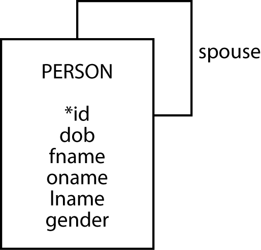

Now for a bit of marriage counseling. Marriage normally is a
relationship between two people. Is that so? Well, some societies permit
polygyny (one man can have many wives), others allow polyandry (one
woman can have many husbands), and some permit same-sex marriages. So
marriage, if we consider all the possibilities, is an m:m relationship
between people, and partner might be a better choice than spouse for
labeling the relationship Also, a person can be married more than once.
To distinguish between different marriages, we really need to record the
start and end date of each relationship and who was involved.

*A marriage data model*

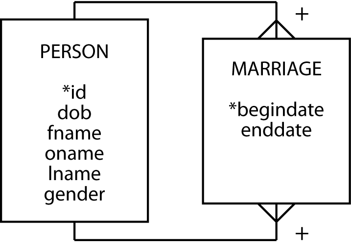

Marriage is an m:m relationship between two persons. It has attributes
*begindate* and *enddate*. An instance of marriage is uniquely
identified by a composite identifier: the two spouse identifiers and
*begindate*. This means any marriage is uniquely identified by the
composite of two person identifiers and the beginning date of the
marriage. We need *begindate* as part of the identifier because the same
couple might have more than one marriage (e.g., get divorced and remarry
each other later). Furthermore, we can safely assume that it is
impossible for a couple to get married, divorced, and remarried all on
the one day. *Begindate* and *enddate* can be used to determine the
current state of a marriage. If *enddate* is null, the marriage is
current; otherwise, the couple has divorced.

This data model assumes a couple goes through some formal process to get
married or divorced, and there is an official date for both of these
events. What happens if they just gradually drift into cohabitation, and
there is no official beginning date? Think about it. (The data model
problem, that is---not cohabitation!) Many countries recognize this
situation as a common-law marriage, so the data model needs to recognize
it. The present data model cannot handle this situation because
*begindate* cannot be null---it is an identifier. Instead, a new
identifier is needed, and *begindate* should become an attribute.

Two new attributes can handle a common-law marriage. *Marriageno* can
count the number of times a couple has been married to each other. In
the majority of cases, *marriageno* will be 1. *Marriagestatus* can
record whether a marriage is current or ended. Now we have a data model
that can also handle common-law marriages. This is also a high-quality
data model in that the client does not have to remember to examine
*enddate* to determine a marriage's current status. It is easier to
remember to examine *marriagestatus* to check status. Also, we can allow
a couple to be married, divorced, and remarried as many times as they
like on the one day---which means we can now use the database in Las
Vegas.

*A revised marriage data model*

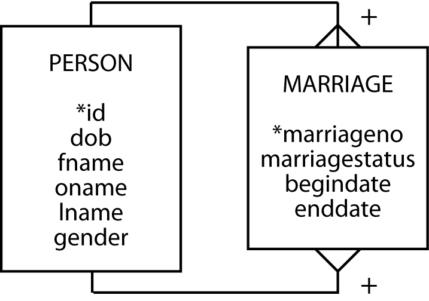

All right, now that we have the couple successfully married, we need to
start thinking about children. A marriage has zero or more children, and
let's start with the assumption a child belongs to only one marriage.
Therefore, we have a 1:m relationship between marriage and person to
represent the children of a marriage.

*A marriage with children data model*

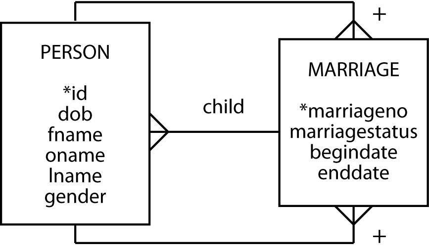

You might want to consider how the model would change to handle
single-parent families, adopted children, and other aspects of human
relationships.

+-------------------------------------------------------------------------+
| *Skill builder*                                                         |
|                                                                         |
| The International Commission for Border Resolution Disputes requires a  |
| database to record details of which countries have common borders.      |
| Design the database. Incidentally, which country borders the most other |
| countries?                                                              |
+-------------------------------------------------------------------------+

#### When's a book not a book?

Sometimes we have to rethink our ideas of physical objects. Consider a
data model for a library.

*A library data model fragment*

 *Missing*

The preceding fragment assumes that a person borrows a book. What
happens if the library has two copies of the book? Do we add an
attribute to BOOK called *copy number*? No, because we would introduce
redundancy by repeating the same information for each book. What you
need to recognize is that in the realm of data modeling, a book is not
really a physical thing, but the copy is, because it is what you borrow.

*A revised library data model fragment*

 *Missing*

As you
can see, a book has many copies, and a copy is of one book. A book can
be identified by *callno*, which is usually a Library of Congress number
or Dewey number. A copy is identified by a *bookno*. This is a unique
number allocated by the library to the copy of the book. If you look in
a library book, you will generally find it pasted on the inside back
cover and shown in numeric and bar code format. Notice that it is called
*book number* despite the fact that it really identifies a copy of a
book. This is because most people, including librarians, think of the
copy as a book.

The International Standard Book Number (ISBN) uniquely identifies any
instance of a book (not copy). Although it sounds like a potential
identifier for BOOK, it is not. ISBNs were introduced in the second half
of the twentieth century, and books published before then do not have an
ISBN.

#### A history lesson

Many organizations maintain historical data (e.g., a person's job
history or a student's enrollment record). A data model can depict
historical data relationships just as readily as current data
relationships.

Consider the case of an employee who works for a firm that consists of
divisions (e.g., production) and departments (e.g., quality control).
The firm contains many departments, but a department belongs to only one
division. At any one time, an employee belongs to only one department.

*Employment history---take 1*

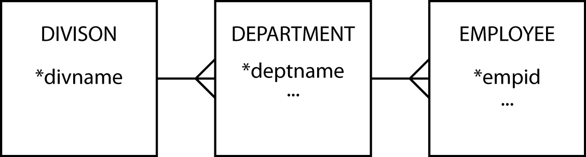

The fragment in the figure can be amended to keep track of the divisions
and departments in which a person works. While employed with a firm, a
person can work in more than one department. Since a department can have
many employees, we have an m:m relationship between DEPARTMENT and
EMPLOYEE. We might call the resulting associative entity POSITION.

*Employment history---take 2*

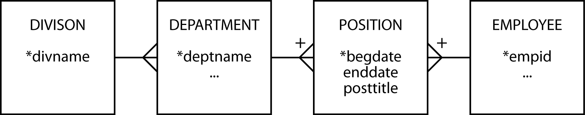

The revised fragment records employee work history. Note that any instance
of POSITION is identified by *begdate* and the identifiers for EMPLOYEE
and DEPARTMENT. The fragment is typical of what happens when you move
from just keeping current data to recording history. A 1:m becomes an
m:m relationship to record history.

People who work get paid. How do we keep track of an employee's pay
data? An employee has many pay slips, but a pay slip belongs to one
employee. When you look at a pay slip, you will find it contains many
items: gross pay and a series of deductions for tax, medical insurance,
and so on. Think of a pay slip as containing many lines, analogous to a
sales form. Now look at the revised data model.

*Employment history---take 3*

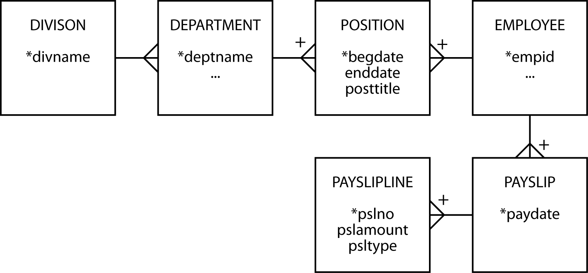

Typically, an amount shown on a pay slip is
identified by a short text field (e.g., gross pay). PAYSLIPLINE contains
an attribute *psltype* to identify the text that should accompany an
amount, but where is the text? When dealing with codes like *psltype*
and their associated text, the fidelity of a data model is improved by
creating a separate entity, PSLTEXT, for the code and its text.

*Employment history---take 4*

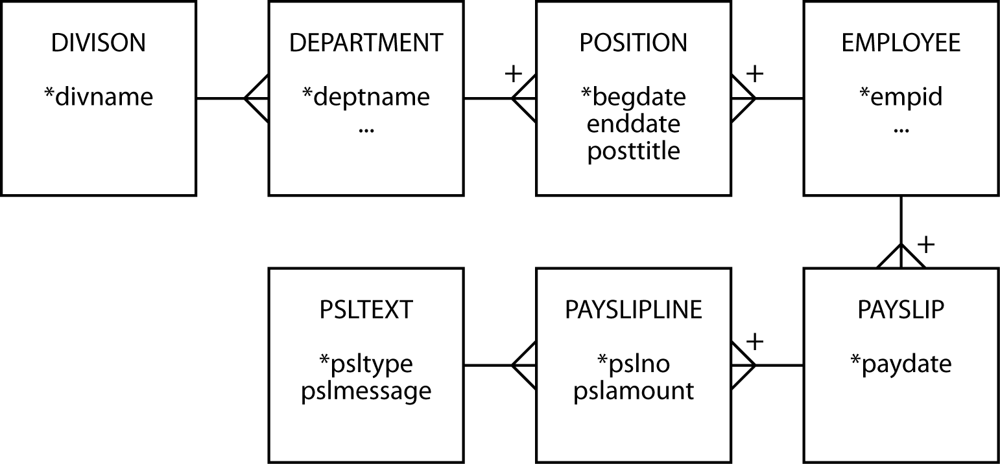

#### A ménage à trois for entities

Consider aircraft leasing. A plane is leased to an airline for a
specific period. When a lease expires, the plane can be leased to
another airline. So, an aircraft can be leased many times, and an
airline can lease many aircraft. Furthermore, there is an agent
responsible for handling each deal. An agent can lease many aircraft and
deal with many airlines. Over time, an airline will deal with many
agents. When an agent reaches a deal with an airline to lease a
particular aircraft, you have a transaction. If you analyze the aircraft
leasing business, you discover there are three m:m relationships. You
might think of these as three separate relationships.

*An aircraft-airline-agent data model*

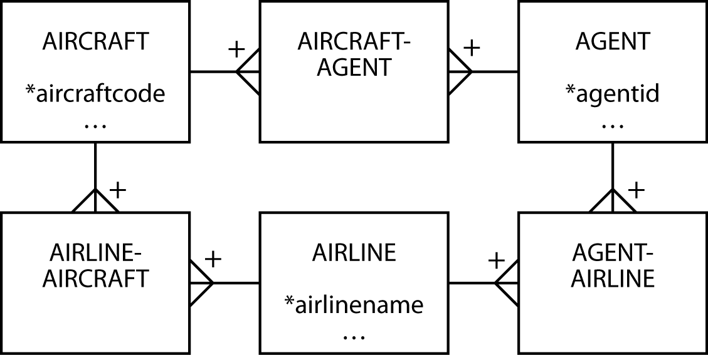

The problem with three separate m:m relationships is that it is unclear
where to store data about the lease. Is it stored in AIRLINE-AIRCRAFT?
If you store the information there, what do you do about recording the
agent who closed the deal? After you read the fine print and do some
more thinking, you discover that a lease is the association of these
three entities in an m:m relationship.

*A revised aircraft-airline-agent data model*

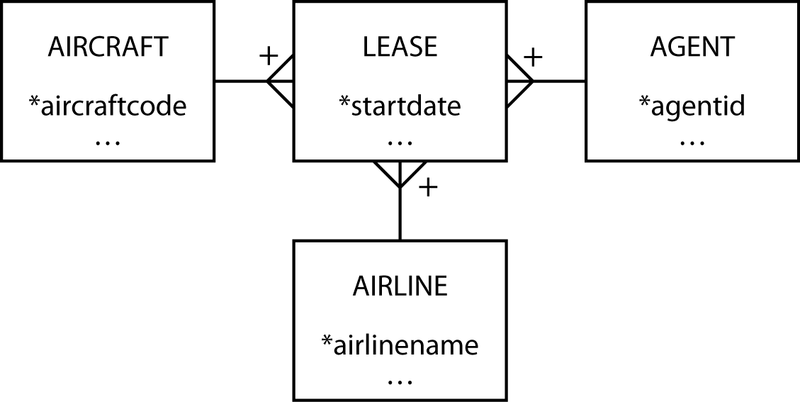

+--------------------------------------------------------------------------+
| *Skill builder*                                                          |
|                                                                          |
| Horse racing is a popular sport in some parts of the world. A horse      |
| competes in at most one race on a course at a particular date. Over      |
| time, a horse can compete in many races on many courses. A horse's rider |
| is called a jockey, and a jockey can ride many horses and a horse can    |
| have many jockeys. Of course, there is only ever one jockey riding a     |
| horse at a particular time. Courses vary in their features, such as the  |
| length of the course and the type of surface (e.g., dirt or grass).      |
| Design a database to keep track of the results of horse races.           |
+--------------------------------------------------------------------------+

#### Project management---planning and doing

Project management involves both planned and actual data. A project is
divided into a number of activities that use resources. Planning
includes estimation of the resources to be consumed. When a project is
being executed, managers keep track of the resources used to monitor
progress and keep the project on budget. Planning data may not be as
detailed as actual data and is typically fairly broad, such as an
estimate of the number of hours that an activity will take. Actual data
will be more detailed because they are usually collected by getting
those assigned to the project to log a daily account of how they spent
their time. Also, resources used on a project are allocated to a
particular activity. For the purposes of this data model, we will focus
only on recording time and nothing else.

*A project management data model*

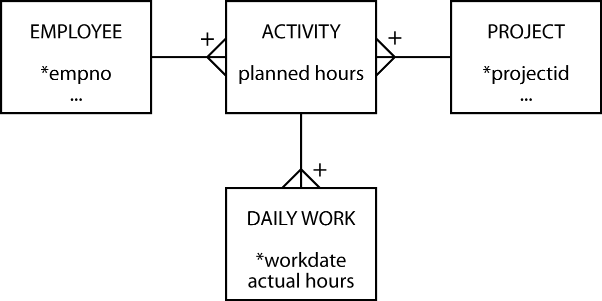

Notice that *planned hours* is an attribute of ACTIVITY, and *actual
hours* is an attribute of DAILY WORK. The hours spent on an activity are
derived by summing *actual hours* in the associated DAILY WORK entity.
This is a high-fidelity data model if planning is done at the activity
level and employees submit daily worksheets. Planning can be done in
greater detail, however, if planners indicate how many hours of each day
each employee should spend on a project.

*A revised project management data model*

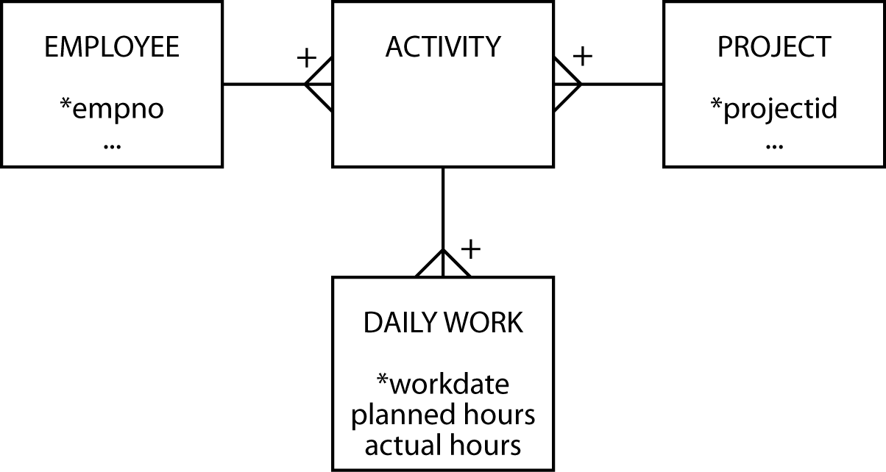

Now you see that *planned hours* and *actual hours* are both attributes
of DAILY WORK. The message of this example, therefore, is not to assume
that planned and actual data have the same level of detail, but do not
be surprised if they do.

#### Cardinality

Some data modeling languages are quite precise in specifying the
cardinality, or multiplicity, of a relationship. Thus, in a 1:m
relationship, you might see additional information on the diagram. For
example, the "many" end of the relationship might contain notation (such
as 0,n) to indicate zero or more instances of the entity at the "many"
end of the relationship.

*Cardinality and modality options*

  Cardinality   Modality    Meaning
  ------------- ----------- ---------------------------------------------------------------------------------------------
  0,1           Optional    There can be zero or one instance of the entity relative to the other entity.
  0,n                       There can be zero or many instances of the entity relative to the other entity.
  1,1           Mandatory   There is exactly one instance of the entity relative to the other entity.
  1,n                       The entity must have at least one and can have many instances relative to the other entity.
  
The data modeling method of this text, as you now realize, has taken a
broad approach to cardinality (is it 1:1 or 1:m?). We have not been
concerned with greater precision (is it 0,1 or 1,1?), because the focus
has been on acquiring basic data modeling skills. Once you know how to
model, you can add more detail. When learning to model, too much detail
and too much terminology can get in the way of mastering this difficult
skill. Also, it is far easier to sketch models on a whiteboard or paper
when you have less to draw. Once you switch to a data modeling tool,
then adding cardinality precision is easier and appropriate.

*Modality*

Modality, also known as optionality, specifies whether an instance of an
entity must participate in a relationship. Cardinality indicates the
range of instances of an entity participating in a relationship, while
modality defines the minimum number of instances. Cardinality and
modality are linked, as shown in the table above. If an entity is
optional, the minimum cardinality will be 0, and if mandatory, the
minimum cardinality is 1.

By asking the question, "Does an occurrence of this entity require an
occurrence of the other entity?" you can assess whether an entity is
mandatory. The usual practice is to use "O" for optional and place it
near the entity that is optional. Mandatory relationships are often
indicated by a short line (or bar) at right angles to the relationship
between the entities.

In the following figure, it is mandatory for an instance of STOCK to
have an instance of NATION, and optional for an instance of NATION to
have an instance of STOCK, which means we can record details of a nation
for which stocks have not yet been purchased. During conversion of the
data model to a relational database, the mandatory requirement (i.e.,
each stock must have a nation) is enforced by the foreign key
constraint.

*1:m relationship showing modality*

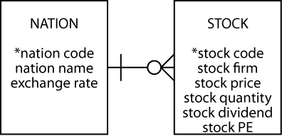

Now consider an example of an m:m relationship. A SALE can have many
LINEITEMs, and a LINEITEM has only one SALE. An instance of LINEITEM
must be related to an instance of SALE, otherwise it can't exist.
Similarly, it is mandatory for an instance of SALE to have an instance
of LINEITEM, because it makes no sense to have a sale without any items
being sold.

In a relational database, the foreign key constraint handles the
mandatory relationship between instances of LINEITEM and SALE, The
mandatory requirement between SALE and LINEITEM has to be built into the
processing logic of the application that processes a sales transaction.
Basic business logic requires that a sale include some items, so a sales
transaction creates one instance of SALE and multiple instances of
LINEITEM. It does not make sense to have a sale that does not sell
something.

*An m:m relationship showing modality*


The relationship between ITEM and LINEITEM is similar in structure to
that of NATION and STOCK, which we saw in the previous example. An
instance of a LINEITEM has a mandatory requirement for an instance of
ITEM. An instance of an ITEM can exist without the need for an instance
of a LINEITEM (i.e., the items that have not been sold).

We gain further understanding of modality by considering a 1:1
relationship. We focus attention on the 1:1 because the 1:m relationship
has been covered. The 1:1 implies that it is mandatory for an instance
of DEPT to be related to one instance of EMP (i.e., a department must
have a person who is the boss), and an instance of EMP is optionally
related to one instance of DEPT (i.e., an employee can be a boss, but
not all employees are departmental bosses).

*A 1:1 relationship showing modality*

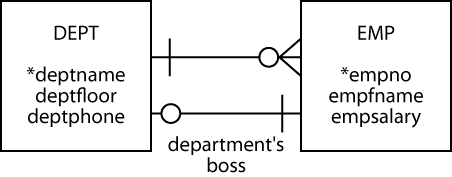

Earlier, when deciding where to store the foreign key for the 1:1
relationship, we settled on placing the foreign key in DEPT, because all
departments have a boss. Now we have a rule. The foreign key goes with
the entity for which the relationship is mandatory. When specifying the
create statements, you will need to be aware of the chicken-and-egg
connection between DEPT and EMP. We cannot insert an employee in EMP
unless we know that person's department, and we cannot insert a
department unless we have already inserted the boss for that department
in EMP. We can get around this problem by using a **deferrable foreign
key constraint**, but at this point we don't know enough about
transaction processing to discuss this approach.

Let's now consider recursive relationships. The following figure shows a
recursive 1:m between employees, representing that one employee can be
the boss of many other employees and a person has one boss. It is
optional that a person is a boss, and optional that everyone has a boss,
mainly because there has to be one person who is the boss of everyone.
However, we can get around this one exception by inserting employees in
a particular order. By inserting the biggest boss first, we effectively
make it mandatory that all employees have a boss. Nevertheless, data
models cover every situation and exception, so we still show the
relationship as optional.

*1:m recursive with modality*

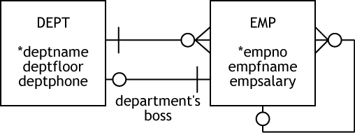

We rely again on the British monarchy. This time we use it to illustrate
modality with a 1:1 recursive relationship. As the following figure
shows, it is optional for a monarch to have a successor. We are not
talking about the end of a monarchy, but rather how we address the data
modeling issue of not knowing who succeeds the current monarch.
Similarly, there must be a monarch who did not succeed someone (i.e.,
the first king or queen). Thus, both ends of the succession relationship
have optional modality.

*1:1 recursive with modality*

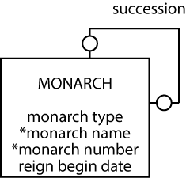

Finally, in our exploration of modality, we examine the m:m recursive.
The model indicates that it is optional for a product to have components
and optional for a product to be a component in other products. However,
every assembly must have associated products.

*m:m recursive with modality*

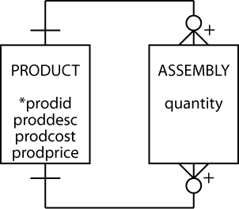

##### Summary

Modality adds additional information to a data model, and once you have
grasped the fundamental ideas of entities and relationships, it is quite
straightforward to consider whether a relationship is optional or
mandatory. When a relationship is mandatory, you need to consider what
constraint you can add to a table's definition to enforce the
relationship. As we have seen, in some cases the foreign key constraint
handles mandatory relationships. In other cases, the logic for enforcing
a requirement will be built into the application.

#### Entity types

A data model contains different kinds of entities, which are
distinguished by the format of their identifiers. Labeling each of these
entities by type will help you to determine what questions to ask.

##### Independent entity

An independent entity is often central to a data model and foremost in
the client's mind. Independent entities are frequently the starting
points of a data model. Remember that in the investment database, the
independent entities are STOCK and NATION. Independent entities
typically have clearly distinguishable names because they occur so
frequently in the client's world. In addition, they usually have a
single identifier, such as *stock code* or *nation code*.

Independent entities are often connected to other independent entities
in a 1:m or m:m relationship. The data model in the following figure
shows two independent entities linked in a 1:m relationship.

*NATION and STOCK---independent entities*


##### Weak or dependent entity

A weak entity (also known as a dependent entity) relies on another
entity for its existence and identification. It is recognized by a plus
on the weak entity's end of the relationship. CITY cannot exist without
REGION. A CITY is uniquely identified by *cityname* and *regname*. If
the composite identifier becomes unwieldy, creating an arbitrary
identifier (e.g., cityno) will change the weak entity into an
independent one.

*CITY---a weak entity*

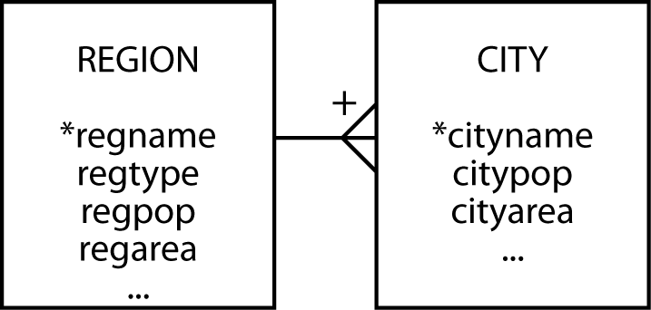

##### Associative entity

Associative entities are by-products of m:m relationships. They are
typically found between independent entities. Associative entities
sometimes have obvious names because they occur in the real world. For
instance, the associative entity for the m:m relationship between
DEPARTMENT and EMPLOYEE is usually called POSITION. If the associative
entity does not have a common name, the two entity names are generally
hyphenated (e.g., DEPARTMENT-EMPLOYEE). Always search for the
appropriate name, because it will improve the quality of the data model.
Hyphenated names are a last resort.

*POSITION is an associative entity*


Associative entities can show either the current or the historic
relationship between two entities. If an associative entity's only
identifiers are the two related entities' identifiers, then it records
the current relationship between the entities. If the associative entity
has some time measure (e.g., date or hour) as a partial identifier, then
it records the history of the relationship. Whenever you find an
associative entity, ask the client whether the history of the
relationship should be recorded.

Creating a single, arbitrary identifier for an associative entity will
change it to an independent one. This is likely to happen if the
associative entity becomes central to an application. For example, if a
personnel department does a lot of work with POSITION, it may find it
more expedient to give it a separate identifier (e.g., *position
number*).

##### Aggregate entity

An aggregate entity is created when several different entities have
similar attributes that are distinguished by a preceding or following
modifier to keep their names unique. For example, because components of
an address might occur in several entities (e.g., CUSTOMER and
SUPPLIER), an aggregate address entity can be created to store details
of all addresses. Aggregate entities usually become independent
entities. In this case, we could use *address number* to identify an
instance of address uniquely.

##### Subordinate entity

A subordinate entity stores data about an entity that can vary among
instances. A subordinate entity is useful when an entity consists of
mutually exclusive classes that have different descriptions. The farm
animal database shown in the following figure indicates that the farmer
requires different data for sheep and horses. Notice that each of the
subordinate entities is identified by the related entity's identifier.
You could avoid subordinate entities by placing all the attributes in
ANIMAL, but then you make it incumbent on the client to remember which
attributes apply to horses and which to sheep. This becomes an important
issue for null fields. For example, is the attribute *hay consumption*
null because it does not apply to sheep, or is it null because the value
is unknown?

*SHEEP and HORSE are subordinate entities*

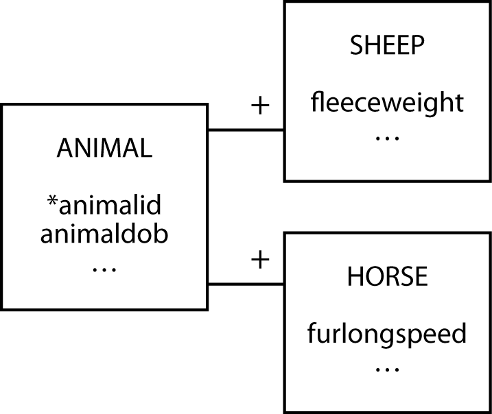

If a subordinate entity becomes important, it is likely to evolve into
an independent entity. The framing of a problem often determines whether
subordinate entities are created. Stating the problem as, "a farmer has
many animals, and these animals can be horses or sheep," might lead to
the creation of subordinate entities. Alternatively, saying that "a
farmer has many sheep and horses" might lead to setting up SHEEP and
HORSE as independent entities.

#### Generalization and aggregation

Generalization and aggregation are common ideas in many modeling
languages, particularly object-oriented modeling languages such as the
Unified Modeling Language (UML), which we will use in this section.

##### Generalization

A generalization is a relationship between a more general element and a
more specific element. In the following figure, the general element is
*animal*, and the specific elements are *sheep* and *horse*. A horse is
a subtype of animal. A generalization is often called an "is a"
relationship because the subtype element is a member of the
generalization.

A generalization is directly mapped to the relational model with one
table for each entity. For each of the subtype entities (i.e., SHEEP and
HORSE), the primary key is that of the supertype entity (i.e., ANIMAL).
You must also make this column a foreign key so that a subtype cannot be
inserted without the presence of the matching supertype. A
generalization is represented by a series of 1:1 relationships to weak
entities.

*A generalization hierarchy in UML*

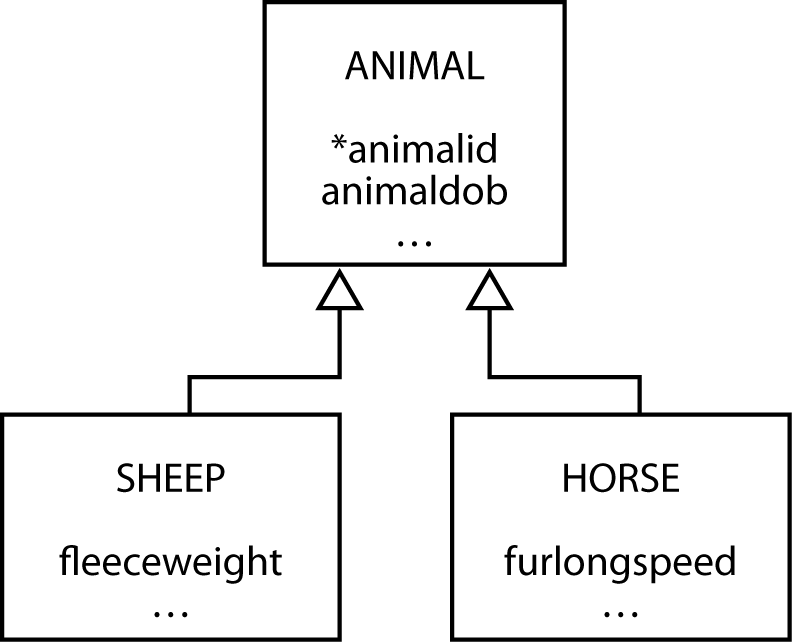

#### Aggregation

Aggregation is a part-whole relationship between two entities. Common
phrases used to describe an aggregation are "consists of," "contains,"
and "is part of." The following figure shows an aggregation where a herd
consists of many cows. Cows can be removed or added, but it is still a
herd. An open diamond next to the whole denotes an aggregation. In data
modeling terms, there is a 1:m relationship between herd and cow.

*An aggregation in UML and data modeling*

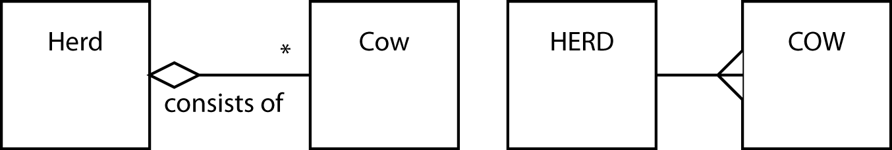

There are two special types of aggregation: shared and composition. With
**shared aggregation**, one entity owns another entity, but other
entities can own that entity as well. A sample shared aggregation is
displayed in the following figure, which shows that a class has many
students, and a student can be a member of many classes. Students, the
parts in this case, can be part of many classes. An open diamond next to
the whole denotes a shared aggregation, which we represent in data
modeling as an m:m relationship.

*Shared aggregation in UML and data modeling*


In a **composition aggregation,** one entity exclusively owns the other
entity. A solid diamond at the whole end of the relationship denotes
composition aggregation. The appropriate data model is a weak entity, as
shown in the following figure.

*Composition aggregation in UML and data modeling*


#### Data modeling hints

A high-fidelity data model takes time to develop. The client must
explain the problem fully so that the database designer can understand
the client's requirements and translate them into a data model. Data
modeling is like prototyping; the database designer gradually creates a
model of the database as a result of interaction with the client. Some
issues will frequently arise in this progressive creation, and the
following hints should help you resolve many of the common problems you
will encounter.

#### The rise and fall of a data model

Expect your data model to both expand and contract. Your initial data
model will expand as you extend the boundaries of the application. You
will discover some attributes will evolve into entities, and some 1:m
relationships will become m:m relationships. It will grow because you
will add entities, attributes, and relationships to allow for
exceptions. Your data model will grow because you are representing the
complexity of the real world. Do not try to constrain growth. Let the
data model be as large as is necessary. As a rough rule, expect your
final data model to grow to about two to three times the number of
entities of your initial data model.

Expect your data model to contract as you generalize structures. The
following fragment is typical of the models produced by novice data
modelers. It can be reduced by recognizing that PAINTING, SCULPTURE, and
CERAMIC are all types of art. A more general entity, ART, could be used
to represent the same data. Of course, it would need an additional
attribute to distinguish the different types of art recordings.

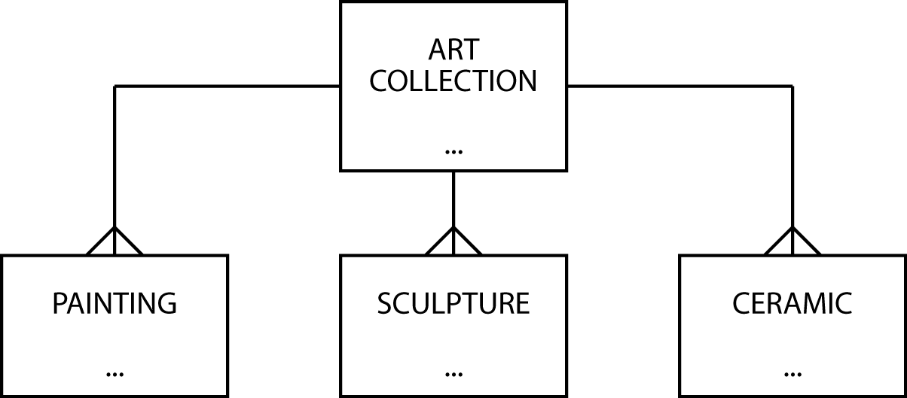

*The shrunken data model*


As you discover new entities, your data model will grow. As you
generalize, your data model will shrink.

#### Identifier

If there is no obvious simple identifier, invent one. The simplest is a
meaningless code (e.g., *person number* or *order number*). If you
create an identifier, you can also guarantee its uniqueness.

Don't overwork an identifier. The worst case we have seen is a
22-character product code used by a plastics company that supposedly not
only uniquely identified an item but told you its color, its
manufacturing process, and type of plastic used to make it! Color,
manufacturing process, and type of plastic are all attributes. This
product code was unwieldy. Data entry error rates were extremely high,
and very few people could remember how to decipher the code.

An identifier has to do only one thing: uniquely identify every instance
of the entity. Sometimes trying to make it do double, or even triple,
duty only creates more work for the client.

#### Position and order

There is no ordering in a data model. Entities can appear anywhere. You
will usually find a central entity near the middle of the data model
only because you tend to start with prominent entities (e.g., starting
with STUDENT when modeling a student information system). What really
matters is that you identify all relevant entities.

Attributes are in no order. You find that you will tend to list them as
they are identified. For readability, it is a good idea to list some
attributes sequentially. For example, first name, other names, and last
name are usually together. This is not necessary, but it speeds up
verification of a data model's completeness.

Instances are also assumed to have no ordering. There is no first
instance, next instance, or last instance. If you must recognize a
particular order, create an attribute to record the order. For example,
if ranking of potential investment projects must be recorded, include an
attribute (*projrank*) to store this data. This does not mean the
instances will be stored in *projrank* order, but it does allow you to
use the ORDER BY clause of SQL to report the projects in rank order.

If you need to store details of a precedence relationship (i.e., there
is an ordering of instances and a need to know the successor and
predecessor of any instance), then use a 1:1 recursive relationship.

*Using an attribute to record an ordering of instances*


#### Attributes and consistency

Attributes must be consistent, retaining the same meaning for every
instance. An example of an inconsistent attribute would be an attribute
*stock info* that contains a stock's PE ratio or its ROI (return on
investment). Another attribute, say *stock info code*, is required to
decipher which meaning applies to any particular instance. The code
could be "1" for PE and "2" for ROI. If one attribute determines the
meaning of another, you have inconsistency. Writing SQL queries will be
extremely challenging because inconsistent data increases query
complexity. It is better to create separate attributes for PE and ROI.

#### Names and addresses

An attribute is the smallest piece of data that will conceivably form
part of a query. If an attribute has segments (e.g., a person's name),
determine whether these could form part of a query. If so, then make
them separate attributes and reapply the query test. When you apply the
query test to *person name*, you will usually decide to create three
attributes: ***f**irst name*, *other names*, and *last name*.

What about titles? There are two sorts of modifier titles: preceding
titles (e.g., Mr., Mrs., Ms., and Dr.) and following titles (e.g., Jr.
and III). These should be separate attributes, especially if you have
divided *name* into separate attributes.

Addresses seem to cause more concern than names because they are more
variant. Business addresses tend to be the most complicated, and foreign
addresses add a few more twists. The data model fragment in the
following figure works in most cases.

*Handling addresses*

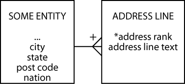

Common features of every address are city, state (province in Canada,
county in Eire), postal code (ZIP code in the United States), and
nation. Some of these can be null. For example, Singapore does not have
any units corresponding to states. In the United States, city and state
can be derived from the zip code, but this is not necessarily true for
other countries. Furthermore, even if this were true for every nation,
you would need a different derivation rule for each country, which is a
complexity you might want to avoid. If there is a lifetime guarantee
that every address in the database will be for one country, then examine
the possibility of reducing redundancy by just storing post code.

Notice that the problem of multiple address lines is represented by a
1:m relationship. An address line is a text string that appears as one
line of an address. There is often a set sequence in which these are
displayed. The attribute *address rank* records this order.

How do you address students? First names may be all right for class, but
it is not adequate enough for student records. Students typically have
multiple addresses: a home address, a school address, and maybe a summer
address. The following data model fragment shows how to handle this
situation. Any instance of ADDRESS LINE is identified by the composite
of *studentid**,** addresstype*, and *address rank*.

*Students with multiple addresses*


The identifier *address type* is used to distinguish among the different
types of addresses. The same data model fragment works in situations
where a business has different mailing and shipping addresses.

When data modeling, can you take a shortcut with names and addresses? It
is time consuming to write out all the components of name and address.
It creates clutter and does not add much fidelity. Our practical advice
is to do two things. *First**, ***create a policy for all names and
addresses (e.g., all names will be stored as three parts: first name,
other names, last name). *Second*, use shorthand forms of attributes for
names and addresses when they obey the policy. So from now on, we will
sometimes use name and address as attributes with the understanding that
when the database is created, the parts will become separate columns.

#### Single-instance entities

Do not be afraid of creating an entity with a single instance. Consider
the data model fragment in the following figure which describes a single
fast-food chain. Because the data model describes only one firm, the
entity FIRM will have only one instance. The inclusion of this single
instance entity permits facts about the firm to be maintained.
Furthermore, it provides flexibility for expansion. If two fast-food
chains combine, the data model needs no amendment.

*FIRM---a single-instance entity*

.png)

#### Picking words

Words are very important. They are all we have to make ourselves
understood. Let the client choose the words, because the data model
belongs to the client and describes the client's world. If you try to
impose your words on the client, you are likely to create a
misunderstanding.

#### Synonyms

Synonyms are words that have the same meaning. For example, task,
assignment, and project might all refer to the same real-world object.
One of these terms, maybe the one in most common use, needs to be
selected for naming the entity. Clients need to be told the official
name for the entity and encouraged to adopt this term for describing it.
Alternatively, create views that enable clients to use their own term.
Synonyms are not a technical problem. It is a social problem of getting
clients to agree on one word.

#### Homonyms

Homonyms are words that sound the same but have different meanings.
Homonyms can create real confusion. *Sale date* is a classic example. In
business it can have several meanings. To the salespeople, it might be
the day that the customer shakes hands and says, "We have a deal." For
the lawyers, it is could be the day when the contract is signed, and for
production, it might be the day the customer takes delivery. In this
case, the solution is reasonably obvious; redefine *sale date* to be
separate terms for each area (e.g., *sales date*, *contract date*, and
*delivery date* for sales, legal, and production departments,
respectively).

Homonyms cause real confusion when clients do not realize that they are
using the same word for different entities or attributes. Hunt down
homonyms by asking lots of questions and querying a range of clients.

#### Exception hunting

Go hunting for exceptions. Keep asking the client questions such as

* Is it always like this?

* Would there be any situations where this could be an m:m relationship?

* Have there ever been any exceptions?

* Are things likely to change in the future?

Always probe for exceptions and look for them in the examples the client
uses. Redesigning the data model to handle exceptions increases
fidelity.

#### Relationship labeling

Relationship labeling clutters a data model. In most cases, labels can
be correctly inferred, so use labels only when there is a possibility of
ambiguity.

#### Keeping the data model in shape

As you add to a data model, maintain fidelity. Do not add entities
without also completing details of the identifier and attributes. By
keeping the data model well formed, you avoid ambiguity, which
frequently leads to miscommunication.

#### Used entities

Would you buy a used data model? Certainly, because a used data model is
more likely to have higher fidelity than a brand new one. A used data
model has been subjected to much scrutiny and revision and should be a
more accurate representation of the real world.

### Meaningful identifiers

An identifier is said to be meaningful when some attributes of the
entity can be inferred from the identifier's value (e.g., a code of B78
for an item informs a clerk that the item is black). The word
"meaningful" in everyday speech usually connotes something desirable,
but many data managers agree that meaningful identifiers or codes create
problems. While avoiding meaningful identifiers is generally accepted as
good data management practice, they are still widely used. After a short
description of some examples of meaningful identifiers, this section
discusses the pros and cons of meaningful identifiers.

The invoice number "12dec0001" is a meaningful identifier. The first
five positions indicate in which period the invoice was generated. The
last four digits of the invoice number have a meaning. The 0001
indicates it was the first invoice sent in December. In addition, e-mail
addresses, like
[[mvdpas\@bizzo.nl]{.underline}](mailto:mvdpas@bizzo.nl), have a
meaning.

When coding a person's gender, some systems use the codes "m" and "f"
and others "1" and "2." The pair (m, f) is meaningful, but (1, 2) is not
and puts the onus on the user to remember the meaning. The codes "m" and
"f'" are derived from the reality that they represent. They are the
first letters of the words male and female. The "1" and "2" are not
abstracted from reality, and therefore they do not have an intuitive
meaning.

However, if you want to set an international standard suitable for many
languages, then you need to revert to numeric codes, because "m" and "f"
are not the first letters in all languages for male and female,
respectively. Thus the English version of the International Organization
for Standardization (ISO) information interchange standard for the
representation of human sexes (ISO 5218) states:

*No significance is to be placed on the fact that "Male" is coded "1"
and "Female" is coded "2." This standard was developed based upon
predominant practices of the countries involved and does not convey any
meaning of importance, ranking or any other basis that could imply
discrimination.*

In determining whether an identifier is meaningful, one can look at the
way new values of that identifier are generated. If the creation takes
place on the basis of characteristics that appear in reality, the
identifier is meaningful. That is why the identifier of the invoice
"12dec0002," which is the identifier assigned to the second invoice
generated in December 2012, is meaningful. It is also why the e-mail
address
[[rwatson\@terry.uga.edu]{.underline}](mailto:rwatson@terry.uga.edu) is
meaningful.

Meaningful identifiers clearly have some advantages and disadvantages,
and these are now considered. 

*Advantages and disadvantages of meaningful identifiers*

+-------------------------------+------------------------+
| Advantages                    | Disadvantages          |
+===============================+========================+
| Recognizable and rememberable | Identifier exhaustion  |
|                               |                        |
| Administrative simplicity     | Reality changes        |
|                               |                        |
|                               | Loss of meaningfulness |
+-------------------------------+------------------------+

#### Advantages of meaningful identifiers

##### Recognizable and rememberable

People can often recognize and remember the significance of meaningful
identifiers. If, for example, someone receives an e-mail from
[[rwatson\@terry.uga.edu]{.underline}](mailto:rwatson@terry.uga.edu),
this person can probably deduce the sender's name and workplace. If a
manufacturer, for instance, uses the last two digits of its furniture
code to indicate the color (e.g., 08 = beech), employees can then
quickly determine the color of a packed piece of furniture. Of course,
the firm could also show the color of the furniture on the label, in
which case customers, who are most unlikely to know the coding scheme,
can quickly determine the color of the enclosed product.

##### Administrative simplicity

By using meaningful identifiers, administration can be relatively easily
decentralized. Administering e-mail addresses, for instance, can be
handled at the domain level. This way, one can avoid the process of
synchronizing with other domains whenever a new e-mail address is
created.

A second example is the EAN (European article number), the bar code on
European products. Issuing EANs can be administered per country, since
each country has a unique number in the EAN. When issuing a new number,
a country need only issue a code that is not yet in use in that country.
The method of contacting all countries to ask whether an EAN has already
been issued is time consuming and open to error. On the other hand,
creating a central database of issued EAN codes is an option. If every
issuer of EAN codes can access such a database, alignment among
countries is created and duplicates are prevented.

#### Disadvantages of meaningful identifiers

##### Identifier exhaustion

Suppose a company with a six-digit item identifier decides to use the
first three digits to specify the product group (e.g., stationery)
uniquely. Within this group, the remaining three digits are used to
define the item (e.g., yellow lined pad). As a consequence, only one
thousand items can be specified per product group. This problem remains
even when some numbers in a specific product group, or even when entire
product groups, are not used.

Consider the case when product group "010" is exhausted and is
supplemented by the still unused product group code "940." What seems to
be a simple quick fix causes problems, because a particular product
group is not uniquely identified by a single identifier. Clients have to
remember there is an exception.

A real-world example of identifier exhaustion is a holding company that
identifies its subsidiaries by using a code, where the first character
is the first letter of the subsidiary's name. When the holding company
acquired its seventh subsidiary, the meaningfulness of the coding system
failed. The newly acquired subsidiary name started with the same letter
as one of the existing subsidiaries. The system had already run out of
identifiers.

When existing identifiers have to be converted because of exhaustion,
printed codes on labels, packages, shelves, and catalogs will have to be
redone. Recoding is an expensive process and should be avoided.

Exhaustion is not only a problem with meaningful identifiers. It can
happen with non-meaningful identifiers. The problem is that meaningful
identifier systems tend to exhaust sooner. To avoid identifier
exhaustion and maintain meaningful identifiers, some designers increase
identifier lengths (e.g., four digits for product group).

##### Reality changes

The second problem of meaningful identifiers is that the reality they
record changes. For example, a company changes its name. The College of
Business at the University of Georgia was renamed the Terry College of
Business. E-mail addresses changed (e.g.,
[[rwatson\@cba.uga.edu]{.underline}](mailto:rwatson@cba.uga.edu) became
[[rwatson\@terry.uga.edu]{.underline}](mailto:rwatson@terry.uga.edu)).
An identifier can remain meaningful over a long period only if the
meaningful part rarely or never changes.

Non-meaningful identifiers avoid reality changes. Consider the case of
most telephone billing systems, which use an account ID to identify a
customer rather than a telephone number. This means a customer can
change telephone numbers without causing any coding problems because
telephone number is not the unique identifier of each customer.

##### A meaningful identifier can lose its meaningfulness

Consider the problems that can occur with the identifier that records
both the color and the material of an article. Chipboard with a beech
wood veneer is coded BW. A black product, on the other hand, is coded
BL. Problems arise whenever there is an overlap between these
characteristics. What happens with a product that is finished with a
black veneer on beech wood? Should the code be BW or BL? What about a
black-painted product that is made out of beech wood? Maybe a new code,
BB for black beech wood, is required. There will always be employees and
customers who do not know the meaning of these not-so-meaningful
identifiers and attribute the wrong meaning to them.

#### The solution---non-meaningful identifiers

Most people are initially inclined to try to make identifiers
meaningful. There is a sense that something is lost by using a simple
numeric to identify a product or customer. Nothing, however, is lost and
much is gained. Non-meaningful identifiers serve their sole purpose
well---to identify an entity uniquely. Attributes are used to describe
the characteristics of the entity (e.g., color, type of wood). A clear
distinction between the role of identifiers and attributes creates fewer
data management problems now and in the future.

+---------------------------------------------------------------------------------+
| *Vehicle identification*                                                        |
|                                                                                 |
| In most countries, every road vehicle is uniquely identified. The               |
| Vehicle Identification Number (VIN) was originally described in ISO             |
| Standard 3779 in February 1977 and last revised in 1983. It is designed         |
| to identify motor vehicles, trailers, motorcycles, and mopeds. A VIN is         |
| 17 characters, A through Z and 0 through 9.                                     |
|                                                                                 |
| The European Union and the United States have different implementations         |
| of the standard. The U.S. VIN is divided into four parts                        |
|                                                                                 |
| * World Manufacturer\'s Identification (WMI) - three characters                 |
|                                                                                 |
| * Vehicle Description Section (VDS) - five characters                           |
|                                                                                 |
| * Check digit                                                                   |
|                                                                                 |
| * Vehicle Identification Section (VIS) - eight characters                       |
|                                                                                 |
| When decoded, a VIN specifies the country and year of manufacture; make,        |
| model, and serial number; assembly plant; and even some equipment               |
| specifications.                                                                 |
|                                                                                 |
| VINs are normally located in several locations on a car, but the most           |
| common places are in the door frame of the front doors, on the engine           |
| itself, around the steering wheel, or on the dash near the window.              |
|                                                                                 |
| What do you think of the VIN as a method of vehicle identification? How         |
| do you reconcile it with the recommendation to use meaningless                  |
| identifiers? If you were consulted on a new VIN system, what would              |
| advise?                                                                         |
+---------------------------------------------------------------------------------+

### The seven habits of highly effective data modelers

There is often a large gap between the performance of *average* and
*expert* data modelers. An insight into the characteristics that make
some data modelers more skillful than others should improve your data
modeling capabilities.

#### Immerse

Find out what the client wants by immersing yourself in the task
environment. Spend some time following the client around and participate
in daily business. Firsthand experience of the problem will give you a
greater understanding of the client's requirements. Observe, ask
questions, reflect, and talk to a wide variety of people (e.g.,
managers, operations personnel, customers, and suppliers). The more you
learn about the problem, the better equipped you are to create a
high-fidelity data model.

#### Challenge

Challenge existing assumptions; dig out the exceptions. Test the
boundaries of the data model. Try to think about the business problem
from different perspectives (e.g., how might the industry leader tackle
this problem?). Run a brainstorming session with the client to stimulate
the search for breakthrough solutions.

#### Generalize

Reduce the number of entities whenever possible by using generalized
structures (remember the Art Collection model) to simplify the data
model. Simpler data models are usually easier to understand and less
costly to implement. Expert data modelers can see beyond surface
differences to discern the underlying similarities of seemingly
different entities.

#### Test

Test the data model by reading it to yourself and several people
intimately familiar with the problem. Test both directions of every
relationship (e.g., a farmer has many cows and a cow belongs to only one
farmer). Build a prototype so that the client can experiment and learn
with a concrete model. Testing is very important because it costs very
little to fix a data model but a great deal to repair a system based on
an incorrect data model.

#### Limit

Set reasonable limits to the time and scope of data modeling. Don't let
the data modeling phase continue forever. Discover the boundaries early
in the project and stick to these unless there are compelling reasons to
extend the project. Too many projects are allowed to expand because it
is easier to say *yes* than *no*. In the long run, however, you do the
client a disservice by promising too much and extending the life of the
project. Determine the core entities and attributes that will solve most
of the problems, and confine the data model to this core. Keep sight of
the time and budget constraints of the project.

#### Integrate

Step back and reflect on how your project fits with the organization's
information architecture. Integrate with existing systems where feasible
and avoid duplication. How does your data model fit with the corporate
data model and those of other projects? Can you use part of an existing
data model? A skilled data modeler has to see both the fine-grained
detail of a project data model and the big picture of the corporate data
resource.

#### Complete

Good data modelers don't leave data models ill-defined. All entities,
attributes, and relationships are carefully defined, ambiguities are
resolved, and exceptions are handled. Because the full value of a data
model is realized only when the system is complete, the data modeler
should stay involved with the project until the system is implemented.
The data modeler, who generally gets involved in the project from its
earliest days, can provide continuity through the various phases and
ensure the system solves the problem.

### Summary

Data modeling is both a technique for modeling data and its
relationships and a graphical representation of a database. It
communicates a database's design. The goal is to identify the facts that
must be stored in a database. Building a data model is a partnership
between a client, a representative of the eventual owners of the
database, and a designer. The building blocks are an entity, attribute,
identifier, and relationship. A well-formed data model, which means the
construction rules have been obeyed, clearly communicates information to
the client. A high-fidelity data model faithfully describes the world it
represents.

A data model is an evolving representation. Each change should be an
incremental improvement in quality. The quality of a data model can be
determined only by understanding the context in which it will be used. A
data model can model historical data relationships just as readily as
current ones. Cardinality specifies the precise multiplicity of a
relationship. Modality indicates whether a relationship is optional or
mandatory. The five different types of entities are independent,
dependent, associative, aggregate, and subordinate. Expect a data model
to expand and contract. A data model has no ordering. Introduce an
attribute if ordering is required. An attribute must have the same
meaning for every instance. An attribute is the smallest piece of data
that will conceivably form part of a query. Synonyms are words that have
the same meaning; homonyms are words that sound the same but have
different meanings. Identifiers should generally have no meaning. Highly
effective data modelers immerse, challenge, generalize, test, limit,
integrate, and complete.

Key terms and concepts
------------------------------------ --------------------------------------------------
Aggregate entity                     Homonym
Aggregation                          Identifier
Associative entity                   Independent entity
Attribute                            Instance
Cardinality                          Mandatory
Composite aggregation                Modality
Data model                           Modeling
Data model quality                   Optional
Dependent entity                     Relationship
Determinant                          Relationship descriptor
Domain                               Relationship label
Entity                               Shared aggregation
Generalization                       Synonym
High-fidelity image

#### References and additional readings

Carlis, J. V. 1991. *Logical data structures*. Minneapolis, MN:
University of Minnesota.

Hammer, M. 1990. Reengineering work: Don't automate, obliterate.
*Harvard Business Review* 68 (4):104--112.

#### Exercises

##### Short answers

1.  What is data modeling?

2. What is a useful technique for identifying entities in a written
    description of a data modeling problem?

3. When do you label relationships?

4. When is a data model well formed, and when is it high-fidelity?

5. How do you handle exceptions when data modeling?

6. Describe the different types of entities.

7. Why might a data model grow?

8. Why might a data model contract?

9. How do you indicate ordering of instances in a data model?

10. What is the difference between a synonym and a homonym?

##### Data modeling

Create a data model from the following narratives, which are sometimes
intentionally incomplete. You will have to make some assumptions. Make
certain you state these alongside your data model. Define the
identifier(s) and attributes of each entity.

1.  The president of a book wholesaler has told you that she wants
    information about publishers, authors, and books.

2. A university has many subject areas (e.g., MIS, Romance languages).
    Professors teach in only one subject area, but the same subject area
    can have many professors. Professors can teach many different
    courses in their subject area. An offering of a course (e.g., Data
    Management 457, French 101) is taught by only one professor at a
    particular time.

3. Kids'n'Vans retails minivans for a number of manufacturers. Each
    manufacturer offers several models of its minivan (e.g., SE, LE,
    GT). Each model comes with a standard set of equipment (e.g., the
    Acme SE comes with wheels, seats, and an engine). Minivans can have
    a variety of additional equipment or accessories (radio,
    air-conditioning, automatic transmission, airbag, etc.), but not all
    accessories are available for all minivans (e.g., not all
    manufacturers offer a driver's side airbag). Some sets of
    accessories are sold as packages (e.g., the luxury package might
    include stereo, six speakers, cocktail bar, and twin overhead
    foxtails).

4. Steve operates a cinema chain and has given you the following
    information:\
    "I have many cinemas. Each cinema can have multiple theaters. Movies
    are shown throughout the day starting at 11 a.m. and finishing at 1
    a.m. Each movie is given a two-hour time slot. We never show a movie
    in more than one theater at a time, but we do shift movies among
    theaters because seating capacity varies. I am interested in knowing
    how many people, classified by adults and children, attended each
    showing of a movie. I vary ticket prices by movie and time slot. For
    instance, Lassie Get Lost is 50 cents for everyone at 11 a.m. but is
    75 cents at 11 p.m."

5. A university gymnastics team can have as many as 10 gymnasts. The
    team competes many times during the season. A meet can have one or
    more opponents and consists of four events: vault, uneven bars,
    beam, and floor routine. A gymnast can participate in all or some of
    these events though the team is limited to five participants in any
    event.

6. A famous Greek shipping magnate, Stell, owns many container ships.
    Containers are collected at one port and delivered to another port.
    Customers pay a negotiated fee for the delivery of each container.
    Each ship has a sailing schedule that lists the ports the ship will
    visit over the next six months. The schedule shows the expected
    arrival and departure dates. The daily charge for use of each port
    is also recorded.

7. A medical center employs several physicians. A physician can see
    many patients, and a patient can be seen by many physicians, though
    not always on the one visit. On any particular visit, a patient may
    be diagnosed to have one or more illnesses.

8. A telephone company offers a 10 percent discount to any customer who
    phones another person who is also a customer of the company. To be
    eligible for the discount, the pairing of the two phone numbers must
    be registered with the telephone company. Furthermore, for billing
    purposes, the company records both phone numbers, start time, end
    time, and date of call.

9. Global Trading (GT), Inc. is a conglomerate. It buys and sells
    businesses frequently and has difficulty keeping track of what
    strategic business units (SBUs) it owns, in what nations it
    operates, and what markets it serves. For example, the CEO was
    recently surprised to find that GT owns 25 percent of Dundee's Wild
    Adventures, headquartered in Zaire, that has subsidiaries operating
    tours of Australia, Zaire, and New York. You have been commissioned
    to design a database to keep track of GT's businesses. The CEO has
    provided you with the following information:\
    \
    SBUs are headquartered in one country, not necessarily the United
    States. Each SBU has subsidiaries or foreign agents, depending on
    local legal requirements, in a number of countries. Each subsidiary
    or foreign agent operates in only one country but can operate in
    more than one market. GT uses the standard industrial code (SIC) to
    identify a market (e.g., newspaper publishing). The SIC is a unique
    four-digit code.\
    \
    While foreign agents operate as separate legal entities, GT needs to
    know in what countries and markets they operate. On the other hand,
    subsidiaries are fully or partly owned by GT, and it is important
    for GT to know who are the other owners of any subsidiary and what
    percentage of the subsidiary they own. It is not unusual for a
    corporation to have shares in several of GT's subsidiary companies
    and for several corporations to own a portion of a subsidiary.
    Multiple ownership can also occur at the SBU level.

10. A real estate investment company owns many shopping malls. Each mall
    contains many shops. To encourage rental of its shops, the company
    gives a negotiated discount to retailers who have shops in more than
    one mall. Each shop generates an income stream that can vary from
    month to month because rental is based on a flat rental charge and a
    negotiated percentage of sales revenue. Also, each shop has monthly
    expenses for scheduled and unscheduled maintenance. The company uses
    the data to compute its monthly net income per square meter for each
    shop and for ad hoc querying.

11. Draw a data model for the following table taken from a magazine that
    evaluates consumer goods. The reports follow a standard fashion of
    listing a brand and model, price, overall score, and then an
    evaluation of a series of attributes, which can vary with the
    product. For example, the sample table evaluates stereo systems. A
    table for evaluating microwave ovens would have a similar layout,
    but different features would be reported (e.g., cooking quality).

+-------------------+-------+----------+-----------+---------+-----------+-----------+--------+
| Brand and model   | Price | Overall\ | Sound\    | Taping\ | FM\       | CD\       | Ease   |
|                   |       | score    | quality   | quality | tuning    | handling  |        |
|                   |       |          |           |         |           |           | of use |
+===================+=======+==========+===========+=========+===========+===========+========+
| Phillips SC-AK103 | 140   | 62       | Very good | Good    | Very good | Excellent | Fair   |
+-------------------+-------+----------+-----------+---------+-----------+-----------+--------+
| Panasonic MC-50   | 215   | 55       | Good      | Good    | Very good | Very good | Good   |
+-------------------+-------+----------+-----------+---------+-----------+-----------+--------+
| Rio G300          | 165   | 38       | Good      | Good    | Fair      | Very good | Poor   |
+-------------------+-------+----------+-----------+---------+-----------+-----------+--------+

12. Draw a data model for the following freight table taken from a mail
    order catalog.

+-------------------+------------------+--------------------+--------------------+
| Merchandise       | Regular delivery | Rush delivery      | Express delivery   |
|                   |                  |                    |                    |
| subtotals         | 7--10 days       | 4--5 business days | 1--2 business days |
+===================+==================+====================+====================+
| Up to \$30.00     | \$4.95           | \$9.95             | \$12.45            |
+-------------------+------------------+--------------------+--------------------+
| \$30.01--\$65.00  | \$6.95           | \$11.95            | \$15.45            |
+-------------------+------------------+--------------------+--------------------+
| \$65.01--\$125.00 | \$8.95           | \$13.95            | \$20.45            |
+-------------------+------------------+--------------------+--------------------+
| \$125.01+         | \$9.95           | \$15.95            | \$25.45            |
+-------------------+------------------+--------------------+--------------------+